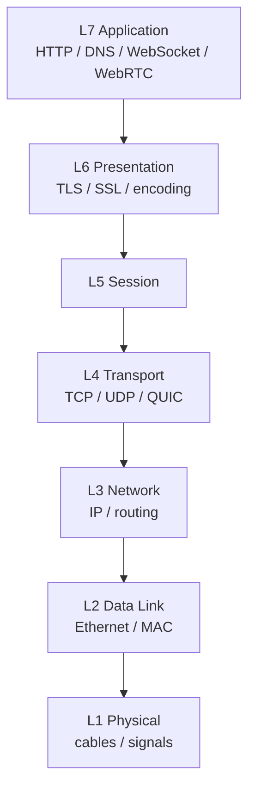
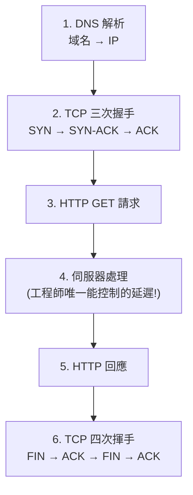

# Networking Essentials｜網路基本原理

> 網路建立在 [[osi-model|分層架構]] 上,系統設計面試最常碰三層:[[network-layer|L3 網路層]]、[[transport-layer|L4 傳輸層]]、[[application-layer|L7 應用層]]。核心取捨:[[tcp|TCP]] vs [[udp|UDP]]、REST/GraphQL/gRPC、[[sse|SSE]]/[[websocket|WebSocket]]/[[webrtc|WebRTC]]、[[load-balancing|負載平衡]]、[[data-locality|資料局部性]]、以及永遠假設網路會失敗的容錯設計。

## 一、網路分層 (OSI)

分層是「一層層抽象」,讓應用開發者用簡單語言思考通訊(像用 `open` 開檔,不必管磁碟怎麼讀 bytes)。



| 層 | 職責 | 代表協定 |
|---|---|---|
| [[network-layer]] (L3) | 路由與定址,把資料拆成封包,盡力而為交付到目的 IP | IP |
| [[transport-layer]] (L4) | 端到端通訊,在 L3 之上加可靠性、排序、流量控制 | [[tcp]]、[[udp]]、[[quic]] |
| [[application-layer]] (L7) | 建立在 TCP/UDP 之上的應用協定 | DNS、HTTP、WebSocket、WebRTC |

## 二、一個簡單的 Web 請求

在瀏覽器輸入 URL 按 Enter 後,背後發生:



值得注意:

- 應用層大幅簡化心智模型(TCP 保證有序可靠、DNS/IP 負責找到伺服器)。
- 概念上一個請求/回應,背後封包遠不止這些,延遲「可忽略,直到忽略不了為止」。
- 連線是雙方要維護的狀態。除非用 [[http-keepalive|HTTP keep-alive]] 或 HTTP/2 [[multiplexing|多路複用]],否則每個請求都要重做建線,開銷可觀。

## 三、傳輸層:TCP vs UDP

面試真正要做的選擇是 [[tcp|TCP]] vs [[udp|UDP]]。[[quic|QUIC]] 是「更好版本的 TCP」,但尚未廣泛普及。

| 特性 | [[udp]] | [[tcp]] |
|---|---|---|
| 連線方式 | 無連線 | 面向連線 |
| 可靠性 | 盡力而為 | 保證交付 |
| 順序 | 不保證 | 維護順序 |
| 流量/壅塞控制 | 無 | 有 |
| 標頭大小 | 8 bytes | 20-60 bytes |
| 速度 | 較快 | 因開銷較慢 |
| 使用場景 | 串流、遊戲、VoIP | 其他所有情況 |

**選哪個**:面試預設 TCP(通常不必說明)。能為 UDP 提出合理論據(低延遲關鍵、可容忍丟包、高流量遙測、不需瀏覽器)而不搞砸細節 → 加分。現代應用常兩者並用(視訊會議用 TCP/HTTP 做信令+驗證,UDP/WebRTC 做音視訊串流)。

## 四、應用層協定

### HTTP / HTTPS

請求-回應、[[stateless|無狀態]](每個請求獨立,伺服器不需記前一個)。

- **方法**:GET(請求,應[[idempotency|冪等]]、無 body)、POST(送資料)、PUT(更新)、PATCH(部分更新)、DELETE(刪除,應冪等)。
- **狀態碼**:2xx 成功(200、201);3xx 重定向(301/302);4xx 客戶端錯誤(404、401、403、429);5xx 伺服器錯誤(500、502)。
- **Headers** = 鍵值對 metadata(如 Accept-Encoding 表明能處理 gzip/brotli)。
- **HTTPS** = HTTP + [[tls|TLS/SSL]] 加密,公開網站一律要用。⚠️ HTTPS 只保證加密,**不保證請求由你的客戶端產生**;API 在驗證前永遠別信任 body(常見錯誤:body 帶 user ID 直接查 DB → 攻擊者改 ID 讀任意用戶資料)。

### API 三範式:REST / GraphQL / gRPC

| 範式 | 適用 | 重點 |
|---|---|---|
| [[rest]] | 面試最常用、預設 | 對[[resource|資源]]做操作,HTTP 動詞+路徑慣例,JSON。`updateUser` 是 operation 不是 resource → 應為 `PUT /users/{id}` |
| [[graphql]] | 前端要靈活查詢、資料結構複雜 | 解決 [[over-fetching]] 與 [[under-fetching]];需求固定時好處模糊 |
| [[grpc]] | 內部微服務間 | HTTP/2 + [[protobuf]],二進位省空間/CPU,吞吐某些基準達 JSON 10 倍 |

> **策略:內部 API 用 gRPC,外部 API 用 REST**。提示:別過早優化協定選擇(過早優化是萬惡之源)。

### 即時推送:SSE / WebSocket / WebRTC

- [[sse|SSE (Server-Sent Events)]]:HTTP 之上的巧妙改裝,伺服器在單一連線中隨時間持續串流多則訊息(`data: {...}` 一行一則)。斷線用 last event ID 自動重連。適合:客戶端一有事件就要立刻收到(如競標即時看當前價)。
- [[websocket|WebSocket]]:持久、類 TCP 的**雙向**連線,透過 HTTP「[[ws-upgrade|升級]]」發起。⚠️ 沿路每個基礎設施(防火牆/代理/LB)都要支援。適合高頻、持久、雙向(即時應用、遊戲)。⚠️ 面試警告:沒理由就跳 WebSocket = 扣分;有狀態連線在規模下開銷大。
- [[webrtc|WebRTC]]:瀏覽器間[[p2p|點對點]],唯一用 UDP 的應用層協定。透過[[signaling-server|信令伺服器]]交換連線資訊再直連;客戶端多在 NAT 後 → 用 [[stun|STUN]](打洞)或 [[turn|TURN]](中繼)。⚠️ 極難做對,面試只建議用在視訊/音訊通話。

## 五、負載平衡 (Load Balancing)

擴展兩選擇:[[vertical-scaling|垂直擴展]](更大伺服器)或 [[horizontal-scaling|水平擴展]](更多伺服器)。水平擴展需要 LB 告訴客戶端跟哪台溝通。

**[[client-side-lb|客戶端 LB]]**:客戶端自己向 service registry 要伺服器列表,直接選一台(不增延遲)。

- 例 **Redis Cluster**:節點用 gossip 互通;客戶端 hash key 決定分片直連,發錯回 MOVED。
- 例 **DNS**:回傳輪換的 IP 列表;設兩區域 LB + DNS 輪換 → 避免 LB 單點故障。
- 何時用:少量可控客戶端,或大量客戶端但可容忍緩慢更新(DNS)。

**[[dedicated-lb|專用 LB]]**:位於客戶端與後端間,每請求多一跳,換得快速更新列表 + 細粒度路由。

| | [[l4-lb|L4 LB]](傳輸層) | [[l7-lb|L7 LB]](應用層) |
|---|---|---|
| 依據 | IP/port,不看內容 | URL/header/cookie |
| 連線 | 維護持久 TCP 連線 | 終止傳入、對後端建新連線 |
| 成本 | 快、開銷低 | CPU 高、功能多 |
| 適合 | [[websocket]] 等持久連線 | 除 WebSocket 外所有 HTTP |

- **健康檢查與容錯**:LB 監控後端,壞了停止路由直到恢復([[failover|自動 failover]] → 高可用)。TCP 健康檢查(能否接受連線)、L7 健康檢查(發 HTTP 確認 200)。
- **演算法**:[[round-robin|Round Robin]]、Random、[[least-connections|Least Connections]]、Least Response Time、IP Hash。無狀態應用通常輪詢/隨機即可;持久連線服務(SSE/WebSocket)用 least connections 避免某台累積所有連線。
- **實作**:硬體(F5 BIG-IP)、軟體(HAProxy/NGINX/Envoy)、雲端(AWS ELB/ALB/NLB)。

## 六、區域化與延遲

全球服務伺服器分散各地。常見模式:單一區域內多個資料中心([[availability-zone|可用區域]]),一棟樓斷線不癱瘓整個服務;再在全球各城市複製。

**[[speed-of-light|光速限制]]**:光在光纖約 2/3 真空光速(~200,000 km/s),紐約↔倫敦往返(~5,600km)理論最低延遲約 **56ms**(還沒算處理時間)。→ 回到 [[data-locality|資料局部性]]:資料盡量靠近需要它的計算。

- [[cdn|CDN]]:策略性分佈全球的[[edge-location|邊緣位置]](數百~數千城市)。邊緣能回答 → 極快,靠快取實現,對靜態內容(圖片/影片/資源)特別有效。
- [[regional-partitioning|區域分片]]:按區域分片資料,每區只存相關資料。例 Uber:把附近城市捆成本地區域(「美國東北」),每區有自己的 co-located 資料庫 → 非常快。

## 七、處理故障與失敗模式

最危險的假設:「[[network-reliability-fallacy|網路是可靠的]]」。永遠假設網路呼叫會失敗/延遲/回意外結果來設計。

- [[retry-backoff|逾時 + 重試 + 退避]]:設逾時、超時放棄重試。重試處理暫時故障(關鍵:API 要[[idempotency|冪等]])。退避要加 [[jitter|抖動]],否則所有客戶端同時重試像打樁機([[thundering-herd|thundering herd]])。面試魔法短語:「指數退避重試 + jitter」。
- [[idempotency|冪等性]]:冪等 API 可被呼叫多次、結果相同。GET 天生冪等。寫入用[[idempotency-key|冪等鍵]](如 user ID + 日期),伺服器只處理一次 → 避免支付重複扣款。
- [[circuit-breaker|熔斷器]]:處理[[cascading-failure|級聯故障]] / thundering herd。三狀態:**Closed**(正常,監控失敗數)→ 超閾值 → **Open**(請求立即失敗、不實際呼叫)→ 逾時後 **Half-Open**(放少量測試請求決定閉合或保持開路)。適合外部 API、DB 連線、微服務間通訊。

## 收尾小考

1. **TCP 和 UDP 最根本的差異?各自適合什麼場景?**
2. **以下哪個 HTTP method 不是冪等的?(A) GET (B) PUT (C) DELETE (D) POST**
3. **REST、GraphQL、gRPC 各自最適合的場景?**
4. **L4 和 L7 Load Balancer 的差異?WebSocket 用哪個?**
5. **Circuit Breaker 的三個狀態?解決什麼問題?**
6. **為什麼重試策略需要加入「抖動 (jitter)」?**

```glossary
{
  "osi-model": { "term": "OSI 模型 (OSI Model)", "short": "把網路通訊拆成 7 層的分層抽象,每層只負責一件事,讓上層不必理解下層細節。系統設計面試重點看 L3/[[transport-layer|L4]]/[[application-layer|L7]]。" },
  "network-layer": { "term": "網路層 (Network Layer, L3)", "short": "負責路由與定址。把資料拆成封包,盡力而為 (best-effort) 交付到目的 IP。代表協定:IP。" },
  "transport-layer": { "term": "傳輸層 (Transport Layer, L4)", "short": "提供端到端通訊,在 L3 之上加可靠性、排序、流量控制。代表:[[tcp|TCP]]、[[udp|UDP]]、[[quic|QUIC]]。" },
  "application-layer": { "term": "應用層 (Application Layer, L7)", "short": "建立在 TCP/UDP 之上的應用協定,如 DNS、HTTP、WebSocket、WebRTC。" },
  "tcp": { "term": "TCP (Transmission Control Protocol)", "short": "面向連線、保證可靠交付與順序、有流量/壅塞控制。連線叫 stream,沒被 ACK 就重傳。Header 20-60 bytes,網際網路主力,面試預設。" },
  "udp": { "term": "UDP (User Datagram Protocol)", "short": "無連線、不保證送達與順序、無流量控制,Header 僅 8 bytes、更低延遲。適合串流/遊戲/VoIP 等速度比可靠性重要的場景。" },
  "quic": { "term": "QUIC", "short": "較新的傳輸協定,可視為「更好版本的 [[tcp|TCP]]」(建在 UDP 上),但尚未廣泛普及。" },
  "http-keepalive": { "term": "HTTP keep-alive", "short": "讓同一條 TCP 連線重複用於多個請求,避免每個請求都重做三次握手的建線開銷。" },
  "multiplexing": { "term": "多路複用 (Multiplexing)", "short": "HTTP/2 在單一連線上同時並行多個請求/回應,免去為每個請求重新建線。" },
  "stateless": { "term": "無狀態 (Stateless)", "short": "每個請求獨立,伺服器不需記住前一個請求。好處是好擴展,設計上盡量縮小有狀態部分。" },
  "idempotency": { "term": "冪等性 (Idempotency)", "short": "同一操作呼叫多次結果相同。GET/PUT/DELETE 天生冪等,POST 不是。是重試安全的前提。" },
  "idempotency-key": { "term": "冪等鍵 (Idempotency Key)", "short": "寫入場景帶的唯一鍵(如 user ID + 日期),伺服器檢查該鍵是否已處理,只處理一次 → 避免支付重複扣款。" },
  "tls": { "term": "TLS / SSL", "short": "傳輸層加密協定。HTTPS = HTTP + TLS。只保證加密,不保證請求來源可信。" },
  "rest": { "term": "REST", "short": "對[[resource|資源]]做操作的 API 風格,用 HTTP 動詞 + 路徑慣例 + JSON。面試預設、簡單、跨平台、易快取。" },
  "resource": { "term": "資源 (Resource)", "short": "REST 操作的對象,≈ DB 表/檔案。核心實體 (Core Entities) 通常直接對應資源,如 `/users/{id}`。" },
  "graphql": { "term": "GraphQL", "short": "2015 Facebook 推出,讓客戶端精確請求所需資料,解決 [[over-fetching]] 與 [[under-fetching]]。適合前端快速迭代、需求多變。" },
  "over-fetching": { "term": "Over-fetching", "short": "API 回傳超出客戶端所需的資料,浪費頻寬與處理。GraphQL 用來避免的問題之一。" },
  "under-fetching": { "term": "Under-fetching", "short": "單次請求拿不到足夠資料,需要多次往返才能組出畫面。GraphQL 用來避免的問題之一。" },
  "grpc": { "term": "gRPC", "short": "Google 推出,HTTP/2 + [[protobuf|Protocol Buffers]]。二進位編碼省空間/CPU、強型別編譯期抓錯,吞吐某些基準達 JSON 10 倍。適合內部微服務。" },
  "protobuf": { "term": "Protocol Buffers (Protobuf)", "short": "像 JSON 但有更嚴格綱要、二進位編碼。同資料 JSON 40 bytes vs Protobuf 15 bytes,更省空間。" },
  "sse": { "term": "SSE (Server-Sent Events)", "short": "HTTP 之上的單向串流:伺服器在一條連線中隨時間持續推多則訊息(`data: {...}`)。斷線用 last event ID 自動重連。適合即時看更新(如競標出價)。" },
  "websocket": { "term": "WebSocket", "short": "持久、類 TCP 的雙向連線,透過 HTTP [[ws-upgrade|升級]]發起,瀏覽器廣泛支援。適合高頻、持久、雙向。沿路每個基礎設施都要支援它。" },
  "ws-upgrade": { "term": "HTTP 升級 (Upgrade)", "short": "WebSocket 從一個普通 HTTP 連線「升級」成持久雙向連線的握手機制,可沿用 cookies/headers。" },
  "webrtc": { "term": "WebRTC", "short": "瀏覽器間[[p2p|點對點]]通訊,唯一用 UDP 的應用層協定。靠[[signaling-server|信令]]交換資訊後直連。極難做對,面試只建議用在視訊/音訊通話。" },
  "p2p": { "term": "點對點 (Peer-to-Peer)", "short": "兩端直接通訊,不經中央伺服器轉送資料(信令階段仍需伺服器協調)。" },
  "signaling-server": { "term": "信令伺服器 (Signaling Server)", "short": "WebRTC 用來在兩個 peer 之間交換連線資訊(IP/port 等)的中介,協商完成後雙方直連。" },
  "stun": { "term": "STUN", "short": "幫 NAT 後的客戶端做打洞 (hole punching),取得可公開路由的 address/port,讓 WebRTC 能直連。" },
  "turn": { "term": "TURN", "short": "當打洞失敗時的中繼伺服器,替兩端轉送流量。比 [[stun|STUN]] 重但更可靠。" },
  "load-balancing": { "term": "負載平衡 (Load Balancing)", "short": "把流量分散到多台伺服器。水平擴展需要它告訴客戶端該跟哪台溝通。分[[client-side-lb|客戶端 LB]]與[[dedicated-lb|專用 LB]]。" },
  "vertical-scaling": { "term": "垂直擴展 (Vertical Scaling)", "short": "用更大/更強的單台伺服器來擴展。2020 年代現代硬體很強,能垂直就垂直。" },
  "horizontal-scaling": { "term": "水平擴展 (Horizontal Scaling)", "short": "加更多伺服器來擴展。面試最常見,但需要[[load-balancing|負載平衡]]分流。" },
  "client-side-lb": { "term": "客戶端負載平衡 (Client-side LB)", "short": "客戶端自己向 service registry 拿伺服器列表並直選一台,不增延遲。適合少量可控客戶端,或可容忍緩慢更新(DNS)。" },
  "dedicated-lb": { "term": "專用負載平衡器 (Dedicated LB)", "short": "位於客戶端與後端間的 LB,每請求多一跳,換得快速更新列表 + 細粒度路由。分 [[l4-lb|L4]] / [[l7-lb|L7]]。" },
  "l4-lb": { "term": "L4 負載平衡器 (Transport Layer)", "short": "依 IP/port 路由、不看內容,維護持久 TCP 連線,快且開銷低。適合 [[websocket|WebSocket]] 等持久連線。" },
  "l7-lb": { "term": "L7 負載平衡器 (Application Layer)", "short": "理解 HTTP,可依 URL/header/cookie 路由(類 API Gateway),終止傳入連線再對後端建新連線。CPU 高、功能多。" },
  "failover": { "term": "自動容錯轉移 (Failover)", "short": "LB 監控後端健康,壞了就停止路由直到恢復,自動把流量轉到健康節點 → 高可用。" },
  "round-robin": { "term": "Round Robin (輪詢)", "short": "依序把請求輪流分給每台伺服器。無狀態應用最簡單常用的演算法。" },
  "least-connections": { "term": "Least Connections (最少連線)", "short": "把新連線給目前連線數最少的伺服器。持久連線服務(SSE/WebSocket)用它避免某台累積所有連線。" },
  "availability-zone": { "term": "可用區域 (Availability Zone)", "short": "Amazon 用語:單一區域內彼此隔離的多個資料中心,一棟樓斷線不癱瘓整個服務。" },
  "speed-of-light": { "term": "光速限制 (Speed of Light)", "short": "光在光纖約 2/3 真空光速(~200,000 km/s)。物理距離設下延遲下限,如 NY↔London 往返理論最低約 56ms。" },
  "data-locality": { "term": "資料局部性 (Data Locality)", "short": "資料盡量靠近需要它的計算,以降低延遲。[[cdn|CDN]] 與[[regional-partitioning|區域分片]]都是它的應用。" },
  "cdn": { "term": "CDN (Content Delivery Network)", "short": "全球分佈的[[edge-location|邊緣位置]]伺服器,靠快取就近回答請求。對靜態內容(圖片/影片/資源)特別有效。" },
  "edge-location": { "term": "邊緣位置 (Edge Location)", "short": "CDN 部署在數百~數千城市的伺服器節點,離用戶近,能快取並就近回應。" },
  "regional-partitioning": { "term": "區域分片 (Regional Partitioning)", "short": "按地理區域把資料分片,每區只存相關資料 + co-located 資料庫。例 Uber 把附近城市捆成本地區域查本地庫 → 非常快。" },
  "network-reliability-fallacy": { "term": "網路可靠的謬誤", "short": "分散式系統最危險的假設。永遠假設網路呼叫會失敗/延遲/回意外結果,並據此設計容錯。" },
  "retry-backoff": { "term": "重試 + 退避 (Retry with Backoff)", "short": "失敗後重試處理暫時故障,但每次等更久([[jitter|加抖動]])再試。面試魔法短語:「指數退避重試 + jitter」。前提是 API [[idempotency|冪等]]。" },
  "jitter": { "term": "抖動 (Jitter)", "short": "重試時間加入隨機性,讓大量客戶端不會同時重試造成 [[thundering-herd|thundering herd]]。" },
  "thundering-herd": { "term": "Thundering Herd", "short": "大量客戶端同步重試形成突刺流量,讓已掙扎的服務更不堪負荷。用 [[jitter|抖動]]與[[circuit-breaker|熔斷器]]緩解。" },
  "circuit-breaker": { "term": "熔斷器 (Circuit Breaker)", "short": "防[[cascading-failure|級聯故障]]。三態:Closed(正常監控)→ 超閾值 → Open(立即失敗不呼叫)→ 逾時後 Half-Open(放少量測試請求)。" },
  "cascading-failure": { "term": "級聯故障 (Cascading Failure)", "short": "一個元件故障引發下游連鎖崩潰(如 DB 重啟時湧入的重試讓它起不來)。[[circuit-breaker|熔斷器]]用來阻斷。" }
}
```
