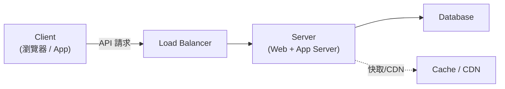

# Client-Server Architecture｜客戶端-伺服器架構

> 現代網路應用最基本的架構模式,幾乎所有系統設計面試的系統都建立在此模型上。[[client|Client]] 發起請求、[[server|Server]] 處理並回傳,兩者透過網路遵循 [[request-response|Request-Response]] 模型溝通。它是你畫架構圖時的第一條線。

## 核心角色

[[client|Client]] 是發起請求的一方(瀏覽器、手機 App、或另一個服務),負責呈現 UI、收集輸入、發請求、展示回應。

[[server|Server]] 接收請求、處理邏輯、回傳結果,負責 [[authentication|驗證與授權]]、執行商業邏輯、讀寫資料庫。實際上 Server 通常不是一台機器,而是多台組成的叢集,前面有 [[load-balancer|Load Balancer]] 分流。

典型 Server 組成:

| 組成 | 角色 | 範例 |
| :--- | :--- | :--- |
| [[web-server|Web Server]] | 收 HTTP | Nginx / Apache |
| [[application-server|Application Server]] | 執行邏輯 | Node.js / Django / Spring Boot |
| [[database|Database]] | 存放資料 | PostgreSQL / MongoDB |

## 為什麼重要

1. **職責分離**:Client 負責展示/互動,Server 負責商業邏輯/資料 → 易維護、易擴展。
2. **集中管理**:資料與邏輯集中在 Server,方便更新、維護、安全管控。
3. **多客戶端支援**:同一 Server 可同時服務網頁、App、第三方 API。
4. **擴展基礎**:流量增加時對 Server 做垂直/水平擴展,不需改動 Client。

## Thin Client vs Thick Client

| 特性 | [[thin-client]] | [[thick-client]] |
| :--- | :--- | :--- |
| 邏輯位置 | 大部分在 Server | Client 承擔較多 |
| 範例 | 伺服器端渲染 [[ssr]] | [[spa]](React / Vue) |
| 優點 | Client 輕量、易維護、安全 | 體驗流暢、減輕 Server 負擔 |
| 缺點 | 每次互動都要請求 Server | 前端複雜、部分邏輯暴露 |

> 面試提示:現代系統設計通常假設 [[thick-client|Thick Client]](SPA 或手機 App)+ [[restful-api|RESTful API]]。設計重點在 Server 端,但 Client 選擇會影響 API 設計。

## Client-Server vs Peer-to-Peer

| 特性 | [[client-server|Client-Server]] | [[p2p|Peer-to-Peer]] |
| :--- | :--- | :--- |
| 通訊方式 | Client 向 Server 請求 | 節點之間直接溝通 |
| 集中控制 | 有(Server 控制一切) | 無(去中心化) |
| 擴展方式 | 擴展 Server | 加入更多 Peer |
| 典型應用 | 幾乎所有 Web 應用 | 視訊通話 [[webrtc]]、檔案分享 BitTorrent |

> 面試提示:面試中 99% 的問題都是 Client-Server。只有明確涉及視訊/音訊通話,才考慮 P2P([[webrtc|WebRTC]])。

## 面試中的應用:畫架構圖的起點



1. **從 Client 開始**:使用者透過什麼介面使用系統?(瀏覽器?App?)
2. **加入 Server**:處理請求的後端服務是什麼?
3. **定義 API**:Client 和 Server 怎麼溝通?(REST?GraphQL?WebSocket?)
4. **加入 Database**:Server 的資料存在哪裡?
5. **擴展**:流量大了怎麼辦?加 [[load-balancer|Load Balancer]]、Cache、CDN…

這就是為什麼 Client-Server 是基礎中的基礎——它是你畫出的第一條線,後續所有設計都在這框架上展開。

### 收尾小考

1. Client 和 Server 的核心職責分別是什麼?
2. 為什麼 Client-Server 的職責分離很重要?
3. Thin vs Thick Client 的主要差異?現代偏向哪種?
4. 什麼時候考慮 P2P 而非 Client-Server?

```glossary
{
  "client": { "term": "Client(客戶端)", "short": "發起請求的一方,如瀏覽器、手機 App 或另一個服務;負責呈現 UI、收集輸入、發請求並展示回應。" },
  "server": { "term": "Server(伺服器)", "short": "接收請求、處理邏輯、回傳結果的一方;負責 [[authentication|驗證授權]]、商業邏輯與讀寫 [[database|資料庫]]。實務上常是多台機器組成的叢集。" },
  "request-response": { "term": "Request-Response(請求-回應)模型", "short": "Client 送出請求、Server 回傳回應的溝通模式,是 Client-Server 架構的基本互動方式。" },
  "client-server": { "term": "Client-Server Architecture(客戶端-伺服器架構)", "short": "Client 向 Server 請求、Server 集中控制與處理的架構;現代網路應用與系統設計的基礎模型。" },
  "authentication": { "term": "Authentication & Authorization(驗證與授權)", "short": "驗證使用者身分(你是誰)並判斷其權限(你能做什麼),通常由 Server 負責。" },
  "load-balancer": { "term": "Load Balancer(負載平衡器)", "short": "擺在 Server 叢集前面,把進來的流量分散到多台機器,是水平擴展的關鍵元件。" },
  "web-server": { "term": "Web Server(網頁伺服器)", "short": "負責接收 HTTP 請求的伺服器,如 Nginx、Apache;常作為流量入口轉發給 [[application-server|Application Server]]。" },
  "application-server": { "term": "Application Server(應用伺服器)", "short": "執行商業邏輯的伺服器,如 Node.js、Django、Spring Boot。" },
  "database": { "term": "Database(資料庫)", "short": "存放與管理資料的系統,如 PostgreSQL、MongoDB,由 Server 讀寫。" },
  "thin-client": { "term": "Thin Client(瘦客戶端)", "short": "大部分邏輯在 Server,Client 只負責顯示;典型例子是伺服器端渲染 [[ssr|SSR]]。優點是輕量、易維護、安全。" },
  "thick-client": { "term": "Thick Client(胖客戶端)", "short": "Client 承擔較多邏輯(路由、狀態、UI),Server 主要提供資料 API;典型例子是 [[spa|SPA]]。體驗流暢但前端複雜、部分邏輯暴露。" },
  "ssr": { "term": "SSR(Server-Side Rendering,伺服器端渲染)", "short": "由 Server 產生完整 HTML 再交給瀏覽器渲染,是 [[thin-client|Thin Client]] 的典型做法。" },
  "spa": { "term": "SPA(Single-Page Application,單頁應用)", "short": "前端(如 React、Vue)處理路由、狀態與 UI,只向 Server 要資料;是 [[thick-client|Thick Client]] 的典型形式。" },
  "restful-api": { "term": "RESTful API", "short": "以 REST 風格設計的 HTTP API,是現代 Client 與 Server 溝通的常見方式。" },
  "p2p": { "term": "Peer-to-Peer(P2P,點對點)", "short": "節點之間直接溝通、去中心化、無中央 Server 控制;擴展靠加入更多 Peer。典型應用如視訊通話、檔案分享。" },
  "webrtc": { "term": "WebRTC", "short": "瀏覽器間直接傳輸音視訊/資料的 [[p2p|P2P]] 技術,適合低延遲的視訊/音訊通話。" }
}
```
