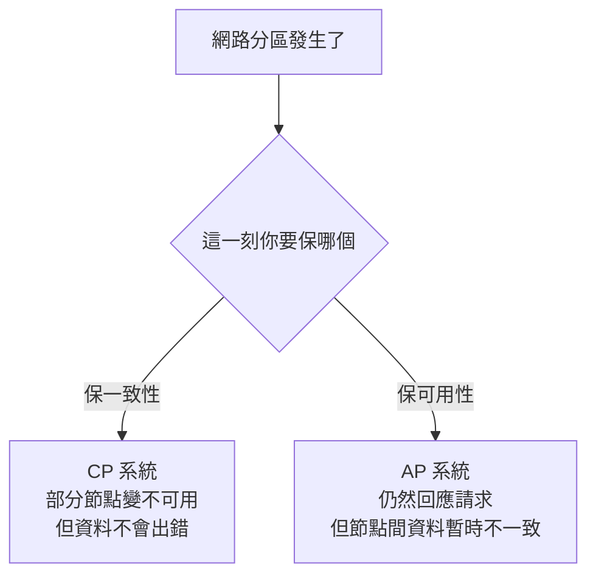

# CAP 定理 (CAP Theorem)

> 分散式系統最常被引用、面試最常問的一條取捨原則。一句話:**網路一斷,你只能保「一致」或「可用」其中一個。**

## 三個特性

[[cap-theorem|CAP 定理]] 講的是分散式系統的三個特性,在**網路分區發生時**最多只能同時滿足兩個:

| 字母 | 名稱 | 白話 |
|---|---|---|
| **C** | [[consistency]] | 所有節點同一時間看到的資料一樣;寫入後不管讀哪個節點都拿到新值。 |
| **A** | [[availability]] | 每個請求都在有限時間內得到回應,不會無限等待。 |
| **P** | [[partition-tolerance]] | 節點間斷線、訊息丟失時,系統仍能繼續運作。 |

## 關鍵洞見:真正的取捨永遠是 C vs A

網路不可能永遠不斷線,所以 [[partition-tolerance|P]] **幾乎一定得保留**。P 既然必選,真正的選擇就只剩 **C 和 A 二選一**:



- **[[cp-system|CP 系統]]**:分區時犧牲可用性 — 寧可拒絕服務,也不給你錯的資料。
- **[[ap-system|AP 系統]]**:分區時仍回應 — 代價是節點間資料暫時不一致,之後才慢慢調和([[eventual-consistency|最終一致性]])。
- **[[ca-system|CA 系統]]**:真實分散式系統幾乎不存在,等於假設「網路永不分區」,不切實際。

## ATM 案例(同一帳戶,台北 + 台中)

這是最好記的例子。帳戶餘額被多個分行/ATM 共享:

- **選 CP(放棄 A)**:台北提款 1000,系統立刻同步,台中馬上看到餘額減少。但台北↔台中**斷線時,台中不能提款**(無法確定最新餘額)。→ 犧牲可用性,保證不出錯。
- **選 AP(放棄 C)**:台中斷線仍允許提款,體驗好(永遠能領)。但兩邊可能各領 1000 造成 **超支 (overdraft)**。→ 犧牲一致性,保證能用。

## 什麼時候該選強一致性 (CP)?

預設其實是**選可用性**。只有「**短暫不一致就會釀大禍**」的系統才值得犧牲可用性去保強一致:

- **庫存管理** — 避免超賣。
- **有限資源預訂**(機位、門票、飯店房)— 避免重複預訂。
- **銀行 / 帳戶餘額** — 必須跨節點精確,防詐騙、防超支。

而社群動態牆、使用者頭像快取這類,容忍短暫不一致沒關係 → 選 AP。

> 💡 面試心法:被問「你這個系統 C 還是 A?」→ **預設答可用性 (Availability)**,再補一句「除非是金流/庫存/訂位這種不能容忍過期資料的,才改走強一致 (CP)」。這就是 [[default-availability|預設選 A、特例選 C]] 的決策規則。

```glossary
{
  "cap-theorem": {
    "term": "CAP Theorem CAP 定理",
    "short": "分散式系統在網路分區時,一致性(C)、可用性(A)、分區容錯(P)三者最多只能同時滿足兩個。因為分區無法避免,實務上 P 必選,真正取捨是 [[consistency|C]] vs [[availability|A]]。",
    "deeper": "為什麼 CAP 定理說 CA 系統在真實分散式系統中幾乎不存在?"
  },
  "consistency": {
    "term": "Consistency 一致性",
    "short": "所有節點在同一時間看到相同資料;寫入後,不論讀取打到哪個節點都回傳那個最新值。"
  },
  "availability": {
    "term": "Availability 可用性",
    "short": "每個請求都能在有限時間內得到回應,不會被無限期卡住等待。"
  },
  "partition-tolerance": {
    "term": "Partition Tolerance 分區容錯",
    "short": "節點之間斷線或訊息丟失(網路分區)時,系統仍能繼續運作。因為網路不可能永不斷線,這項幾乎一定要保留。"
  },
  "cp-system": {
    "term": "CP System CP 系統",
    "short": "網路分區時選擇保一致性、犧牲可用性 — 寧可讓部分節點暫時拒絕服務,也不回傳可能過期/錯誤的資料。適合銀行、庫存、訂位。"
  },
  "ap-system": {
    "term": "AP System AP 系統",
    "short": "網路分區時選擇保可用性、犧牲一致性 — 仍然回應請求,代價是節點間資料暫時不同步,之後才透過 [[eventual-consistency|最終一致性]] 調和。適合社群牆、快取。"
  },
  "ca-system": {
    "term": "CA System CA 系統",
    "short": "同時保一致性與可用性、放棄分區容錯。等於假設網路永不分區,在真實分散式系統幾乎不存在。"
  },
  "eventual-consistency": {
    "term": "Eventual Consistency 最終一致性",
    "short": "允許節點間資料暫時不一致,但保證在沒有新寫入後,所有節點最終會收斂到相同的值 — 只是不保證何時完成。"
  },
  "default-availability": {
    "term": "Default: Availability 預設選可用性",
    "short": "CAP 落到實務的決策規則:預設選可用性,只有無法容忍過期資料的系統(金流、庫存、訂位)才改走強一致 (CP)。",
    "deeper": "面試被問系統要選 C 還是 A,該怎麼判斷與回答?"
  }
}
```
