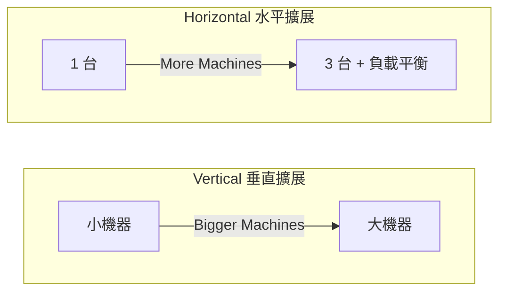

# Scalability｜擴展性

> 核心:[[scalability|可擴展性]] 是系統「隨需求增加,靠加資源維持效能與穩定」的能力。兩個關鍵指標是 [[throughput|吞吐量]] 與 [[latency|延遲]];擴展手段分 [[vertical-scaling|垂直擴展]](加大單機)與 [[horizontal-scaling|水平擴展]](加多台機器)。

## 什麼是可擴展性

[[scalability|Scalability]] 指系統能隨需求(使用者、資料量、流量)增加,**透過增加資源來維持效能與穩定性**的能力。分散式系統使用量常持續成長,目標是高流量下仍維持低延遲、高吞吐量。

兩個核心指標:

- [[throughput|吞吐量 (Throughput)]]:每秒能處理的請求數。
- [[latency|延遲 (Latency)]]:單一請求從發出到完成所需的時間。

**為什麼重要?**

1. **應對高流量**:架構若不可擴展,流量成長時可能延遲、錯誤甚至宕機。
2. **成本效率**:可彈性增減資源,避免浪費。
3. **業務成長**:產品成功後架構必須支撐更多使用者。
4. **可靠性**:分散式可擴展設計避免[[single-point-of-failure|單點故障]],提高穩定度。

> 垂直擴展比喻:單孔濾網咖啡機一次沖 1 杯,需求變大就換三孔的高級咖啡機一次沖 3 杯(加 RAM、換更快 CPU、用更大硬碟)。

## 垂直 vs 水平擴展



**[[vertical-scaling|垂直擴展 (Vertical Scaling)]] — Bigger Machines**

- 做法:升級單一伺服器(增加 CPU、記憶體、硬碟)。
- 優點:簡單、改動少。
- 缺點:有物理上限,成本高。

**[[horizontal-scaling|水平擴展 (Horizontal Scaling)]] — More Machines**

- 比喻:與其一直換更高級的咖啡機,不如多買幾台普通咖啡機,請更多人同時沖。
- 做法:增加伺服器數量,透過 [[load-balancer|Load Balancer]] 讓多台機器分擔工作。
- 優點:理論上無限擴展,彈性佳,能應對大規模成長。
- 缺點:系統設計複雜,需處理分散式[[data-consistency|資料一致性]]等問題。

## 比較與選用順序

一般企業會**先垂直擴展解決短期需求**,流量持續增加時**再轉向水平擴展**支撐長期成長。

| 比較項目 | [[vertical-scaling]] | [[horizontal-scaling]] |
| :--- | :--- | :--- |
| 做法 | 升級單機 | 增加機器數量 |
| 上限 | 有物理上限 | 理論無限 |
| 複雜度 | 低 | 高 |
| 成本 | 初期低、後期貴 | 彈性 |
| 適合 | 短期、快速解法 | 長期、大規模 |

### 收尾小考

1. [[throughput|Throughput]] 和 [[latency|Latency]] 分別指什麼?
2. 以下何者正確?(A) Horizontal 比 Vertical 簡單 (B) Vertical 理論上無上限 (C) Horizontal 需處理分散式資料一致性問題 (D) 一般建議直接從 Horizontal 開始
3. 為什麼可擴展性對業務很重要?列舉至少三個原因。

```glossary
{
  "scalability": {
    "term": "Scalability(可擴展性)",
    "short": "系統隨需求(使用者、資料量、流量)增加,靠增加資源維持效能與穩定的能力。手段分 [[vertical-scaling|垂直擴展]] 與 [[horizontal-scaling|水平擴展]]。"
  },
  "throughput": {
    "term": "Throughput(吞吐量)",
    "short": "每秒能處理的請求數,衡量系統處理能力的指標之一。"
  },
  "latency": {
    "term": "Latency(延遲)",
    "short": "單一請求從發出到完成所需的時間,愈低代表回應愈快。"
  },
  "vertical-scaling": {
    "term": "Vertical Scaling(垂直擴展)",
    "short": "升級單一伺服器(加 CPU、記憶體、硬碟)。簡單、改動少,但有物理上限、後期成本高。"
  },
  "horizontal-scaling": {
    "term": "Horizontal Scaling(水平擴展)",
    "short": "增加伺服器數量,透過 [[load-balancer|負載平衡]] 分擔工作。理論上無限擴展、彈性佳,但設計複雜、需處理 [[data-consistency|資料一致性]]。"
  },
  "load-balancer": {
    "term": "Load Balancer(負載平衡器)",
    "short": "把進來的請求分配到多台伺服器,是 [[horizontal-scaling|水平擴展]] 的關鍵元件。"
  },
  "data-consistency": {
    "term": "Data Consistency(資料一致性)",
    "short": "分散式系統中多台機器/多份資料副本之間保持一致的問題,是水平擴展要額外處理的挑戰。"
  },
  "single-point-of-failure": {
    "term": "Single Point of Failure(單點故障)",
    "short": "系統中某個元件一壞整體就掛掉的弱點;可擴展的分散式設計可避免它以提高可靠性。"
  }
}
```
