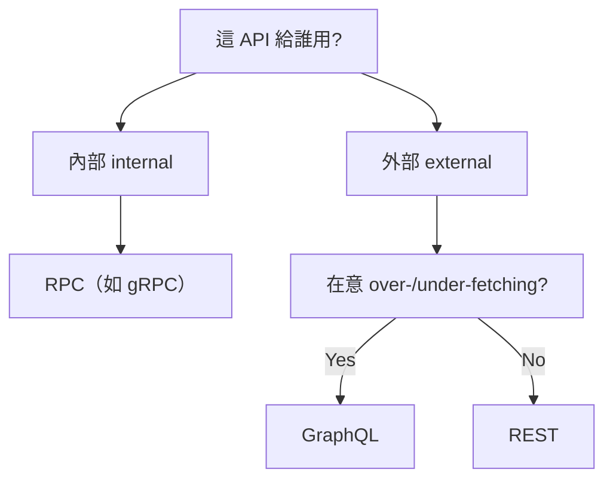

# API Design｜API 設計 — 決策樹

> 核心:選 API 風格不是看潮流,而是看「**誰來用**」與「**有沒有 [[over-fetching|過度抓取]] / [[under-fetching|抓取不足]] 的痛**」。內部用 [[rpc|RPC]]、外部視抓取問題在 [[graphql|GraphQL]] 與 [[rest|REST]] 之間選。

## 怎麼選?(決策樹)



| 對象 | 在意 over-/under-fetching | 選用 |
|---|---|---|
| 內部 (internal) | — | [[rpc]] |
| 外部 (external) | Yes | [[graphql]] |
| 外部 (external) | No | [[rest]] |

## 為什麼是這兩個痛點?

- **[[over-fetching|過度抓取]]**:一個 endpoint 回一坨,拿到一堆用不到的欄位。
- **[[under-fetching|抓取不足]]**:一個 endpoint 不夠,要打好幾次才能湊齊資料。
- [[graphql|GraphQL]] 用一次查詢同時解掉這兩個問題,所以當「外部 API 且在意抓取效率」時它是首選。

> 補充(整理脈絡):本主題資料夾原本有 10 個 PDF,實為 5 個主題各重複一份(檔名亂貼 + 簡體副本),已清理為 5 個繁體檔:決策樹、[[rest|REST]]、[[graphql|GraphQL]]、[[rpc|RPC]]、API Security。本筆記對應「決策樹」(`API Design.pdf`)。

## 收尾小考

1. 一個 API 只給公司內部服務互打,決策樹建議用哪種風格?為什麼?
2. 用自己的話解釋 over-fetching 與 under-fetching 的差別,各舉一個情境。
3. 外部 API 若**不**在意抓取效率,決策樹會落在 REST 還是 GraphQL?

```glossary
{
  "rpc": { "term": "RPC（Remote Procedure Call，遠端程序呼叫，如 gRPC）", "short": "像呼叫本地函式一樣呼叫遠端服務。決策樹中當 API 只給內部 (internal) 使用時的選擇。" },
  "rest": { "term": "REST（Representational State Transfer）", "short": "以資源 + HTTP 動詞為核心的 API 風格。外部 API 且不太在意 [[over-fetching|過度抓取]]/[[under-fetching|抓取不足]] 時的選擇。" },
  "graphql": { "term": "GraphQL（圖查詢語言）", "short": "讓用戶端用一次查詢精準指定要哪些欄位,同時解掉 [[over-fetching|過度抓取]] 與 [[under-fetching|抓取不足]]。外部 API 且在意抓取效率時的選擇。" },
  "over-fetching": { "term": "Over-fetching（過度抓取）", "short": "一個 endpoint 回一坨資料,拿到一堆用不到的欄位,浪費頻寬。" },
  "under-fetching": { "term": "Under-fetching（抓取不足）", "short": "一個 endpoint 給的資料不夠,要打好幾次請求才能湊齊需要的資料。" }
}
```
