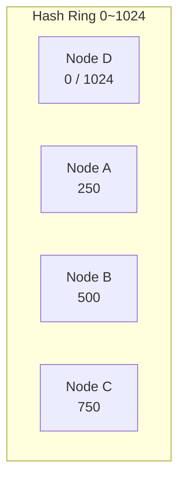

# Consistent Hashing｜一致性雜湊

> 核心:當伺服器數量改變時,[[consistent-hashing|一致性雜湊]] 只需搬動**一小部分**資料,大部分 key 留在原節點 —— 解決了 [[simple-hash|簡單 hash]] 「改 N 就幾乎全搬」的致命傷。

## 為什麼需要一致性雜湊?

分散式系統常要把資料分散到多台伺服器。最直觀的做法是 [[simple-hash|簡單 hash]]:`server = hash(key) % N`(N = 節點數)。

問題:只要 **N 改變**(新增/移除伺服器),幾乎所有資料都要重新分配,造成大量搬遷 → 效能問題與系統不穩定。

範例(值 1~9):

| N | 分配結果 |
|---|---|
| N = 3 | 3,6,9→Node0｜1,4,7→Node1｜2,5,8→Node2 |
| N = 4 | 4,8→Node0｜1,5,9→Node1｜2,6→Node2｜3,7→Node3 |

→ 多加一個 node,**9 個值裡有 7 個被移動**(只有 1 和 2 留在原位)。

## Hash 環怎麼運作

[[consistent-hashing|一致性雜湊]] 的核心是 [[hash-ring|Hash 環]]:



- 把所有可能的 hash 值映射成一個圓環(0 → MAX_HASH)。
- 每個節點 (server) 用 hash 落到環上某個位置;每筆資料也用 `hash(key)` 算出位置。
- **規則:資料順時針找到第一個節點,交給它存。**

| hashed value | 落點 | 順時針第一個節點 |
|---|---|---|
| 200 | D~A | [[clockwise-rule]] → A |
| 400 | A~B | B |
| 600 | B~C | C |

## 節點加入 / 移除:只動鄰居

- **新節點加入**:假設 E 落在 150,**只有「D 與 E 之間」(0~150) 的資料從 A 搬到 E**,其餘不變。受影響的只有「新節點與其前一個節點之間」的 key。
- **節點移除**:假設 A 下線,原本屬於 A 的資料移到**下一個節點 B**,其他不受影響。

這就是 [[consistent-hashing|一致性雜湊]] 的價值 —— 變動只波及環上相鄰的一段。

## 為什麼需要虛擬節點?

基本版每個實體節點在環上只有一個位置,會有兩個問題:

1. **資料分佈不均**:hash 雖隨機,但節點少時可能很不平均。例:移除 A 後,B 要扛掉約一半的 hashed values。
2. **節點性能不同**:強/弱伺服器都只拿一個區間,沒按硬體能力分配。

→ 解法:引入 [[virtual-nodes|虛擬節點]]。

## 虛擬節點做法與好處

**做法**:每個實體節點對應**多個** [[virtual-nodes|虛擬節點 (vNodes)]],一起映射到環上,像許多小節點。資料依舊順時針找最近的 vNode,再交由對應的實體節點。

例:A 散成 A1(250)/A2(580)/A3(920)、B 散成 B1(500)/B2(830)/B3(80)… 每個實體節點散佈多個位置 → key 分布更均勻。

**好處**:

1. **平均分佈**:節點數少也能均勻切開。
2. **依硬體能力分配**:強機器放更多 vNodes、負責更多資料;弱機器少放。
3. **彈性擴展**:每節點有多個 vNodes,加入/移除時搬遷更細顆粒、負載更平滑。

## 面試:什麼時候想到 Consistent Hashing?

口訣:**「變動的節點 + 需要穩定歸屬 + 想少搬家」→ consistent hashing**。常見場景:

- 分散式快取 sharding:Memcached / Redis(避免 `key % N` 大規模重分配)
- 儲存 sharding/routing:Cassandra / Dynamo 風格 partition routing
- Sticky connections:聊天室/即時服務把同一使用者路由到固定節點
- API Gateway / Sticky Sessions:減少跨節點 session 同步
- Rate Limiting:把 key 穩定分到對應節點做限流
- Metrics / Aggregation:相同維度聚到固定節點累加
- CDN / Edge Routing:URL 或內容 ID 穩定映射到 edge 節點

### 收尾小考

1. 簡單 hash (`hash(key) % N`) 在什麼情況下出問題?舉例說明。
2. (是非)consistent hashing 中新增節點時,所有 key 都要重新分配。
3. [[virtual-nodes|Virtual Node]] 解決了哪兩個問題?
4. 列舉三個適合用 consistent hashing 的場景。

```glossary
{
  "simple-hash": {
    "term": "簡單 hash (Simple Hash / Modulo Hashing)",
    "short": "用 `server = hash(key) % N` 把 key 分到節點。缺點:N 一變(增/減節點)幾乎所有 key 的歸屬都改變,需大規模重分配。"
  },
  "consistent-hashing": {
    "term": "一致性雜湊 (Consistent Hashing)",
    "short": "把節點與 key 都映射到 [[hash-ring|hash 環]],key 順時針找第一個節點。節點數改變時只搬動環上相鄰的一小段資料,而非全部。"
  },
  "hash-ring": {
    "term": "Hash 環 (Hash Ring)",
    "short": "把所有可能 hash 值排成一個圓環 (0→MAX_HASH);節點與 key 都映射到環上某點。是 [[consistent-hashing|一致性雜湊]] 的核心結構。"
  },
  "clockwise-rule": {
    "term": "順時針規則 (Clockwise Rule)",
    "short": "在 [[hash-ring|hash 環]] 上,一筆資料交給「順時針方向第一個遇到的節點」儲存。"
  },
  "virtual-nodes": {
    "term": "虛擬節點 (Virtual Nodes / vNodes)",
    "short": "讓每個實體節點在 [[hash-ring|環]] 上對應多個位置 (vNode)。解決節點少時分佈不均、以及依硬體能力分配負載的問題。"
  }
}
```
