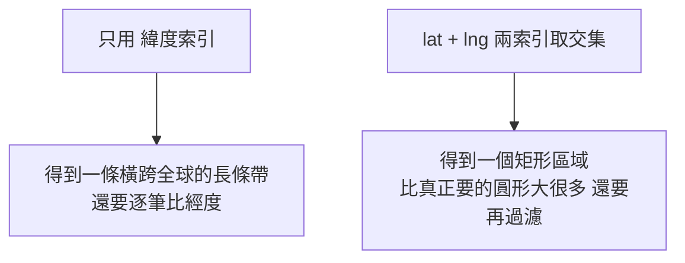

# Geospatial Index 地理空間索引

> 08 索引最後一塊。面試經典:**「找我附近 5 公里的餐廳/司機」**。一句話:一般索引只懂**一維**(一個 ID),但地理是**二維**(經緯度),需要專門索引把「2D 鄰近」變成可快速過濾的查詢。

## 1. 為什麼 B-Tree / Hash 不夠用?

[[btree|B-Tree]] / [[hash-index|Hash]] 的 key 是**一維**(整數 ID 排成一條線)。但地理座標是**二維**(lng 經度, lat 緯度),典型查詢是「某點半徑 5km 內」「某城市多邊形內」。

**那用兩個一維 B-Tree(lat 一個、lng 一個)不行嗎?**



兩種都很差 → 需要**專門的空間索引**,直接框出貼近的候選區。

## 2. 五種主流技術

### ① [[geohash|Geohash]] — 把 2D 壓成 1D 字串
把經緯度編碼成一個 Base32 字串,**前綴越長 = 範圍越小越精確**(`dr` 舊金山 → `dr5` 某區 → `dr5ru` 某街區)。
- 巧妙處:**相近的點通常共享前綴** → 於是「2D 鄰近」變成「字串前綴/範圍查詢」,**直接套用現成的 [[btree|B-Tree]]**!
- ⚠️ [[boundary-effect|邊界效應]]:剛好落在格子兩側的兩點,即使現實只隔一條馬路,前綴可能完全不同。
- 用於:Redis GEO (`GEOADD`/`GEORADIUS`)、MongoDB、Elasticsearch。

### ② [[quadtree|QuadTree 四分樹]] — 遞迴切四等份
一個矩形區域資料太多,就切成 4 個子象限(NE/NW/SE/SW),遞迴到每塊夠稀疏。
- 優點:**動態精度**(密集區自動切更細)。
- 缺點:要專門樹結構(不能像 Geohash 直接用 B-Tree);是 R-Tree 的概念基礎。

### ③ [[r-tree|R-Tree]] — 彈性可重疊矩形(生產標準)
用**有彈性、可重疊的矩形** [[mbr|MBR]] 依**實際資料分布**包覆分組(不像 QuadTree 硬切四等份)。
- 比喻:整理桌上照片,把靠近的自然分一組(組可重疊)。
- 優勢:**同一索引能同時處理「點 + 大型形狀」**(餐廳點、外送多邊形、道路網)、磁碟友好。
- 代價:矩形重疊時一次查詢可能要走訪多個分支。
- ✅ **現代生產環境的標準選擇**(PostGIS、SQLite)。

### ④ [[s2|Google S2]] 與 ⑤ [[h3|Uber H3]] — 把地球切成格子給 cell 編號
- **S2**:地球投影到**立方體**,每面切小四邊形 cell,每 cell 一個 ID,精度可調(level 0–30)。靠近極區會變形。用於 Google Maps、Foursquare。
- **H3**:地球投影到**二十面體**,切**六邊形** cell(分布更均勻)。`k_ring` 找中心格半徑 k 內所有六邊形,適合鄰近搜尋 + 分散式聚合(熱力圖)。用於 Uber 叫車/外送。

> 共通最後一步:不論用哪種索引**先框出候選**,最後都要用**精確距離公式 [[haversine|Haversine]]** 把「矩形/格子裡但其實在圓外」的濾掉。

## 3. 一張表比較

| 技術 | 原理 | 優點 | 缺點 |
|---|---|---|---|
| Geohash | 2D→1D 字串,套 B-Tree | 簡單、直接用現有 B-Tree | 邊界效應、矩形不貼圓 |
| QuadTree | 遞迴切四等份 | 結構簡單、動態精度 | 固定切割、需專門結構 |
| R-Tree | 可重疊矩形 MBR | 點+多邊形、磁碟友好(**生產標準**) | 重疊致多路搜尋 |
| S2 | 立方體切四邊形 | 精度可調、適合地圖切片 | 極區變形、實作複雜 |
| H3 | 二十面體切六邊形 | 六邊形均勻、適合鄰近+聚合 | 需特殊函式庫 |

---

### 收尾小考(待會在聊天回答)
1. 為什麼「兩個一維 B-Tree(lat、lng)」做鄰近搜尋效果不好?
2. Geohash 用什麼巧妙手法,讓 2D 鄰近查詢可以直接套用 B-Tree?
3. R-Tree 跟 QuadTree 最核心的差異?哪個是生產標準?

```glossary
{
  "geospatial-index": { "term": "Geospatial Index 地理空間索引", "short": "針對二維(經緯度)資料的索引,支援「附近/範圍/多邊形內」查詢。常見:[[geohash|Geohash]]、[[quadtree|QuadTree]]、[[r-tree|R-Tree]]、[[s2|S2]]、[[h3|H3]]。" },
  "geohash": { "term": "Geohash", "short": "把經緯度編碼成 Base32 字串,前綴越長越精確;相近點共享前綴,於是可用 [[btree|B-Tree]] 做前綴/範圍查。缺點:[[boundary-effect|邊界效應]]。" },
  "boundary-effect": { "term": "Boundary Effect 邊界效應", "short": "兩點剛好落在相鄰格子的兩側時,即使現實很近,Geohash 前綴卻可能完全不同(馬路兩側餐廳)。" },
  "quadtree": { "term": "QuadTree 四分樹", "short": "把一塊區域遞迴切成 4 個子象限(NE/NW/SE/SW),資料密集處自動切更細。是 [[r-tree|R-Tree]] 的概念基礎。" },
  "r-tree": { "term": "R-Tree", "short": "用彈性、可重疊的矩形 [[mbr|MBR]] 依實際資料分布分組;能同時處理點與多邊形、磁碟友好。PostGIS/SQLite 的生產標準。" },
  "mbr": { "term": "MBR 最小邊界矩形", "short": "Minimum Bounding Rectangle:剛好把一組物件包起來的最小矩形,R-Tree 用它分組。" },
  "s2": { "term": "Google S2", "short": "把地球投影到立方體、每面切小四邊形 cell 並給唯一 ID,精度可調(level 0–30)。極區會變形。" },
  "h3": { "term": "Uber H3", "short": "把地球投影到二十面體、切六邊形 cell(分布均勻);k_ring 找半徑 k 內所有格,適合鄰近搜尋與聚合。" },
  "haversine": { "term": "Haversine 距離公式", "short": "依經緯度算地球表面兩點的實際大圓距離。空間索引先框候選,最後用它過濾「在矩形/格子內但其實在圓外」的點。" },
  "btree": { "term": "B-Tree / B+Tree Index", "short": "為讀優化的平衡多叉樹索引,處理一維有序 key;支援等值 O(log n)+範圍+排序。Geohash 把 2D 轉 1D 字串後就能借它。" },
  "hash-index": { "term": "Hash Index 雜湊索引", "short": "用 hash 把 key 算成 bucket,等值查詢 O(1);順序被打亂,不支援範圍——所以也不適合地理鄰近。" }
}
```
