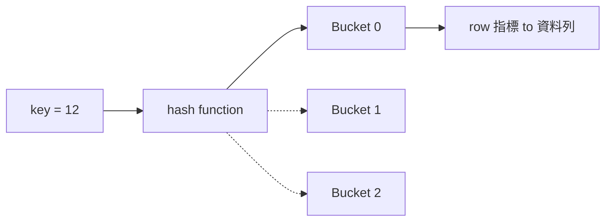

# Hash Index 雜湊索引

> 索引家族第 3 種。一句話:**用一個算式把 key 直接算成「存放位置」,等值查詢快到接近 [[o1|O(1)]]——但完全不支援範圍查詢。**

## 1. 核心概念

[[hash-index|Hash Index]] 用一個 [[hash-function|雜湊函數]] 把 key 換算成一個位置編號([[bucket|bucket]]),查資料時直接算出位置、一步跳到,不用像 [[btree|B-Tree]] 那樣一層層往下找。

- ✅ 超強項:**[[equality-lookup|等值查詢]]**(`WHERE id = 123`)——算一次就定位。
- ❌ 死穴:**[[range-query|範圍查詢]]** 與排序(`WHERE id > 100`、`ORDER BY`)——因為雜湊會**打亂順序**,相鄰的 key 被算到完全不相干的位置。

```
WHERE id = 12   →  hash(12)=0 → 直接看 Bucket 0 → 找到   ≈ O(1)
WHERE id > 10   →  順序沒了,只能把每個 bucket 掃一遍   = O(n)
```

## 2. 結構三件套



1. **[[hash-function|雜湊函數]]**:把 key 轉成一個數字(hash code),例如 `hash(key) = key % 4`。
2. **[[hash-table|雜湊表]]**:一排 [[bucket|bucket]],每個 bucket 指向實際的資料記錄。
3. **[[collision|碰撞處理]]**:不同 key 算到**同一個 bucket** 時要有對策。

## 3. 碰撞 (Collision) 怎麼辦

兩個不同 key 算出同一個位置,叫 [[collision|碰撞]]。例:`key=8` 和 `key=12`,`%4` 都等於 0,都想住 Bucket 0。兩種解法:

- **[[chaining|鏈結法 Chaining]]**:那個 bucket 裡放一條 linked list,把多筆串起來;查的時候到 bucket 再逐一比對。
- **[[open-addressing|開放位址法 Open Addressing]]**:這格滿了,就往**鄰近的空格**找位置放。

## 4. 查詢流程(查 `id = 12`)

1. 算 `hash(12) = 0`
2. 跳到 Bucket 0(若有碰撞,比對串在這裡的幾筆)
3. 拿到 row 指標 → 讀真正的資料頁

## 5. 優缺點

- ✅ **優點**:等值查詢接近 [[o1|O(1)]]、插入快(算 hash 直接放)、空間利用率可以很高。
- ❌ **缺點**:不支援範圍/排序、要處理碰撞、**[[rehash|擴容 (rehash)]] 成本高**(bucket 太滿時要重算整批,很貴)。

## 6. Hash Index vs B-Tree

| 特性 | Hash Index | B-Tree Index |
|---|---|---|
| 等值查詢 | 很快 (O(1)) | O(log n) |
| 範圍查詢 | ❌ 不支援 | ✅ 高效(有序) |
| 排序 ORDER BY | ❌ 不支援 | ✅ 支援 |
| 寫入開銷 | 較低 | 較高(要維持平衡) |
| 預設選擇 | 特定等值場景 | **通用預設** |

> 心智模型:**B-Tree 是「有序的書 + 索引頁」(能翻範圍);Hash 是「直接報座位號」(只認單一座位,不知道隔壁是誰)。**

## 7. 實際應用

- **MySQL**:InnoDB 預設 [[btree|B+Tree]];Memory/HEAP 引擎才支援 Hash Index。
- **Redis**:底層就是一張大 Hash Table。
- **[[sharding|分散式 sharding]]**:常用 `hash(key)` 決定一筆資料該落在哪個節點——這也呼應之前學的 [[consistent-hashing|一致性雜湊]]。

---

### 收尾小考(待會在聊天回答)
1. 為什麼 Hash Index **不能**做範圍查詢?
2. 碰撞的兩種處理方式?
3. 什麼情況該選 Hash 而不是 B-Tree?

```glossary
{
  "hash-index": { "term": "Hash Index 雜湊索引", "short": "用 [[hash-function|雜湊函數]] 把 key 直接算成存放位置,等值查詢接近 [[o1|O(1)]];但雜湊打亂順序,不支援範圍查詢。" },
  "hash-function": { "term": "Hash Function 雜湊函數", "short": "把任意 key 換算成固定範圍數字(hash code)的算式,例如 key % 4。相同輸入永遠得到相同輸出。" },
  "hash-table": { "term": "Hash Table 雜湊表", "short": "一排 [[bucket|bucket]] 組成的結構;用 key 算出索引直接定位,平均存取 [[o1|O(1)]]。" },
  "bucket": { "term": "Bucket 桶", "short": "雜湊表裡的一格,存放被算到這個位置的資料(或指向資料的指標)。" },
  "collision": { "term": "Collision 碰撞", "short": "兩個不同 key 被雜湊到同一個 [[bucket|bucket]]。用 [[chaining|鏈結法]] 或 [[open-addressing|開放位址法]] 解決。" },
  "chaining": { "term": "Chaining 鏈結法", "short": "碰撞時,bucket 內用 linked list 串起多筆;查詢到該 bucket 再逐筆比對。" },
  "open-addressing": { "term": "Open Addressing 開放位址法", "short": "碰撞時不串列,改往鄰近的空 bucket 找位置放(線性探測等)。" },
  "equality-lookup": { "term": "Equality Lookup 等值查詢", "short": "找「剛好等於某值」的查詢,如 WHERE id = 123。Hash Index 的主場。" },
  "range-query": { "term": "Range Query 範圍查詢", "short": "找「一段範圍」的查詢,如 WHERE id > 100 或 BETWEEN。需要 key 有序,Hash Index 做不到、B-Tree 擅長。" },
  "rehash": { "term": "Rehash 擴容重算", "short": "bucket 太滿(碰撞變多)時,擴大雜湊表並把所有 key 重新計算位置——成本高。" },
  "o1": { "term": "O(1) 常數時間", "short": "不論資料多少,操作步數幾乎固定。Hash 等值查詢的理想複雜度。" },
  "btree": { "term": "B-Tree / B+Tree Index", "short": "為讀優化的平衡多叉樹索引;支援等值 O(log n) + 範圍 + 排序,是索引的通用預設。B+Tree 葉節點用 linked list 串接,範圍查詢更強。" },
  "consistent-hashing": { "term": "Consistent Hashing 一致性雜湊", "short": "把節點與 key 雜湊到同一個環上,節點增減只搬動相鄰一段 key;比取模雜湊(N 一變幾乎全搬)適合擴縮容。", "deeper": "一致性雜湊和這裡的 Hash Index 有什麼關係與差別?" },
  "sharding": { "term": "Sharding 分片", "short": "把資料水平切到多個節點;常用 hash(key) 決定落點,以分散負載。" }
}
```
