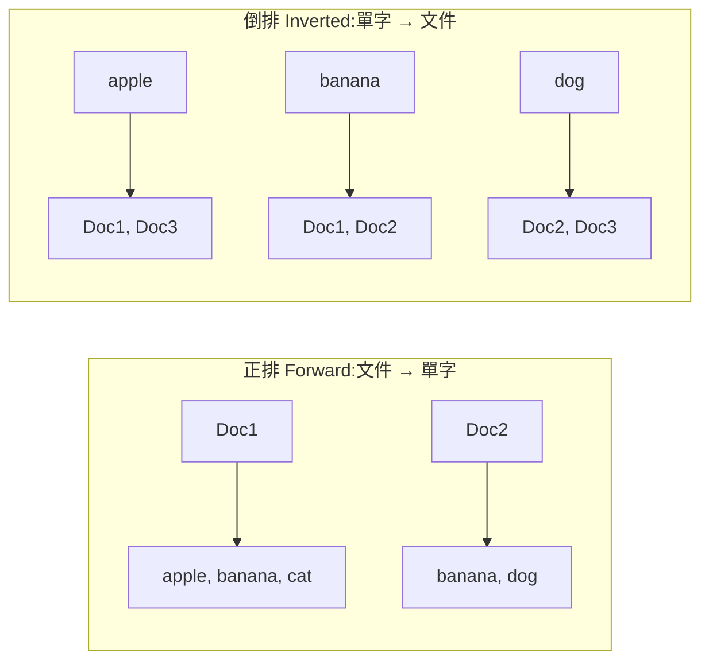

# Inverted Index 倒排索引

> 08 索引第 5 種(最後一個!)。**全文搜尋的核心**——Google、Elasticsearch 都靠它。一句話:建一張「**單字 → 出現在哪些文件**」的對照表,搜尋時直接跳到該單字的文件清單,不用掃過每一篇文章。

## 1. 為什麼需要它?

要找「**包含單字 apple 的所有文件**」:
- 沒索引:把每篇文件從頭讀到尾找有沒有 apple → **O(n × 文件大小)**,海量文件下完全不可行。
- 有 [[inverted-index|倒排索引]]:查表 `apple → [Doc1, Doc3]`,**一步拿到答案**。

## 2. 正排 vs 倒排(名字的由來)



- **[[forward-index|正排索引]]**:`文件 → 它有哪些字`(像「每篇文章的單字表」)。
- **[[inverted-index|倒排索引]]**:`單字 → 它出現在哪些文件`(把上面的關係**反過來**,所以叫「倒排」)。全文搜尋要的是後者。

## 3. 兩個核心資料結構

1. **[[term-dictionary|Term Dictionary 詞典]]**:所有出現過的單字 (term) 的集合。
2. **[[posting-list|Posting List 倒排表]]**:每個 term 對應一條清單,記它出現在哪些文件。每個 entry(一個 [[posting|posting]])可帶:
   - `docID`(哪份文件)
   - [[tf|TF 詞頻]](在該文件出現幾次,用於排序相關性)
   - `positions`(在文件中的第幾個位置,用於 [[phrase-query|片語查詢]])

例:`apple → [(Doc1, pos=[2,7]), (Doc3, pos=[5])]`

## 4. 查詢怎麼運作

| 查詢 | 做法 |
|---|---|
| 單詞 `apple` | 直接取 posting list → `[Doc1, Doc3]` |
| `apple AND dog` | 兩條 posting list **取交集** → `[Doc3]` |
| `apple OR banana` | 兩條 posting list **取聯集** |
| 片語 `"apple pie"` | 用 positions:只有當 apple 的位置 +1 = pie 的位置才算命中 |

## 5. 優缺點

- ✅ **優點**:查詢極快(term 直接跳 posting list)、支援布林/片語檢索、天生適合全文搜尋。
- ❌ **缺點**:
  - **建立成本高**:要先 [[tokenize|斷詞]] + [[normalize|正規化]](轉小寫、去 [[stop-words|stop words]])。
  - **儲存成本高**:posting list 很大,需壓縮(VarInt、Roaring Bitmap)。
  - **更新貴**:每次增刪文件都要改動倒排表。

## 6. 實際應用

- 搜尋引擎:**Elasticsearch / Solr / OpenSearch**(底層都是 [[lucene|Lucene]])、Google。
- 資料庫全文搜尋:PostgreSQL `to_tsvector()`、MySQL `FULLTEXT` 的 `MATCH ... AGAINST`。
- 程式碼搜尋:VSCode、Sourcegraph。

---

### 收尾小考(答完這課就全通了!)
1. 正排索引 vs 倒排索引,核心差別是什麼?
2. `apple AND dog` 在倒排索引裡是怎麼算出來的?
3. 隨便舉一個用倒排索引的知名系統。

```glossary
{
  "inverted-index": { "term": "Inverted Index 倒排索引", "short": "建「單字 → 出現在哪些文件」的對照表,全文搜尋時直接跳到該詞的文件清單。對比 [[forward-index|正排索引]]。" },
  "forward-index": { "term": "Forward Index 正排索引", "short": "「文件 → 它包含哪些單字」的對照;倒排索引就是把這個關係反過來。" },
  "term-dictionary": { "term": "Term Dictionary 詞典", "short": "倒排索引中所有出現過的單字 (term) 的集合,查詢先在這裡定位 term。" },
  "posting-list": { "term": "Posting List 倒排表", "short": "一個 term 對應的清單,記它出現在哪些文件;布林查詢就是對多條 posting list 做交集/聯集。" },
  "posting": { "term": "Posting", "short": "Posting list 裡的一筆,通常含 docID、[[tf|詞頻 TF]]、以及位置 positions(供片語查詢)。" },
  "tf": { "term": "TF 詞頻 (Term Frequency)", "short": "一個詞在某文件出現的次數,用來衡量相關性、為搜尋結果排序。" },
  "phrase-query": { "term": "Phrase Query 片語查詢", "short": "查「apple pie」這種連續詞;靠 posting 裡的 positions,只有 apple 位置 +1 = pie 位置才算命中。" },
  "tokenize": { "term": "Tokenize 斷詞", "short": "把一段文字切成一個個單字 (token),是建倒排索引的第一步。中文斷詞尤其麻煩。" },
  "normalize": { "term": "Normalize 正規化", "short": "把 token 統一處理:轉小寫、還原詞形、去除 [[stop-words|stop words]],讓 Apple/apple 視為同一詞。" },
  "stop-words": { "term": "Stop Words 停用詞", "short": "the、a、is 這類超高頻但沒鑑別力的詞,建索引時通常濾掉以省空間。" },
  "lucene": { "term": "Apache Lucene", "short": "開源全文搜尋函式庫,Elasticsearch / Solr / OpenSearch 的底層引擎。" }
}
```
