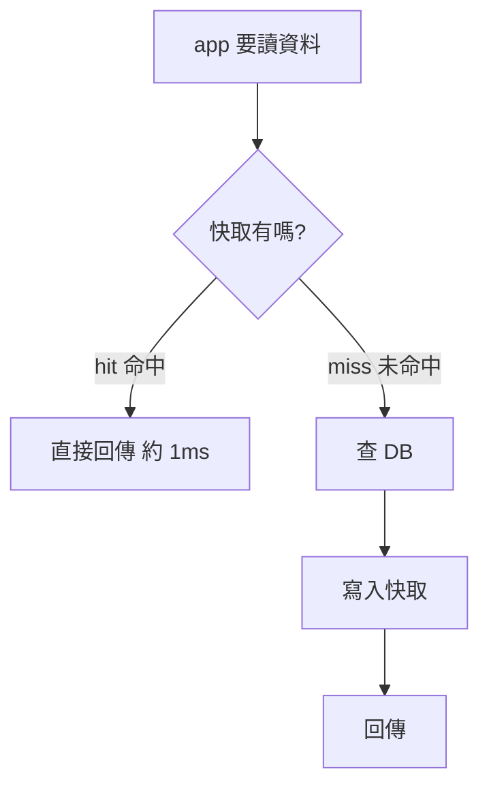

<!-- 2026-06-11 已入庫 KG:Caching Fundamentals & Layers (303a076e)、Cache Patterns: Read axis vs Write axis (37fbb7f9)、Cache Eviction Policies (f150e9ff)、Cache Problems: Stampede/Consistency/Hot Key (2991b33e);均 principle。 -->
# Caching 快取

> 高讀取流量幾乎一定要快取。從 Postgres 讀用戶資料約 **50ms**(資料在磁碟),從 [[redis-cache|Redis]] 記憶體快取只要 **1ms** → 快 50 倍。快取**降低 DB 負載 + 削減延遲**,代價是引入「資料過時」與「失效」的新麻煩。

## 1. 在哪裡快取(由近到遠的層次)


- **[[external-cache|外部快取]]**(Redis / Memcached):獨立快取服務,所有 app server **共用同一份** → 擴展性好。**面試預設答案**;先從這出發,再按需加別層。
- **[[cdn|CDN]]**:地理分散的邊緣伺服器,把內容放到**離用戶最近**處。最穩妥的使用理由 = **大規模傳遞靜態媒體**(圖片/影片)。無 CDN 跨洲 +250~300ms;有 CDN 從附近邊緣 20~40ms。
- **[[client-side-cache|客戶端快取]]**:存在瀏覽器 / App 本地(HTTP cache、localStorage)。後端能控制的程度有限、易過時。
- **[[in-process-cache|行程內快取]]**:直接存在 app 行程的記憶體裡,**零網路呼叫**,比 Redis 更快。但**每台 instance 各有一份、不共享**。只適合「很少變、頻繁讀的小資料」(設定值、feature flag、熱 key);**不是 Redis 的替代品**。

> 延遲排序(低→高):**行程內 < 外部 Redis < CDN**(CDN 雖最慢,仍遠快於直連 origin)。

## 2. 四種快取架構模式

| 模式 | 怎麼運作 | 取捨 |
|---|---|---|
| Cache-Aside(旁載) | app 先查快取,miss 才查 DB 並寫回快取 | **最常見、面試預設**;miss 多一次延遲 |
| Write-Through(同步寫穿) | app 寫快取,快取**同步**寫 DB,兩者都成功才算數 | 快取永遠最新;寫入較慢、有 dual-write 風險 |
| Write-Behind(非同步回寫) | app 寫快取,快取**背景批次**寫 DB | 寫入超快;崩潰未 flush 會丟資料 |
| Read-Through(讀穿) | app 不碰 DB,miss 由**快取自己**去 DB 取 | CDN 本質就是這種;需特殊 library |

- **[[cache-aside|Cache-Aside]]**:只記一個模式就記這個。流程見下圖。
- **[[write-through|Write-Through]]** / **[[write-behind|Write-Behind]]** / **[[read-through|Read-Through]]**:點術語看差異。



## 3. 淘汰策略 (Eviction Policy)

快取記憶體有限,滿了要決定踢誰:
- **[[lru|LRU]]**(最近最少使用):踢最久沒用的。「最近用過很可能再用」→ **多數系統的預設**。
- **[[lfu|LFU]]**(最不常使用):踢存取次數最少的。適合長期持續熱門的 key(排行榜)。
- **[[fifo|FIFO]]**(先進先出):只看插入時間踢最舊的。忽略使用模式,**真實系統很少用**。
- **[[ttl|TTL]]**(存活時間):**本身不是淘汰策略**,而是給每個 key 設過期時間,常和 LRU/LFU 搭配,在新鮮度與記憶體間平衡。

## 4. 三大快取問題(面試重點)

- **[[cache-stampede|快取雪崩 Cache Stampede]]**:熱門 key 過期那一瞬間,大量請求同時 miss、一起打 DB,一個查詢瞬間變幾千個 → 打垮 DB。最有效解:**[[request-coalescing|請求合併 Single Flight]]**(只讓一個請求重建快取,其他等結果)。
- **[[cache-consistency|快取一致性]]**:快取與 DB 對同一資料回不同值(更新大頭照後,DB 新值但快取還是舊照)。**沒完美解**;常用「**寫入時失效快取**」(更新 DB 後刪掉快取項目,下次讀再以新值填充)+ 短 TTL + 接受 [[eventual-consistency|最終一致性]]。
- **[[hot-key|熱 Key]]**:單一 key 流量遠超其他(`user:taylorswift` 每秒幾百萬請求),壓垮某個 Redis 節點。解:**複製熱 key** 到多節點、加 [[in-process-cache|行程內備援]]、套 rate limiting。⚠️ 各副本的過期時間**別設成完全一樣**,以免同時過期又造成雪崩。

## 5. 面試怎麼談(五步)

**不要一上來就喊快取**,先確立「為什麼需要」(讀取密集 / 昂貴查詢 / DB CPU 過高 / 延遲需求),用大概數字量化,再說快取怎麼解。然後:

1. **確認瓶頸**(什麼慢、為何慢)
2. **決定快取什麼**(讀多、少變、取得貴的;想好 key 設計 `user:123:profile`)
3. **選架構**(預設 cache-aside;靜態內容提 CDN;極端熱 key 提行程內)
4. **設淘汰**(LRU 穩妥預設 + TTL 防過時)
5. **說明缺點**(失效?Redis 掛了降級查 DB + [[circuit-breaker|斷路器]]?雪崩用請求合併?)

> 核心取捨:快取讓讀取更快、降後端負載,但引入**資料過時 + 失效複雜度**。別什麼都快取——有時一個設計良好的 index 就夠了。

---

### 收尾小考(讀完在聊天回答)
1. 把 In-Process、Redis、CDN 依**延遲由低到高**排序。
2. Cache-Aside 跟 Write-Through 核心差在哪?
3. 什麼是 Cache Stampede?最有效的解法?
4. LRU / LFU / FIFO 哪個真實系統很少用,為什麼?
5. 極端熱門 key(名人個資)會造成什麼問題?怎麼解?

```glossary
{
  "redis-cache": { "term": "Redis (記憶體快取)", "short": "單節點記憶體快取,同區讀取 <1ms、單節點 10 萬+ 讀取/秒;是「外部快取」最常用的實作。" },
  "external-cache": { "term": "External Cache 外部快取", "short": "獨立的快取服務([[redis-cache|Redis]]/Memcached),所有 app server 共用同一份 → 擴展性好。面試預設答案。" },
  "cdn": { "term": "CDN 內容傳遞網路", "short": "地理分散的邊緣伺服器,把內容快取在離用戶最近處;最穩用途是大規模傳遞靜態媒體(圖片/影片)。本質是一種 [[read-through|read-through]] 快取。" },
  "client-side-cache": { "term": "Client-Side Cache 客戶端快取", "short": "存在瀏覽器/App 本地(HTTP cache、localStorage);後端可控程度有限、資料易過時。" },
  "in-process-cache": { "term": "In-Process Cache 行程內快取", "short": "直接存在 app 行程記憶體,零網路呼叫、比 Redis 更快;但每台 instance 各有一份不共享,只適合很少變的小資料。不是 Redis 的替代品。" },
  "cache-aside": { "term": "Cache-Aside 旁載快取", "short": "app 先查快取,miss 才查 DB 並把結果寫回快取。最常見、面試預設;只在需要時才快取。" },
  "write-through": { "term": "Write-Through 同步寫穿", "short": "app 寫快取,快取同步寫 DB,兩者都成功才算數。快取永遠最新但寫入較慢,仍有 dual-write 不一致風險。" },
  "write-behind": { "term": "Write-Behind 非同步回寫", "short": "app 只寫快取,快取在背景批次非同步寫 DB。寫入超快,但 flush 前崩潰會丟資料;適合高寫入吞吐 + 可接受最終一致。" },
  "read-through": { "term": "Read-Through 讀穿快取", "short": "app 不直接碰 DB,cache miss 由快取自己去 DB 取、存、回傳。是 write-through 的讀取對應;CDN 即此類。" },
  "lru": { "term": "LRU 最近最少使用", "short": "淘汰最久沒被存取的項目。「最近用過很可能再用」適應多數負載,是許多系統的預設淘汰策略。" },
  "lfu": { "term": "LFU 最不常使用", "short": "淘汰存取次數最少的項目;每 key 維護計數器。適合長期持續熱門的 key(熱門影片、排行榜)。" },
  "fifo": { "term": "FIFO 先進先出", "short": "只看插入時間,淘汰最早進來的;忽略使用模式可能踢掉熱門項,真實系統很少用。" },
  "ttl": { "term": "TTL 存活時間", "short": "給每個 key 設過期時間。本身不是淘汰策略,常搭配 [[lru|LRU]]/[[lfu|LFU]],在新鮮度與記憶體間平衡。" },
  "cache-stampede": { "term": "Cache Stampede 快取雪崩", "short": "熱門 key 過期瞬間大量請求同時 miss 一起打 DB,一個查詢變幾千個可能打垮 DB。又稱 thundering herd。" },
  "request-coalescing": { "term": "Request Coalescing 請求合併 (Single Flight)", "short": "雪崩最有效解:只讓一個請求去重建快取,其他請求等它的結果,避免同時打 DB。" },
  "cache-consistency": { "term": "Cache Consistency 快取一致性", "short": "快取與 DB 對同一資料回不同值。沒完美解;常用「寫入時失效快取」+ 短 TTL + 接受最終一致性。" },
  "hot-key": { "term": "Hot Key 熱 Key", "short": "單一 key 流量遠超其他,壓垮某個 Redis 節點。解:複製熱 key 到多節點、加行程內備援、套 rate limiting;副本過期時間別設成完全一樣。" },
  "eventual-consistency": { "term": "Eventual Consistency 最終一致性", "short": "不要求每刻一致,但保證沒有新更新後最終會收斂;feed/metrics 短暫延遲通常可接受。" },
  "circuit-breaker": { "term": "Circuit Breaker 斷路器", "short": "下游(如 Redis)故障時快速失敗、暫時不再呼叫,給它時間恢復;快取掛了可降級直接查 DB。" }
}
```
