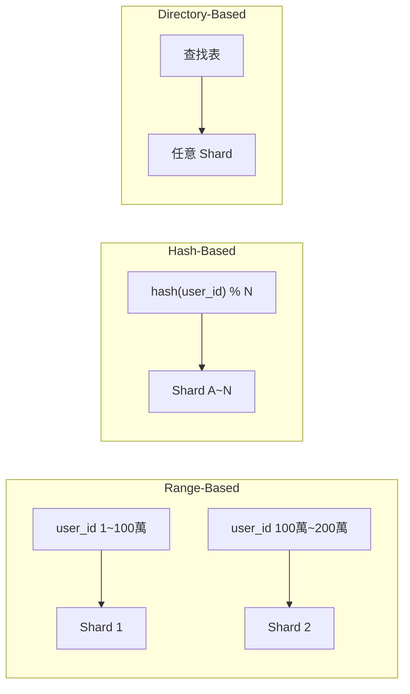
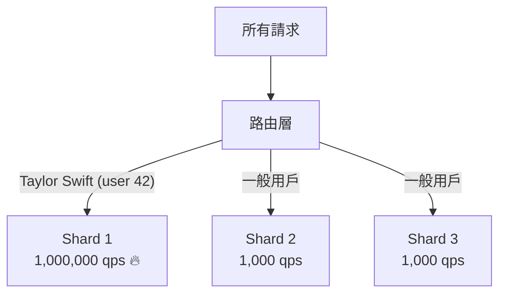
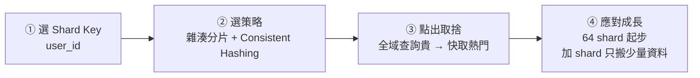

# Sharding 分片

> 單台資料庫跑不動了,怎麼辦?把資料拆散到多台機器。這就是 [[sharding|Sharding]] 的核心思路。

## 為什麼需要 Sharding?

流量成長,先靠 [[vertical-scaling|垂直擴展]](更大的機器)撐一段時間。但單台有天花板:即使 Amazon Aurora 也有約 **256 TB** 硬性限制。撞牆後只剩一條路 — 水平擴展,把資料分散到多台。

### Partitioning vs Sharding

這兩個詞常被混用,嚴格說:

| 術語 | 範圍 | 白話 |
|---|---|---|
| [[partitioning]] | 單一 DB instance 內 | 邏輯上切分,不增加機器 |
| [[sharding]] | 多台機器 | 每台各持部分資料,合起來才是完整資料集 |

- **水平分區 (Horizontal Partitioning)**:依 row 切(不同年份訂單放不同分區)。
- **垂直分區 (Vertical Partitioning)**:依 column 切(常用欄位一區,大欄位另一區)。
- **Sharding** = 把水平分區延伸到多台 — 每個 [[shard|shard]] 是獨立 DB,有自己的 CPU、記憶體、連線池。

## 兩個核心決策

拆資料前要想清楚兩件事:

1. **用哪個欄位分片** → [[shard-key|Shard Key]]
2. **怎麼把資料分配到各台機器** → [[sharding-strategy|Sharding 策略]]

### 好的 Shard Key 三條件

| 條件 | 意思 | 反例 |
|---|---|---|
| 高基數 | key 的不同值要夠多 | `is_premium`(布林,只有兩個 shard) |
| 均勻分佈 | 值能平均散落 | 國家碼(90% 用戶在同一國) |
| 契合查詢 | 最常見查詢只打一台 shard | `created_at`(新寫入全打最新 shard) |

好例子:用戶導向 App 用 `user_id`(高基數、均勻、多數查詢限定單一用戶)。

## 三種 Sharding 策略



- **[[range-based-sharding|Range-Based 範圍分片]]**:依連續值範圍分組。優點是支援高效範圍掃描;缺點是存取不均、`created_at` 會讓所有新寫入打同一個 shard。適合多租戶 SaaS(每家公司一段 ID 範圍)。

- **[[hash-based-sharding|Hash-Based 雜湊分片]]** — **面試預設首選**:對 shard key 雜湊再取模。`shard = hash(user_id) % 4`。分佈均勻,但增減 shard 時 `% 4` 變 `% 5` 幾乎每筆都要搬 → 這正是 [[consistent-hashing|Consistent Hashing]] 的用武之地。

- **[[directory-based-sharding|Directory-Based 目錄分片]]**:用查找表決定每筆放哪台。彈性最高,但每個請求多一次查找(延遲),且目錄服務本身成單點故障。**面試中很少是正解**。

## 三大挑戰

### 1. 熱點 (Hot Spot)

某些 shard 承受不成比例的流量,成為瓶頸。最典型是 **[[celebrity-problem|名人問題 (Celebrity Problem)]]**:用 `user_id` 分片,Taylor Swift 那個 shard 可能是普通用戶的 1000 倍流量。



**應對**:把熱 key 隔離到專屬 shard;用複合 shard key(`hash(user_id + date)`)讓同一用戶資料隨時間分散;動態 shard 拆分(MongoDB balancer、Vitess resharding)。

### 2. 跨 Shard 查詢

查詢模式和 shard key 不對齊時,必須同時打多個 shard、等全部回應、自行聚合 — 這叫 **[[scatter-gather|Scatter-Gather]]**。64 個 shard = 64 倍網路呼叫。

**最小化方式**:快取結果(熱門排行榜快取 5 分鐘);[[denormalization|反正規化]]把常一起查的資料放同一 shard;接受管理後台等罕見查詢慢一點。

> 面試心法:頻繁需要跨 shard 查詢通常是 **shard key 選錯**的訊號,要重新思考設計。

### 3. 維持一致性

單一 DB 的 transaction 簡單;sharding 後跨 shard transaction 很麻煩。教科書解法 **[[2pc|2PC (Two-Phase Commit)]]** 保證一致但慢又脆弱(任一 shard 失敗整個卡死)。

**實務做法**:
- 設計成**避免跨 shard transaction** — 用 `user_id` 分片就把一個用戶所有資料放他的 shard。
- 用 **[[saga-pattern|Saga 模式]]**:把操作拆成一連串步驟 + 補償動作(失敗就退款),代價是[[eventual-consistency|最終一致性]]。
- 接受**最終一致性**:粉絲數反正規化存多 shard,幾秒不同步沒問題。

## 現代資料庫怎麼處理 Sharding

你大概不需要從頭實作。主流資料庫各有機制:

| 資料庫 | 機制 |
|---|---|
| Cassandra | Murmur3Partitioner + 虛擬節點(Consistent Hashing) |
| DynamoDB | Partition key 雜湊路由,自動拆分/合併 |
| MongoDB | 範圍 chunk + background balancer 自動搬移 |
| PostgreSQL/MySQL | Vitess / Citus 開源 sharding 層 |
| 雲端 SQL | Aurora、Cloud Spanner 內建分散式 sharding |

面試說「用 DynamoDB 以 `user_id` 為 partition key」就夠了。

## 面試怎麼談 Sharding

**先確立瓶頸,再提 Sharding** — 過早分片是第一大錯誤。

三種常見瓶頸的說法:
- **儲存**:「5 億用戶 × 5KB = 2.5TB,現在還行,成長 10 倍就需分片。」
- **寫入吞吐**:「尖峰每秒 5 萬次寫入,單台撐不住。」
- **讀取吞吐**:「就算有 read replica,服務 1 億 DAU 仍需分片。」

公式:**確認瓶頸 → 解釋為什麼單台無法擴展 → 提出 Sharding**。

**社群媒體 App 逐步說明範例**:



> 一台調校良好的單台 DB 能走的路比多數人預期的遠 — **確認真的需要才分片**。

```glossary
{
  "sharding": {
    "term": "Sharding 分片",
    "short": "把資料拆散到多台機器,每台各持部分資料(稱為 [[shard|shard]]),合起來才是完整資料集。解決單台 DB 的儲存、讀寫吞吐瓶頸。",
    "deeper": "什麼情況下才應該引入 Sharding?如何向面試官證明必要性?"
  },
  "shard": {
    "term": "Shard 分片節點",
    "short": "Sharding 後每台機器所持有的那一部分資料。每個 shard 是獨立 DB,有自己的 CPU、記憶體、連線池。"
  },
  "partitioning": {
    "term": "Partitioning 分區",
    "short": "在單一 DB instance 內邏輯切分資料,不增加機器。分水平(依 row)和垂直(依 column)兩種。與 [[sharding|Sharding]] 的差別在於不跨機器。"
  },
  "vertical-scaling": {
    "term": "Vertical Scaling 垂直擴展",
    "short": "用更大、更強的單台機器(更多 CPU、記憶體、儲存)來應付流量。簡單但有天花板,終究需要水平擴展。"
  },
  "shard-key": {
    "term": "Shard Key 分片鍵",
    "short": "決定每筆資料要放哪個 shard 的欄位。好的 shard key 要高基數、均勻分佈、契合最常見的查詢模式。選錯會導致熱點或大量跨 shard 查詢。",
    "deeper": "為什麼 created_at 和 is_premium 都是爛的 shard key?"
  },
  "sharding-strategy": {
    "term": "Sharding Strategy 分片策略",
    "short": "決定如何把資料分配到各台機器。三種主要策略:[[range-based-sharding|範圍分片]]、[[hash-based-sharding|雜湊分片]]、[[directory-based-sharding|目錄分片]]。"
  },
  "range-based-sharding": {
    "term": "Range-Based Sharding 範圍分片",
    "short": "依連續值範圍分組(Shard 1 存 user 1~100 萬…)。支援範圍掃描,但存取模式通常不均勻;用時間戳分片容易造成熱點。"
  },
  "hash-based-sharding": {
    "term": "Hash-Based Sharding 雜湊分片",
    "short": "對 shard key 雜湊再取模決定 shard。分佈均勻,是面試預設首選。缺點是增減 shard 時大量資料需搬移,可搭配 [[consistent-hashing|Consistent Hashing]] 解決。",
    "deeper": "Hash-Based Sharding 增減節點為何需要 Consistent Hashing?"
  },
  "directory-based-sharding": {
    "term": "Directory-Based Sharding 目錄分片",
    "short": "用查找表記錄每筆資料放哪台。彈性最高,可把熱門資料搬到專屬 shard;但每個請求多一次查找(延遲),且目錄服務是單點故障。面試中很少是正解。"
  },
  "consistent-hashing": {
    "term": "Consistent Hashing 一致性雜湊",
    "short": "把節點與 key 都雜湊到同一個環上,增減節點時只需搬動環上相鄰的一小段 key,大幅減少搬移量。[[hash-based-sharding|雜湊分片]] 擴縮容的關鍵技術。"
  },
  "celebrity-problem": {
    "term": "Celebrity Problem 名人問題",
    "short": "熱點問題的典型案例:某個用戶(如 Taylor Swift)的流量遠超其他用戶,導致存放該用戶資料的 shard 過載成瓶頸。應對方式是把熱 key 隔離到專屬 shard 或使用複合 shard key。"
  },
  "scatter-gather": {
    "term": "Scatter-Gather 散集查詢",
    "short": "需要同時打多個 shard、等全部回應、再自行聚合結果的查詢模式。64 個 shard 就是 64 倍網路呼叫。頻繁出現是 shard key 設計不良的訊號。"
  },
  "denormalization": {
    "term": "Denormalization 反正規化",
    "short": "刻意讓資料重複存放,使常一起查詢的資料落在同一個 shard 或同一張表,減少跨 shard 查詢。代價是資料更新需同步多處。"
  },
  "2pc": {
    "term": "2PC Two-Phase Commit 兩階段提交",
    "short": "跨多節點保證 transaction 一致性的協定:先詢問所有參與者是否就緒(Prepare),全部同意後再送出 Commit。理論嚴謹但慢且脆弱,任一節點失敗就卡死。生產環境多避免使用。"
  },
  "saga-pattern": {
    "term": "Saga Pattern Saga 模式",
    "short": "把跨 shard 操作拆成一連串獨立步驟,每步驟失敗就執行補償動作(例如退款)。代價是[[eventual-consistency|最終一致性]]而非強一致,但比 [[2pc|2PC]] 更適合生產環境。"
  },
  "eventual-consistency": {
    "term": "Eventual Consistency 最終一致性",
    "short": "允許節點間資料暫時不同步,但保證在沒有新寫入後最終會收斂到相同值。適合容忍短暫不一致的場景(粉絲數、排行榜)。"
  }
}
```
