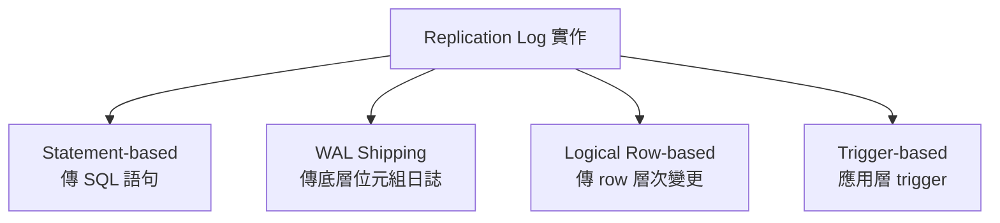
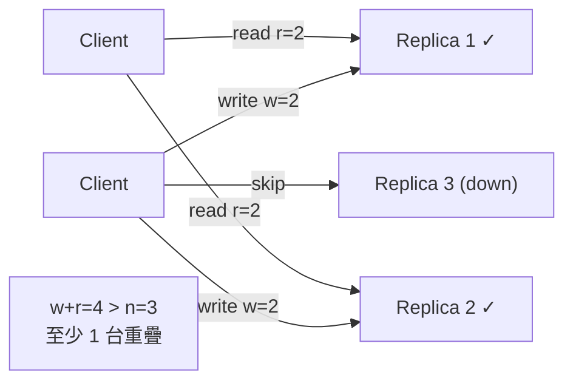

# Replication 複寫

> 把同一份資料的副本放在多台透過網路連接的機器上。難點不在「複製」，而在**資料持續更新時如何讓所有副本保持一致**。

## 為什麼需要 Replication？

[[replication|Replication]] 的三個核心動機：

- **降低延遲**：資料放在地理上靠近用戶處，讀取更快。
- **提升可用性**：某些節點失效時系統仍能運作。
- **擴展讀取吞吐量**：把讀取請求分散到多台機器。

三種主要架構：[[single-leader|Single-Leader]]、[[multi-leader|Multi-Leader]]、[[leaderless|Leaderless]]。

---

## 架構一：Single-Leader Replication

最常見、最直覺的做法。

- 指定一台 [[leader|Leader]]（主節點 / master / primary），**所有寫入必須先打到 Leader**。
- 其他叫 [[follower|Follower]]（從節點 / slave / read replica）。Leader 把每次寫入包成 [[replication-log|Replication Log]] 發給所有 Follower，Follower 照順序套用。
- 讀取可打 Leader 或任何 Follower，**寫入只能打 Leader**。

被 PostgreSQL、MySQL、MongoDB、Kafka、RabbitMQ 廣泛採用。

### 同步 vs 非同步 Replication

這是最關鍵的取捨之一：

| 模式 | 說明 | 優點 | 缺點 |
|---|---|---|---|
| [[sync-replication]] | Leader 等 Follower 回報才回應 client | Follower 保證有最新資料 | Follower 沒回應，整個寫入卡住 |
| [[async-replication]] | Leader 發出不等確認就回應 client | 寫入更快、可用性高 | Leader 掛掉時最後幾筆寫入永久消失 |
| [[semi-sync-replication]] | 一台同步、其他非同步 | 至少兩節點有最新資料 | 多一層設定複雜度 |

> 面試必考：同步保一致性但犧牲可用性；非同步保可用性但有資料遺失風險。沒有哪個更好，看系統需求。

### 新增 Follower（不停機）

不能直接複製檔案（DB 一直在寫，複製過程不一致）。標準流程：


快照對應 Replication Log 的精確位置——PostgreSQL 叫 **log sequence number**，MySQL 叫 **binlog coordinates**。

### 處理節點失效

- **Follower 失效：追趕恢復**。本地保留 Replication Log，重啟後向 Leader 請求中斷期間的變更，追上繼續。
- **Leader 失效：[[failover|Failover]]**。步驟：① 偵測失效（多用 timeout，如 30 秒）→ ② 選新 Leader（多數 replica 投票或由 controller 指定，選資料最新的）→ ③ 重新設定系統（client 寫入打新 Leader）。

**Failover 地雷**：

- 非同步下新 Leader 可能沒收到舊 Leader 最後幾筆寫入 → 通常被丟棄，違反持久性。
- [[split-brain|Split Brain]]：兩個節點同時以為自己是 Leader，都接受寫入 → 資料損毀。
- Timeout 難拿捏：太長恢復慢，太短忙時誤觸發。

### Replication Log 的四種實作



- **[[statement-based-replication|Statement-based]]**：傳 SQL 給 Follower 執行。問題：`NOW()`、`RAND()` 等非確定性函數在不同節點結果不同。MySQL 5.1 前用。
- **[[wal-shipping|WAL Shipping]]**：直接傳 storage engine 的預寫日誌。缺點：與 storage engine 緊耦合，升版本可能需停機。PostgreSQL、Oracle 用。
- **[[logical-log|Logical (row-based) Log]]**：用和 storage engine 分離的格式記錄 row 層次變更。Leader/Follower 可跑不同版本，是 [[cdc|CDC (Change Data Capture)]] 的基礎。MySQL binlog 用。
- **[[trigger-based-replication|Trigger-based]]**：把 replication 邏輯搬到應用層。Overhead 高，但需要只複製部分資料或跨不同 DB 類型時有用。

### Replication Lag 的三種問題

非同步下從 Follower 讀可能看到過時資料，這種暫時不一致叫 [[eventual-consistency|最終一致性 (Eventual Consistency)]]。

| 問題 | 描述 | 解法 |
|---|---|---|
| [[read-after-write]] | 用戶發貼文後馬上看不到（讀到還沒同步的 Follower） | 讀自己改過的資料時從 Leader 讀；或追蹤最後寫入 timestamp |
| [[monotonic-reads]] | 刷新後留言「消失了」（路由到 lag 更大的 Follower） | 同一用戶讀取永遠打同一台 replica（用 user ID hash 決定） |
| [[consistent-prefix-reads]] | 先看到答案才看到問題（因果順序顛倒） | 有因果關係的寫入寫到同一 partition；或用 [[version-vector]] |

---

## 架構二：Multi-Leader Replication

Single-Leader 弱點：所有寫入得通過那一台，連不到就寫不進去。[[multi-leader|Multi-Leader]] 讓多個節點都能接受寫入，每個 Leader 同時是其他 Leader 的 Follower。

> 面試提示：**單一 datacenter 內用 Multi-Leader 幾乎從不值得**；**跨多 datacenter 就完全不同**。

**適用場景**：多 datacenter 部署、離線操作（如手機日曆 App）、協作編輯（如 Google Docs）。

### Multi-Leader vs Single-Leader（跨 DC 比較）

| 面向 | [[single-leader]] | [[multi-leader]] |
|---|---|---|
| 效能 | 每次寫入跨網路到 Leader 所在 DC，增延遲 | 寫入在本地 DC 處理，跨 DC 延遲對用戶不可見 |
| DC 失效容忍 | Leader 所在 DC 掛了需 failover | 每個 DC 可獨立運作，恢復後再同步 |
| 網路問題 | 對 DC 間連線問題敏感 | 非同步可容忍暫時網路中斷 |

### 處理寫入衝突

Multi-Leader 最大挑戰：A、B 同時在不同 Leader 改同一份資料都成功，非同步複製後衝突。

- **[[conflict-avoidance|衝突迴避 (Conflict Avoidance)]]**：確保特定記錄所有寫入走同一 Leader（路由到同一 DC）。DC 掛了就失效。
- **[[lww|Last Write Wins (LWW)]]**：每寫入附 timestamp，取最大的為勝者，其他丟棄。簡單但丟資料。Cassandra 唯一支援的解法。
- **保留所有版本**：讓應用層或用戶自行決定如何合併。
- **自動合併研究方向**：[[crdt|CRDT (Conflict-free Replicated Datatypes)]]（集合/計數器/有序列表自動合理解衝突）、Operational Transformation（Google Docs 用）。

---

## 架構三：Leaderless Replication

完全拋棄 Leader，任何 replica 都能直接接受寫入。Amazon Dynamo 讓它重新流行；Riak、Cassandra、Voldemort 受啟發。

- **寫入**：client 同時發給所有 replica，夠多台成功回應就算成功（如 3 台中 2 台），忽略沒回應的。
- **讀取**：同時向多台發請求，用 version number 判斷哪個更新，以最新為準。

### 讓 Stale Replica 追上

- **[[read-repair|Read Repair]]**：client 並行讀多台，發現某台 version 舊就把新值寫回。對頻繁讀的值效果好。
- **[[anti-entropy|Anti-entropy Process]]**：背景持續掃描差異補資料。不保證順序，可能有明顯延遲。

### Quorum Reads 和 Writes

[[quorum|Quorum]] 條件：n 個 replica，寫入需 **w** 個確認，讀取需查 **r** 個。只要 **w + r > n**，讀取時至少有一個節點有最新資料。



常見配置：n=3, w=2, r=2（容忍一個失效）；n=5, w=3, r=3（容忍兩個失效）。

**Quorum 一致性的限制**：即使 w+r>n，[[sloppy-quorum|Sloppy Quorum]]、並發寫入的 clock skew、節點失效後舊資料恢復等情況仍可能讀到舊值。

### Sloppy Quorum 和 Hinted Handoff

網路中斷讓 client 連不到原本該存資料的 n 台「家」節點時：

- **[[sloppy-quorum|Sloppy Quorum]]**：接受寫入，暫存到現在連得到的其他節點（不在原 n 台裡）。提升寫入可用性，但即使 w+r>n 也無法保證讀到最新。
- **[[hinted-handoff|Hinted Handoff]]**：網路恢復後把臨時保管的寫入送回「家」節點（像沒帶鑰匙借住鄰居家，拿到鑰匙再回家）。

---

## 面試應用速查

| 場景 | 推薦架構 | 關鍵考量 |
|---|---|---|
| 讀取密集（社群媒體） | [[single-leader]] + read replica | Replication lag、read-after-write |
| 高可用（不能停機） | Single-leader + automatic [[failover]] | Split brain、資料遺失風險 |
| 多 DC 全球部署 | [[multi-leader]] | 衝突解法（LWW / CRDT） |
| 高可用 + 寫入擴展 | [[leaderless]] + [[quorum]] | LWW 資料遺失，最終一致性 |

> 面試黃金原則：永遠討論取捨；主動提 replication lag 與解法；用數字支撐決策（「每秒 50,000 讀取 → 需三台 read replica，lag 通常 <100ms 可接受」）。

```glossary
{
  "replication": {
    "term": "Replication 複寫",
    "short": "把同一份資料的副本放在多台透過網路連接的機器上，目的是降低延遲、提升可用性、擴展讀取吞吐量。難點在於資料持續更新時讓所有副本保持一致。",
    "deeper": "三種 replication 架構各自最適合什麼場景？"
  },
  "single-leader": {
    "term": "Single-Leader Replication 單主複寫",
    "short": "一台 [[leader|Leader]] 負責所有寫入，其他 [[follower|Follower]] 只能接受讀取並從 Leader 同步資料。最常見、最直覺，被 PostgreSQL、MySQL、MongoDB 廣泛採用。"
  },
  "multi-leader": {
    "term": "Multi-Leader Replication 多主複寫",
    "short": "多個節點都能接受寫入，每個 Leader 同時是其他 Leader 的 Follower。適合跨 datacenter 部署、離線操作、協作編輯。代價是需要處理[[conflict-avoidance|寫入衝突]]。"
  },
  "leaderless": {
    "term": "Leaderless Replication 無主複寫",
    "short": "完全沒有 Leader，任何 replica 都能直接接受寫入。用 [[quorum|Quorum]] 條件 w+r>n 保證讀寫重疊。Riak、Cassandra 採用此架構。"
  },
  "leader": {
    "term": "Leader 主節點",
    "short": "Single-Leader 架構中唯一接受寫入的節點，也叫 master 或 primary。把每次寫入包成 [[replication-log|Replication Log]] 發給所有 [[follower|Follower]]。"
  },
  "follower": {
    "term": "Follower 從節點",
    "short": "從 [[leader|Leader]] 接收並套用 [[replication-log|Replication Log]] 的節點，也叫 slave、read replica。可以接受讀取，但不能接受寫入。"
  },
  "replication-log": {
    "term": "Replication Log 複寫日誌",
    "short": "Leader 把每次寫入記錄成的日誌，發給所有 Follower 讓它們照順序套用，確保副本資料一致。實作方式有 statement-based、WAL shipping、logical row-based 等。"
  },
  "sync-replication": {
    "term": "Synchronous Replication 同步複寫",
    "short": "Leader 等 Follower 回報成功才通知 client 完成。保證 Follower 有最新資料（一致性），但 Follower 沒回應時整個寫入卡住（犧牲可用性）。"
  },
  "async-replication": {
    "term": "Asynchronous Replication 非同步複寫",
    "short": "Leader 發出寫入不等 Follower 確認就回應 client。寫入更快、可用性高，但 Leader 在 Follower 同步前掛掉，那些寫入永久消失（資料遺失風險）。"
  },
  "semi-sync-replication": {
    "term": "Semi-synchronous Replication 半同步複寫",
    "short": "保持一台 Follower 同步、其他非同步。至少兩個節點（Leader + 一台 Follower）有最新資料，兼顧一致性與可用性的折衷做法。"
  },
  "failover": {
    "term": "Failover 故障轉移",
    "short": "Leader 失效時，把某台 Follower 提升為新 Leader 的過程。挑戰包括：非同步下資料遺失、[[split-brain|Split Brain]]、timeout 門檻難拿捏。"
  },
  "split-brain": {
    "term": "Split Brain 腦裂",
    "short": "兩個節點同時以為自己是 Leader，都接受寫入，導致資料損毀。防範方式：用 fencing token 確保舊 Leader 完全下線後新 Leader 才接管。"
  },
  "statement-based-replication": {
    "term": "Statement-based Replication 語句複寫",
    "short": "Leader 把每個 SQL 語句傳給 Follower 執行。問題：NOW()、RAND() 等非確定性函數在不同節點結果不同，造成不一致。MySQL 5.1 前使用。"
  },
  "wal-shipping": {
    "term": "WAL Shipping 預寫日誌傳送",
    "short": "把 storage engine 做崩潰恢復的 WAL（Write-Ahead Log）直接傳給 Follower。缺點：與 storage engine 緊耦合，升版本可能需停機。PostgreSQL、Oracle 使用。"
  },
  "logical-log": {
    "term": "Logical (Row-based) Log 邏輯日誌",
    "short": "用和 storage engine 分離的格式記錄 row 層次變更。Leader/Follower 可跑不同版本，易被外部解析，是 [[cdc|CDC]] 的基礎。MySQL binlog 使用。"
  },
  "trigger-based-replication": {
    "term": "Trigger-based Replication 觸發器複寫",
    "short": "把 replication 邏輯搬到應用層（trigger + stored procedure）。Overhead 高，但需要只複製部分資料或跨不同 DB 類型時有用。"
  },
  "cdc": {
    "term": "CDC Change Data Capture 變更資料擷取",
    "short": "擷取資料庫 row 層次的所有變更（insert、update、delete）並推送到下游系統。[[logical-log|Logical Log]] 是其常見實作基礎。"
  },
  "eventual-consistency": {
    "term": "Eventual Consistency 最終一致性",
    "short": "允許節點間資料暫時不一致，但保證在沒有新寫入後，所有節點最終會收斂到相同的值。非同步 replication 帶來的典型一致性模型。"
  },
  "read-after-write": {
    "term": "Read-After-Write Consistency 讀自己剛寫",
    "short": "用戶寫入後立刻讀卻看到舊值（被路由到還沒同步的 Follower）。解法：讀自己可能改過的資料時從 Leader 讀，或追蹤最後寫入 timestamp 確保讀取夠新的 replica。"
  },
  "monotonic-reads": {
    "term": "Monotonic Reads 單調讀取",
    "short": "同一用戶先讀到一份資料，刷新後卻看到更舊的版本（時光倒流）。解法：確保同一用戶的讀取永遠打同一台 replica（用 user ID hash 決定）。"
  },
  "consistent-prefix-reads": {
    "term": "Consistent Prefix Reads 因果一致讀取",
    "short": "讀者因不同 partition 的 lag 不同，先看到答案才看到問題（因果順序顛倒）。解法：有因果關係的寫入寫到同一 partition，或用 [[version-vector|Version Vector]] 追蹤依賴。"
  },
  "version-vector": {
    "term": "Version Vector 版本向量",
    "short": "多 replica 各自維護自己的 version number，組成的集合可追蹤因果依賴，判斷哪些寫入是「並發的」（互不知情）、哪些有先後順序。有時也叫 vector clock。"
  },
  "conflict-avoidance": {
    "term": "Conflict Avoidance 衝突迴避",
    "short": "Multi-Leader 中，確保特定記錄所有寫入都走同一 Leader（路由到同一 DC），從根源避免衝突。缺點：那個 DC 掛了就失效。"
  },
  "lww": {
    "term": "Last Write Wins LWW 最後寫入獲勝",
    "short": "每次寫入附上 timestamp，取最大的為勝者，其他丟棄。實作簡單，但並發寫入只有一個存活，其他靜默丟棄，犧牲持久性。Cassandra 採用此策略。"
  },
  "crdt": {
    "term": "CRDT Conflict-free Replicated Datatypes 無衝突複製資料類型",
    "short": "設計成自動合理解衝突的資料結構，如集合、計數器、有序列表，不需人工介入即可在多 replica 間收斂。Riak 2.0 原生支援，Cassandra 有計數器類型。"
  },
  "quorum": {
    "term": "Quorum 法定多數",
    "short": "n 個 replica，寫入需 w 個確認，讀取需查 r 個；只要 w+r>n，讀寫節點必有重疊，保證至少讀到一份最新資料。常見配置：n=3, w=2, r=2。"
  },
  "sloppy-quorum": {
    "term": "Sloppy Quorum 寬鬆法定多數",
    "short": "原本該存資料的 n 台「家」節點連不到時，接受寫入到其他可達節點（不在原 n 台裡）。提升寫入可用性，但即使 w+r>n 也無法保證讀到最新。配合 [[hinted-handoff|Hinted Handoff]] 使用。"
  },
  "hinted-handoff": {
    "term": "Hinted Handoff 帶提示的交接",
    "short": "Sloppy Quorum 下，臨時保管節點在網路恢復後把寫入送回原本該存資料的「家」節點。像沒帶鑰匙借住鄰居家，拿到鑰匙再回家。"
  },
  "read-repair": {
    "term": "Read Repair 讀取修復",
    "short": "Leaderless 架構中，client 並行讀多台發現某台 version 舊，就把新值寫回那台。對頻繁讀的值效果好，是讓 stale replica 追上的方式之一。"
  },
  "anti-entropy": {
    "term": "Anti-entropy Process 反熵程序",
    "short": "背景持續掃描 replica 之間的差異並補資料。不保證順序，可能有明顯延遲，是讓 stale replica 追上的另一種方式。"
  }
}
```
