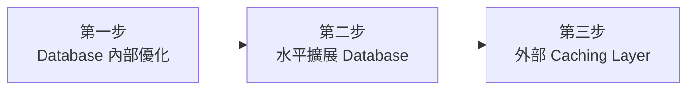
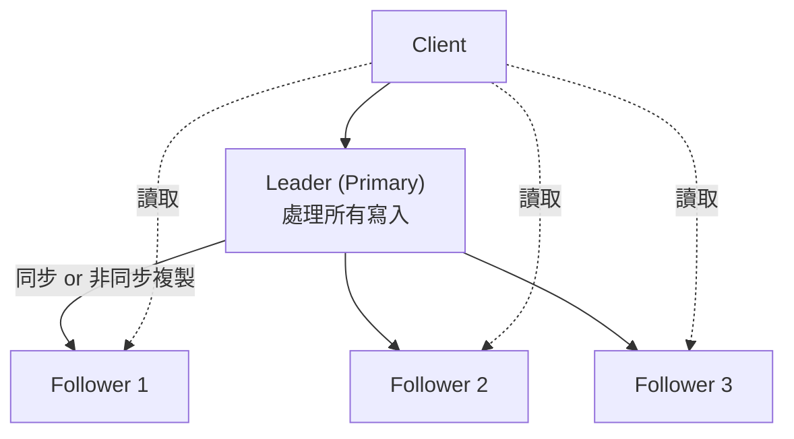

# 擴展讀取效能 (Scaling Reads)

> 一句話:**讀取流量成長速度遠快於寫入,物理限制終究會贏——要靠架構演進撐住。**

## 為什麼讀取是問題所在

Instagram 載入一個 feed 可能觸發超過 100 次讀取操作,但你一天可能只發一張照片(1 次寫入)。一般來說[[read-write-ratio|讀寫比]]起碼是 10:1,對內容型應用甚至達 100:1 以上。

讀取量一旦超過單台 database 的[[physical-limits|物理限制]](CPU、RAM、磁碟 I/O),加再多程式碼都沒有用。解法是**架構演進**,按以下三步依序走:



---

## 第一步：Database 內部優化

### Index（索引）

[[database-index|Index]] 是排好序的查找表,把複雜度從線性 O(n) 降到對數 O(log n)。以 100 萬筆資料為例:

- 沒有 index → [[full-table-scan|Full table scan]],讀遍全部 100 萬筆
- 有 index → 只查約 20 個 entry

常見類型:B-tree(一般查詢)、Hash index(精確比對)、特殊 index(全文搜尋、地理查詢)。

> 面試心法:對常 query、join、排序的欄位加 index。Index 加太少死掉的應用,遠比 index 加太多的多。

### 硬體升級（Vertical Scaling）

換 SSD、加 RAM、更快 CPU,能快速買到喘息空間,但無法解決根本問題。[[vertical-scaling|垂直擴展]]是面試裡的補充答案,不是核心解法。

### Denormalization（反正規化）

[[normalization|正規化]]把資料拆成多張表,查詢要大量 JOIN。[[denormalization|反正規化]]允許資料重複存放,換來更快的讀取:

| 設計方式 | 做法 | 讀取 | 寫入 |
|---|---|---|---|
| [[normalization]] | 資料分多表,用 JOIN 組合 | 慢(多表掃描) | 快(無冗余) |
| [[denormalization]] | 把相關資料放同一張表 | 快(單表查詢) | 慢(需更新多處) |

[[materialized-view|Materialized View]] 把這個概念再推進一步:把昂貴的聚合計算(例如商品平均評分)預先算好存起來,而不是每次頁面載入都重跑。

---

## 第二步：水平擴展 Database

當單一 database 撐到極限(粗略參考點:超過每秒 50,000–100,000 次讀取),就要加更多 server。

### Read Replica（讀取副本）

[[read-replica|Read replica]] 把 primary database 的資料複製到額外的 server 上。所有**寫入走 primary,讀取打任一 replica**,把讀取負載分散開來。

標準做法是 [[leader-follower|Leader-Follower Replication]]:



核心挑戰是 [[replication-lag|Replication Lag]]:

- **同步複製**：寫入後所有 replica 都確認才 commit,資料一致但**寫入延遲高**。
- **非同步複製**：寫入後立刻 commit,replica 稍後才同步,寫入快但**資料可能短暫不一致**。

### Database Sharding（分片）

[[sharding|Sharding]] 把資料分散到多個 database,讓每個 DB 的資料集變小、查詢更快。

- **[[functional-sharding|Functional Sharding]]（功能分片）**：依業務功能拆分,例如 user DB、product DB、likes DB。各業務讀寫負載彼此隔離。
- **[[geographic-sharding|Geographic Sharding]]（地理分片）**：美國用戶資料放美國 DB,歐洲資料放歐洲 DB。從附近的 server 讀取,延遲更低。

> Sharding 增加高運維複雜度,且主要是寫入擴展的技術。大多數讀取問題,加 caching layer 更有效。

---

## 第三步：外部 Caching Layer

大多數應用存取模式高度偏斜——同一則爆紅貼文被幾百萬人讀,同一個商品被幾千人瀏覽。Cache 利用這個規律:

| 存取層 | 延遲 | 特性 |
|---|---|---|
| [[application-cache]] | 毫秒以下 | 存 key-value,從 RAM 直接拿 |
| Database | 幾十毫秒 | 需讀磁碟、執行 query |

### Application-Level Caching（應用層快取）

[[redis|Redis]] / Memcached 坐在 application 和 database 中間:
- **Cache hit** → 毫秒以下回應
- **Cache miss** → 查 database,把結果填進 cache

[[cache-invalidation|Cache Invalidation]] 是最主要的挑戰。常見策略:

| 策略 | 白話 | 適用場景 |
|---|---|---|
| [[ttl]] | 給 entry 設存活時間,過期自動失效 | 更新模式可預期的資料 |
| Write-through | 寫入 DB 時同步更新 cache | 強一致性需求 |
| Write-behind | 失效事件排進 queue 非同步處理 | 降低寫入延遲 |
| [[tagged-invalidation]] | 給 entry 加標籤,批次失效 | 複雜依賴關係 |
| [[cache-versioning]] | key 加版本號,資料更新換 key | 避免 race condition |

> 實務上用組合策略:短 TTL 當安全網 + 對關鍵資料主動失效。TTL 應由非功能性需求決定——需求說「最多 30 秒過時」,TTL 就設 30 秒。

### CDN 與 Edge Caching

[[cdn|CDN (Content Delivery Network)]] 把 cache 延伸到全球各地的 edge location。東京用戶從東京 edge server 拿資料,延遲從 200ms 降到 10ms 以下,同時消除 origin server 的負載。

對讀取密集應用,CDN caching 可把 origin 負載降低 90% 以上。

> 重要原則:CDN 只對**多個用戶共享的資料**有意義。用戶專屬資料(私訊、個人設定)cache hit rate 是零,不要放 CDN。

---

## 進階問題：熱點與雪崩

### Cache Stampede（快取雪崩）

當熱門的 cache entry 同時過期,大量請求同時打到 database——像對自己做 DDoS。

解法依嚴重程度遞進:

1. **[[distributed-lock|Distributed Lock]]**：第一個 cache miss 拿 lock 重建,其他等待。保護 backend,但重建失敗時所有等待請求都 timeout。
2. **[[probabilistic-early-refresh|Probabilistic Early Refresh]]**：entry 越舊,每個請求觸發背景刷新的機率越高。把重建請求分散在過期前 10–15 分鐘。
3. **背景主動刷新**：對最重要的 cache,持續在過期前更新。保證絕不出現雪崩,代價是基礎設施複雜度。

### Request Coalescing（請求合併）

當幾百萬請求同時打同一個 cache key:

- **[[request-coalescing|Request Coalescing]]**：把對同一 key 的多個請求合併成一個。Backend 請求量從「無限大」降到剛好 N 個(N = application server 數)。
- **[[cache-key-fanout|Cache Key Fanout(key 扇出)]]**：把一個熱 key 複製成多份(例如 `feed:taylor-swift:1` 到 `:10`),把 500,000 req/s 分散到 10 個 key,每個各 50,000。代價是記憶體增加和失效複雜度。

### Cache Versioning（快取版本化）

每次資料更新不刪舊 entry,而是換一個帶版本號的 key(例如 `event:123:v42` → `event:123:v43`)。

優點:
- 無 race condition(DB 強制新版本號是原子操作)
- 不需廣播失效訊號
- 舊 entry 靠 TTL 自然清理

限制:每次請求多一次 cache 查找(先查版本號,再查資料)。對搜尋結果、feed 這類聚合資料幫助不大。

---

## 面試應用指引

幾乎每場系統設計面試都會談到讀取擴展。正確思路:

1. 找出請求量大的 API endpoint
2. 先從 query 優化和 index 開始
3. 再考慮 caching 和 read replica
4. 不要直接跳到複雜分散式 caching

**什麼時候不適合用**:
- **寫入密集系統**(Robotaxi 位置追蹤,讀寫比 2:1):先聚焦寫入擴展。
- **小規模應用**(1000 用戶):一個 index 設計良好的單一 DB 就夠。
- **強一致性系統**(金融交易、庫存):謹慎考慮,搭配積極失效和短 TTL。
- **即時協作系統**(Google Docs):需要即時更新,caching 是阻礙。

```glossary
{
  "read-write-ratio": {
    "term": "Read-Write Ratio 讀寫比",
    "short": "讀取請求與寫入請求的比例。一般應用起碼 10:1,內容型應用可達 100:1——這是讀取擴展問題的根源。",
    "deeper": "讀寫比如何影響你對 caching 或 read replica 的選擇?"
  },
  "physical-limits": {
    "term": "Physical Limits 物理限制",
    "short": "CPU、RAM、磁碟 I/O 的硬體上限。碰到這些限制,加再多程式碼都沒有用,必須靠架構演進解決。"
  },
  "database-index": {
    "term": "Database Index 索引",
    "short": "一張排好序的查找表,讓 database 不必掃全表就能找到對應的 row。把複雜度從 O(n) 降到 O(log n)。",
    "deeper": "什麼情況下 index 會讓寫入變慢?複合 index 的欄位順序有什麼影響?"
  },
  "full-table-scan": {
    "term": "Full Table Scan 全表掃描",
    "short": "沒有 index 時,database 對每個 query 讀遍整張表的每一筆資料。資料量一大,效能災難性下降。"
  },
  "vertical-scaling": {
    "term": "Vertical Scaling 垂直擴展",
    "short": "換更好的硬體(SSD、更多 RAM、更快 CPU)。快速買到喘息空間,但有物理上限且無法解決根本架構問題。"
  },
  "normalization": {
    "term": "Normalization 正規化",
    "short": "把資料拆分到多張表,避免重複儲存。節省空間但查詢需要大量 JOIN,讀取密集時效能差。"
  },
  "denormalization": {
    "term": "Denormalization 反正規化",
    "short": "允許資料重複存放,把相關欄位合併到同一張表。讀取只需單表查詢,代價是寫入需更新多處。適合讀遠多於寫的系統。",
    "deeper": "什麼情況下反正規化的儲存冗余是值得的?"
  },
  "materialized-view": {
    "term": "Materialized View 實體化檢視",
    "short": "把昂貴的聚合計算(如平均評分、統計加總)預先算好並存起來。讀取時直接取結果,不必每次重算。"
  },
  "read-replica": {
    "term": "Read Replica 讀取副本",
    "short": "把 primary database 的資料複製到額外 server。所有寫入走 primary,讀取可打任一 replica,水平分散讀取負載。",
    "deeper": "Read replica 的 replication lag 在什麼業務場景下是不可接受的?"
  },
  "leader-follower": {
    "term": "Leader-Follower Replication 主從複製",
    "short": "一台 primary (leader) 處理所有寫入,多台 secondary (follower) 複製資料並處理讀取請求。是 [[read-replica]] 的標準實作方式。"
  },
  "replication-lag": {
    "term": "Replication Lag 複製延遲",
    "short": "寫入 primary 後,資料傳播到 replica 需要一段時間。這段時間內讀 replica 可能看到舊資料(stale read)。同步複製消除 lag 但增加寫入延遲。"
  },
  "sharding": {
    "term": "Database Sharding 資料庫分片",
    "short": "把資料水平拆分到多個 database,讓每個 DB 只存部分資料。資料集變小後個別查詢更快,讀寫負載也能分散。"
  },
  "functional-sharding": {
    "term": "Functional Sharding 功能分片",
    "short": "依業務功能拆分資料庫,例如 posts DB、users DB、likes DB 分開存。各業務讀寫負載彼此隔離。"
  },
  "geographic-sharding": {
    "term": "Geographic Sharding 地理分片",
    "short": "依地理位置拆分,美國用戶資料放美國 DB,歐洲資料放歐洲 DB。用戶從附近的 server 讀取,延遲更低。"
  },
  "application-cache": {
    "term": "Application-Level Cache 應用層快取",
    "short": "Redis / Memcached 這類 in-memory cache 坐在 application 和 database 中間。Cache hit 毫秒以下回應,比 database 快 10–100 倍。"
  },
  "redis": {
    "term": "Redis",
    "short": "最常見的 in-memory key-value store,用作 [[application-cache]]。支援豐富資料結構(string、list、hash、set)和 TTL 設定。"
  },
  "cache-invalidation": {
    "term": "Cache Invalidation 快取失效",
    "short": "當資料改變時,確保 cache 不繼續回傳過時資料的機制。被稱為電腦科學兩大難題之一。常見策略有 [[ttl]]、write-through、[[cache-versioning]] 等。",
    "deeper": "write-through 和 write-behind invalidation 各自的取捨是什麼?"
  },
  "ttl": {
    "term": "TTL (Time-to-Live) 存活時間",
    "short": "給 cache entry 設定一個固定的存活時間,過期後自動失效。實作最簡單,但過期前可能回傳過時資料。TTL 應由業務的非功能性需求決定。"
  },
  "tagged-invalidation": {
    "term": "Tagged Invalidation 標籤失效",
    "short": "給 cache entry 加上標籤(如 user:123:posts),當相關資料改變時,批次讓所有帶這個標籤的 entry 失效。適合複雜依賴關係。"
  },
  "cache-versioning": {
    "term": "Cache Versioning 快取版本化",
    "short": "資料更新時不刪舊 cache entry,而是換一個帶版本號的 key(如 event:123:v42 → event:123:v43)。無 race condition、不需廣播失效訊號,舊 entry 靠 TTL 自然清理。"
  },
  "cdn": {
    "term": "CDN (Content Delivery Network) 內容傳遞網路",
    "short": "把 cache 延伸到全球各地的 edge location。用戶從附近的 edge server 拿資料,延遲大幅降低,同時消除 origin server 的負載。只對多用戶共享的資料有效。"
  },
  "cache-stampede": {
    "term": "Cache Stampede 快取雪崩",
    "short": "熱門 cache entry 同時過期後,大量請求同時打到 database,造成 database 瞬間過載崩潰。解法有 [[distributed-lock]]、[[probabilistic-early-refresh]] 或背景主動刷新。",
    "deeper": "三種解法(distributed lock、probabilistic refresh、主動刷新)各自的適用情境是什麼?"
  },
  "distributed-lock": {
    "term": "Distributed Lock 分散式鎖",
    "short": "第一個發現 cache miss 的請求拿到 lock 去重建,其他請求等待重建完成。能保護 backend,但重建失敗時所有等待請求都會 timeout。"
  },
  "probabilistic-early-refresh": {
    "term": "Probabilistic Early Refresh 機率性提前刷新",
    "short": "entry 越接近過期,每個請求觸發背景刷新的機率越高。把重建請求分散在過期前幾分鐘,避免瞬間雪崩,同時大多數用戶仍拿到快取資料。"
  },
  "request-coalescing": {
    "term": "Request Coalescing 請求合併",
    "short": "把對同一個 cache key 的多個並發請求合併成一個。Backend 最多只收到 N 個請求(N = application server 數),有效防止熱點 key 壓垮 cache 或 backend。"
  },
  "cache-key-fanout": {
    "term": "Cache Key Fanout key 扇出",
    "short": "把一個熱 key 複製成多份(如 feed:taylor-swift:1 到 :10),把極高的請求量分散到多個 key。代價是記憶體增加和失效複雜度。"
  }
}
```
