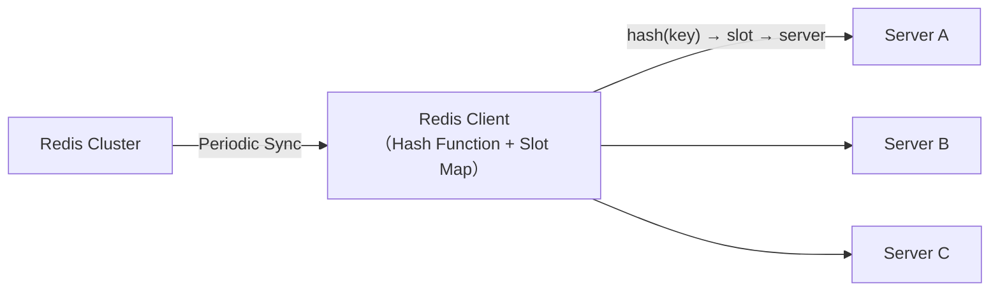
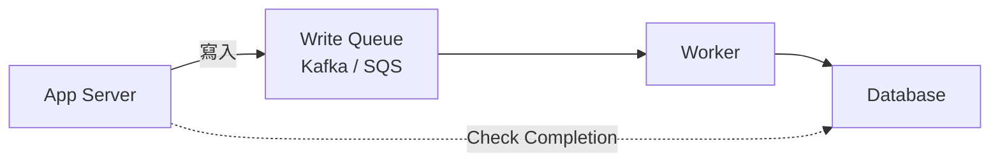
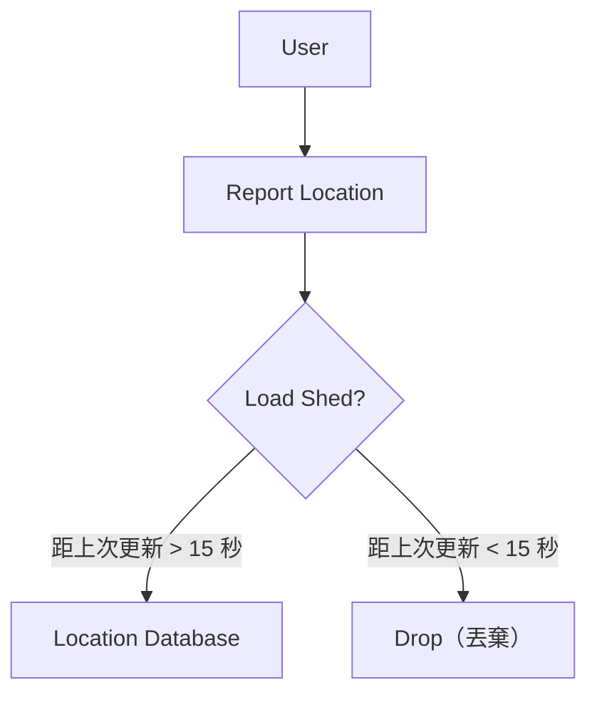
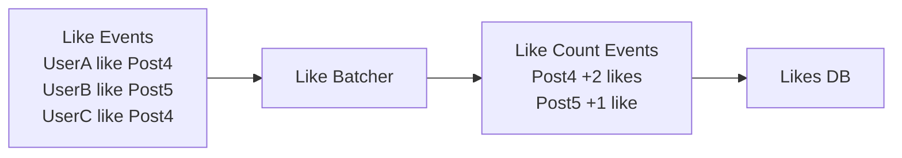
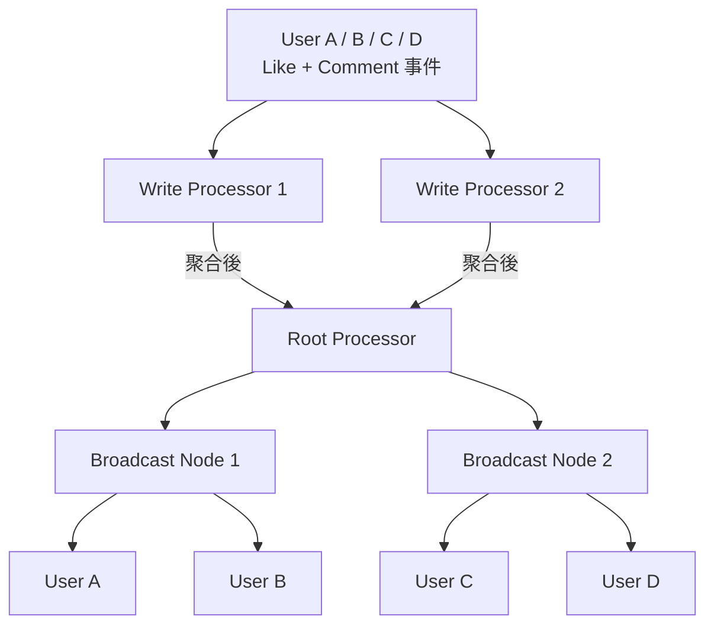

# 擴展寫入效能 (Scaling Writes)

> 當單一 database 或 server 成為瓶頸,如何讓系統承受每秒百萬次寫入?
> 四個策略組合起來,讓你突破單點極限。

## 問題背景

應用從每秒幾百次寫入成長到幾百萬次,會碰上磁碟 I/O、CPU、網路頻寬三道硬牆。[[write-scaling|寫入擴展]] 不是「砸更多硬體」,而是透過架構選擇提升系統承載能力。

面試官最喜歡在規模變大時突然問:「那這個要怎麼擴展?」你可能熟悉讀取端的 [[read-replica|read replica]] 和 [[caching|caching]],但寫入端往往更難。


---

## 第一步：垂直擴展與 DB 選型

### 先把現有硬體用盡

[[vertical-scaling|垂直擴展]] 是第一個檢查點。做 [[back-of-the-envelope|back-of-the-envelope 估算]] 確認是否真的碰到了硬體牆,再考慮往外擴展。現代雲端可以有 200 個 CPU core 和 10Gbps 網路介面,比多數人預設的 4–8 core 機器強得多。

提出這個觀點能展示工程成熟度,但面試官若不接受就不要僵持。

### 選對資料庫

寫入密集的系統可以做有針對性的 DB 選型:

| 資料庫類型 | 代表 | 寫入強項 | 代價 |
|---|---|---|---|
| [[append-only-db]] | [[cassandra]] | 循序寫入磁碟，10,000+ 寫/秒 | 讀取需掃多檔，讀取慢 |
| [[time-series-db]] | InfluxDB、TimescaleDB | 高頻時序寫入 + delta encoding | 非時序場景不佔優 |
| [[log-structured-db]] | LevelDB | Append 不做 in-place update | 讀取需合併 |
| [[column-store]] | ClickHouse | 批次分析型寫入 | OLTP 場景不適合 |

其他對任何 DB 都有效的技巧：
- 停用 [[foreign-key|foreign key constraint]]、複雜 trigger、全文搜尋 indexing（高寫入期間）
- 調整 [[wal|Write-Ahead Log]] flush 間隔（如 PostgreSQL）
- 減少 index 數量（index 越少寫入越快，但讀取查詢效率下降）

> 核心取捨：優化寫入往往犧牲讀取，反之亦然。搞清楚你的瓶頸在哪再針對性優化。

---

## 第二步：Sharding 與 Partitioning

假設單一 server 已用盡，需要水平擴展。

### Horizontal Sharding（水平分片）

[[sharding|Sharding]] 把資料分散到多台 server（稱為 shard），理論上 10 台 server = 10 倍寫入能力。

[[redis-cluster|Redis Cluster]] 是好例子：每個 key 用 CRC hash 得到 slot number，slot 被分配給不同 node，client 維護一份 Slot Map，直接把寫入送往正確 server。



**選 Partitioning Key 是關鍵：**
- 好 key（如 hash(userID)）→ 負載均勻分散
- 壞 key（如 country）→ 熱門國家 shard 過載，其他 shard 閒置（[[hot-shard|Hot Shard]] 問題）

問自己兩個問題：「這個請求需要打到幾個 shard？」「這個請求多常發生？」

### Vertical Partitioning（垂直分片）

[[vertical-partitioning|Vertical Partitioning]] 是把 column 分開，而非把 row 分開。把存取模式不同的欄位拆成獨立的表，各自針對工作負載優化：

```
posts 原始大表 → 拆成三張專門表：
  post_content   （一次寫入，多次讀取）→ 傳統 B-tree index
  post_metrics   （高頻率更新計數器）→ in-memory storage
  post_analytics （append-only 時序）→ time-series DB
```

邏輯上分開之後，可進一步把每張表移到不同 database instance 分別優化。

---

## 第三步：Queue 與 Load Shedding

Sharding 能走 80% 的路，但真實流量不是穩定的。黑色星期五流量 4 倍、跨年夜司機 3 倍，autoscaling 來不及反應，而且 DB 擴縮容往往需要降低吞吐量。

### Write Queue（寫入佇列）

[[write-queue|Write Queue]]（如 Kafka、SQS）把「接受寫入」和「處理寫入」解耦，DB 以最大速度穩定處理，queue 負責吸收爆發。



**注意事項：**
- Queue 是非同步的，client 需要另外查詢寫入是否完成
- Queue 只是緩衝，若寫入速度持續超過 DB 消化速度，queue 會無限增長
- 適合用在「爆發是短暫的」場景；不要用 queue 來遮蓋一個連穩定負載都扛不住的 DB

### Load Shedding（負載丟棄）

[[load-shedding|Load Shedding]] 在系統過載時主動丟棄不重要的寫入，比讓所有東西一起崩潰好得多。

以 Strava / Robotaxi 位置回報為例：用戶每幾秒就會再打一次 API，丟棄一次更新，幾秒後就會收到更新鮮的資料。



---

## 第四步：Batching 與階層式聚合

前三步都把寫入視為既定事實，但我們可以改變寫入的結構，平攤每筆寫入的 overhead（網路來回、transaction 建立、index 更新）。

### Batching（批次寫入）

[[batching|Batching]] 可以在三個層級進行：

**應用層**：client 先收集多筆寫入再一次送出。適合應用不是 source of truth 的情況（如從 Kafka 讀取）；若應用是 source of truth，服務崩潰可能遺失 batch 中還未提交的資料。

**中間處理層**：加入中間程序在寫入 DB 前先聚合。以「按讚」事件為例：



100 次按讚 → 1 次 DB 寫入。但要確認 batching 真的有收益：若大多數貼文每小時才得到一個讚，批次頻率設為一分鐘根本沒有幫助。

**DB 層**：調整 flush 間隔（Redis 預設每 100ms flush 一次）。效果強但是大鎚解法，留給極端情況。

### Hierarchical Aggregation（階層式聚合）

[[hierarchical-aggregation|階層式聚合]] 適用於最極端的分析/串流場景，以多個階段遞增地建立聚合視圖。

以直播留言為例：N 個觀看者都在寫入，每筆寫入都需要廣播給所有人 → all-to-all 通訊是無法解決的問題。

解法：引入 [[write-processor|Write Processor]] 和 [[broadcast-node|Broadcast Node]] 兩層：



Write Processor 根據留言 ID 路由，在時間窗口內聚合按讚數再轉發給 Root Processor；Broadcast Node 負責分發給各自的觀看者。把 N 次寫入降為 M 次（M << N），代價是增加部分延遲。

---

## Deep Dive 常見追問

### Resharding（重新分片）

從 8 個 shard 擴展到 16 個時不能停機重 hash。生產系統使用 [[dual-write|雙寫（dual-write）]] 漸進遷移：同時寫入舊 shard 和新 shard，讀取時優先讀新 shard，確保遷移過程中資料不遺失。

### Hot Key 問題

某篇爆紅推文每秒 100,000 個按讚，單一 shard 扛不住。兩個選項：

| 方法 | 做法 | 優缺點 |
|---|---|---|
| [[key-split-static\|固定拆分]] | key 固定拆成 k 份 | 簡單；讀取放大 k 倍，資料量也 k 倍 |
| [[key-split-dynamic\|動態拆分]] | 偵測到 hot key 才拆 | 更有效率；實作複雜 |

大多數生產系統用固定拆分，因為實作簡單，sub-key 的讀取 overhead 相比效能收益微不足道。

這兩種方法適用於可聚合的 metrics（按讚數、觀看數），不適用於必須保持原子性的資料（用戶 profile）。

---

## 總結：四個策略的取捨

| 策略 | 適合場景 | 主要取捨 |
|---|---|---|
| [[vertical-scaling\|垂直擴展]] + [[db-selection\|DB 選型]] | 先別過早複雜化 | 有天花板 |
| [[sharding\|Sharding]] + [[vertical-partitioning\|Vertical Partitioning]] | 絕大多數擴展需求 | 讀取路徑可能變複雜 |
| [[write-queue\|Write Queue]] + [[load-shedding\|Load Shedding]] | 爆發流量、可容忍非同步 | 引入最終一致性和延遲 |
| [[batching\|Batching]] + [[hierarchical-aggregation\|階層式聚合]] | 高量分析/串流資料 | 延遲增加、元件更多 |

> 核心原則：寫入擴展就是**降低每個元件的吞吐量壓力**。把 10,000 次寫入分散到 10 個 shard、用 queue 平滑爆發、或把寫入批次成 100 次批量操作，都是同一個原則的不同應用。
>
> 面試警示：看到瓶頸先做 [[back-of-the-envelope|back-of-the-envelope 估算]]，確認值不值得引入複雜度，不要在根本不需要擴展的地方硬套這些策略！

```glossary
{
  "write-scaling": {
    "term": "Scaling Writes 寫入擴展",
    "short": "當單一 database 或 server 成為寫入瓶頸時，透過架構選擇（垂直擴展、sharding、queue、batching）讓系統承載更大寫入量的策略集合。",
    "deeper": "面試中被問「這個系統要怎麼擴展寫入？」你會從哪個策略開始，理由是什麼？"
  },
  "vertical-scaling": {
    "term": "Vertical Scaling 垂直擴展",
    "short": "升級單台機器的 CPU、記憶體、磁碟或網路卡來提升效能。現代雲端可達 200 core + 10Gbps；要先確認硬體天花板再考慮往外擴展。"
  },
  "back-of-the-envelope": {
    "term": "Back-of-the-Envelope Estimation 粗略估算",
    "short": "用簡單數字快速估算系統規模（如 QPS、儲存量），確認是否真的需要某個架構決策，避免過度工程化。",
    "deeper": "如何估算一個社群媒體的每秒寫入量，來判斷是否需要 sharding？"
  },
  "cassandra": {
    "term": "Cassandra 資料庫",
    "short": "以 [[append-only-db|append-only commit log]] 實現高寫入吞吐量，普通硬體可達 10,000+ 寫/秒；代價是讀取需掃多份檔案合併，讀取效能不如傳統 RDBMS。"
  },
  "append-only-db": {
    "term": "Append-Only Database Append-Only 資料庫",
    "short": "所有寫入都循序 append 到磁碟而非 in-place update，避免昂貴的磁碟尋址，大幅提升寫入吞吐量。[[cassandra|Cassandra]]、LevelDB 都採用此架構。"
  },
  "time-series-db": {
    "term": "Time-Series Database 時序資料庫",
    "short": "專為帶有 timestamp 的高頻率循序寫入設計，內建 delta encoding 提升儲存效率。代表：InfluxDB、TimescaleDB。適合 metrics 收集、IoT 感測資料。"
  },
  "log-structured-db": {
    "term": "Log-Structured Database Log-Structured 資料庫",
    "short": "採用 append 而非 in-place update 的儲存結構，寫入快但讀取時需合併多份 SSTable。LevelDB 是代表性實作。"
  },
  "column-store": {
    "term": "Column Store 行式儲存",
    "short": "以欄位為單位儲存資料，適合分析型工作負載的批次寫入與掃描。ClickHouse 是代表。不適合 OLTP 逐筆讀寫。"
  },
  "wal": {
    "term": "Write-Ahead Log 預寫日誌",
    "short": "在修改資料前先把操作寫入日誌，確保崩潰後可以恢復。PostgreSQL 允許設定多個 transaction 後才一起 flush，可用來提升寫入吞吐量。"
  },
  "foreign-key": {
    "term": "Foreign Key Constraint 外鍵約束",
    "short": "資料庫層級的完整性約束，確保跨表參照有效。每次寫入都要驗證，高寫入負載時可暫時停用以換取效能。"
  },
  "sharding": {
    "term": "Sharding 水平分片",
    "short": "把資料分散到多台 server（shard），每台只負責整體資料的一部分，讓寫入負載水平擴展。選好 [[partitioning-key|partitioning key]] 是關鍵。",
    "deeper": "如果選了一個糟糕的 partitioning key（如 country），會發生什麼問題？"
  },
  "partitioning-key": {
    "term": "Partitioning Key 分片鍵",
    "short": "決定每筆資料要路由到哪個 shard 的欄位或函數。好的 key（如 hash(userID)）讓負載均勻；壞的 key 造成 [[hot-shard|hot shard]]。"
  },
  "hot-shard": {
    "term": "Hot Shard 熱分片",
    "short": "某個 shard 收到不成比例的流量，成為新瓶頸。通常是 partitioning key 選得不好，或某個 key 的資料天生就是熱點（如爆紅貼文）。"
  },
  "redis-cluster": {
    "term": "Redis Cluster Redis 叢集",
    "short": "用 CRC hash 把 key 映射到 slot，slot 分配給不同 node，client 維護 Slot Map 直接路由寫入。是 [[sharding|sharding]] 的具體實作範例。"
  },
  "vertical-partitioning": {
    "term": "Vertical Partitioning 垂直分片",
    "short": "把一張大表按欄位的存取模式拆成多張專門的表（如內容表、計數器表、分析表），各自移到最適合的 database，減少互相干擾。"
  },
  "write-queue": {
    "term": "Write Queue 寫入佇列",
    "short": "在 App Server 和 Database 之間加入 Kafka/SQS 等訊息佇列，解耦「接受寫入」和「處理寫入」，讓 DB 以穩定速率消化、queue 吸收爆發流量。代價是引入非同步性。",
    "deeper": "什麼情況下用 write queue 反而會讓問題更嚴重？"
  },
  "load-shedding": {
    "term": "Load Shedding 負載丟棄",
    "short": "系統過載時主動拒絕不重要的寫入，保全系統繼續服務較重要的請求，比讓所有東西一起崩潰好。位置回報系統丟棄 15 秒內的重複更新是典型案例。",
    "deeper": "如何判斷哪些寫入可以丟棄？以什麼標準分優先順序？"
  },
  "batching": {
    "term": "Batching 批次寫入",
    "short": "把多筆寫入合批一次送出，平攤每筆寫入的 overhead（網路來回、transaction、index 更新）。可在應用層、中間處理層或 DB 層進行。",
    "deeper": "應用層 batching 和中間處理層 batching 的適用場景有何不同？"
  },
  "hierarchical-aggregation": {
    "term": "Hierarchical Aggregation 階層式聚合",
    "short": "以多個階段遞增地聚合資料，每層減少需要傳遞的事件量。適合直播留言等 all-to-all 廣播場景，把 N 次寫入降為 M 次（M << N），代價是延遲增加。",
    "deeper": "直播留言系統不用 hierarchical aggregation 會遇到什麼問題？"
  },
  "write-processor": {
    "term": "Write Processor 寫入處理器",
    "short": "[[hierarchical-aggregation|階層式聚合]] 架構中的第一層節點，根據資料 ID 路由事件，在時間窗口內聚合後再轉發給 Root Processor，減少 Root Processor 的負載。"
  },
  "broadcast-node": {
    "term": "Broadcast Node 廣播節點",
    "short": "[[hierarchical-aggregation|階層式聚合]] 架構中負責分發更新給終端用戶的節點。Root Processor 只需寫給 M 個 broadcast node，由它們各自負責廣播給一批用戶。"
  },
  "dual-write": {
    "term": "Dual-Write 雙寫",
    "short": "Resharding 時同時寫入舊 shard 和新 shard，讀取優先走新 shard，確保漸進遷移過程中資料不遺失、不停機。",
    "deeper": "雙寫階段結束後，如何安全地切掉舊 shard 的寫入？"
  },
  "read-replica": {
    "term": "Read Replica 讀取副本",
    "short": "主 DB 的唯讀複本，把讀取流量分流，減輕主 DB 壓力。是讀取端的擴展工具，但對寫入瓶頸沒有直接幫助。"
  },
  "caching": {
    "term": "Caching 快取",
    "short": "把常讀取的資料放在記憶體（如 Redis、Memcached）中快速回應，大幅減少 DB 讀取壓力。同樣是讀取端工具，對寫入擴展幫助有限。"
  },
  "db-selection": {
    "term": "Database Selection DB 選型",
    "short": "根據系統的寫入模式選擇最合適的資料庫。寫入密集型可考慮 [[cassandra|Cassandra]]、[[time-series-db|時序 DB]] 或 [[column-store|行式儲存]]，而非預設用通用型 RDBMS。"
  },
  "key-split-static": {
    "term": "Static Key Split 固定 Key 拆分",
    "short": "把每個 key 固定拆成 k 份 sub-key，分散寫入到多個 shard。做法簡單，但資料量和讀取量都乘以 k 倍。適合可聚合的 metrics 資料。"
  },
  "key-split-dynamic": {
    "term": "Dynamic Key Split 動態 Key 拆分",
    "short": "只對偵測到的 hot key 動態拆成多個 sub-key，讀取時聚合。比固定拆分更有效率，但實作更複雜，需要讓讀者和寫者都知道哪些 key 是熱的。"
  }
}
```
