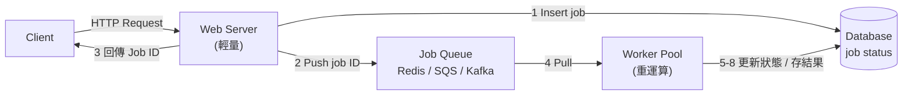
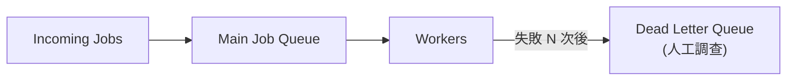

# 管理長時間執行任務 (Manage Long Running Tasks)

> 核心思路一句話:**快速接受、非同步處理、完成時通知。** 把請求的「接收」和「執行」拆開,讓用戶不用等。

## 問題：同步處理的極限

想像用戶要產生一份 PDF 年度報告——需要查詢多張表、聚合幾百萬筆資料、渲染圖表。整個過程至少 30 秒。

在[[sync-processing|同步處理]]下:

- 用戶的瀏覽器盯著載入圖示等 30 秒。
- 大多數 web server 和 load balancer 設有 30–60 秒的 timeout,請求甚至可能來不及完成。
- 用戶以為出錯而重試,製造出更多重複工作。

這類問題到處都是:影片轉碼、圖片縮圖、批量發送電子報、匯入大型 CSV——都遠超用戶能合理等待的範圍。

## 解法：[[async-worker-pattern|非同步 Worker 模式]]

把操作拆成兩個部分:

1. **Web server**:只做驗證 + 把 job 推進 [[message-queue|Queue]],立刻回傳 **Job ID**。這整個過程在毫秒內完成。
2. **[[worker-pool|Worker Pool]]**:獨立的 process 從 Queue 拉取 job,慢慢執行真正耗時的工作,完成後更新 job 狀態。

用戶不再等待——他們立刻收到確認,可以離開頁面,等通知回來查看結果(email / push notification / [[websocket|WebSocket]])。



## 完整執行流程

| 步驟 | 執行者 | 動作 |
|---|---|---|
| 1 | [[web-server]] | 驗證請求,在 DB 建立 pending 狀態的 job 記錄 |
| 2 | [[web-server]] | 把 Job ID 推進 Queue(只傳 ID,不傳完整資料) |
| 3 | [[web-server]] | 立刻把 Job ID 回傳給 Client |
| 4 | [[worker-pool]] | 從 Queue 拉取訊息,從 DB 抓取 job 詳細資料 |
| 5 | [[worker-pool]] | 把 job 狀態更新為 processing |
| 6 | [[worker-pool]] | 執行實際工作 |
| 7 | [[worker-pool]] | 儲存結果(檔案存 S3,metadata 存 DB) |
| 8 | [[worker-pool]] | 把 job 狀態更新為 completed 或 failed |

## 取捨分析

**你得到的**

- **快速回應**:API 呼叫在毫秒內回傳,不再 timeout。
- **獨立擴展**:Web server 和 Worker 各自按需求擴,高峰時多開 worker 即可。
- **故障隔離**:一台 worker 崩潰不影響 API,失敗的 job 可以重試。
- **資源優化**:CPU 密集 worker 跑在計算優化機器;web server 用便宜通用型 instance。

**你失去的**

- **系統複雜度**:要管理 Queue、Worker 和 job 狀態追蹤——更多元件就是更多可能出錯的地方。
- **[[eventual-consistency|最終一致性]]**:API 回傳時工作還沒完成,用戶可能暫時看到過時資料。
- **監控 overhead**:Queue 深度、worker 健康狀況、job 失敗率——你在監控一個分散式系統。

## 技術選擇：Message Queue

[[message-queue|Queue]] 必須是**持久化 (durable)** 的——崩潰不能遺失 job,且要能同時處理多個 worker 的並發存取。

| Queue 技術 | 適合場景 | 注意事項 |
|---|---|---|
| [[bull-bullmq]] | Startup 首選,設定簡單 | Redis memory-first,硬性崩潰可能遺失 job |
| [[aws-sqs]] | 免運維、低流量划算 | 1MB 訊息上限;大規模成本高 |
| [[rabbitmq]] | 複雜路由、企業環境 | 需自行架設,運維負擔真實 |
| [[kafka]] | 高流量、event streaming、需重播 | 最強,最複雜;append-only log 可 fan-out 給多個 consumer |

> 面試預設直接選 **Kafka**,除非面試官有特別要求。重點是展示你理解[[separation-of-concerns|關注點分離]],不是辯論哪個 queue 最好。

## 技術選擇：Worker 執行環境

| 類型 | 優點 | 缺點 |
|---|---|---|
| 一般 Server Process | 完全掌控、除錯直觀、長 job 無限制 | 需管理 server,閒置時也要付費 |
| [[serverless-function]] | 免 server 管理、按用量計費、自動擴展 | 執行時間限制 15–60 分鐘;cold start 延遲 |
| [[container-worker]] | 中間方案,彈性 + 自動擴展 | 比純 server 複雜 |

> 面試預設用**一般 server process**,除非面試官特別要求 serverless。

## 五大深挖問題

### 1. Worker 崩潰怎麼辦？

使用[[heartbeat-mechanism|心跳機制]] — worker 定期向 Queue 回報存活。Queue 沒收到心跳就假設 worker 掛了,把 job 重新排隊。

心跳間隔的取捨：
- 太長 → 崩潰後 job 延遲更久
- 太短 → 大量不必要訊息,可能把 GC pause 的 worker 誤判為死掉

各 Queue 的對應設定:`SQS` → visibility timeout;`RabbitMQ` → heartbeat interval;`Kafka` → session timeout。**10–30 秒是大多數系統的好起點。**

### 2. Job 一直失敗怎麼辦？

不處理的話,「毒藥訊息 (poison message)」會讓整個 worker 群掛掉。

解法:[[dead-letter-queue|Dead Letter Queue (DLQ)]]:



失敗達到閾值(通常 3–5 次)就把 job 移到 DLQ,隔離問題 job,讓健康工作繼續。DLQ 持續增加 = 系統有 bug,需立刻調查。

### 3. 防止重複工作

用戶點三次「產生報告」,Queue 裡就有三個一樣的 job。

解法:[[idempotency-key|Idempotency Key(冪等鍵)]] — 提交 job 前先查 DB/cache 是否已有相同 key 的 job。有就回傳既有 Job ID,不建新的。

Key 的組合方式:`user_id + action + timestamp(取整到想防重複的時間長度)`。

工作本身也要設計成[[idempotent|冪等 (idempotent)]] — 即使 job 執行到一半失敗後被重試,重跑也是安全的。

### 4. Queue 積壓爆炸（Backpressure）

黑色星期五,job 進來速度遠超 worker 處理速度,Queue 積累到幾百萬筆。

解法:[[backpressure|背壓 (Backpressure)]] —

- 設定 Queue 深度上限,超過就拒絕新 job,立刻回傳「系統忙碌中」。
- 根據 Queue 深度(不是 CPU)自動擴展 worker — 等到 CPU 飆高時 Queue 早已積爆。
- AWS 上用 CloudWatch alarm + Auto Scaling group 自動處理。

### 5. 混合工作負載 / Job 依賴關係

**混合工作負載**:5 秒的簡單報告和 5 小時的年末報告共用同一條 Queue,長 job 卡住短 job([[head-of-line-blocking|隊首阻塞]])。

解法:按預期執行時間分**多條 Queue**:

- `fast` queue:多 worker、輕量機器
- `slow` queue:少但更強的 worker
- 若無法預測:先進 fast queue,超時就移到 slow queue

**有依賴關係的 Job**:抓資料 → 產 PDF → 發郵件,三步有順序。

- 簡單鏈式:每個 worker 完成後把下一步 job 推進 Queue,帶入完整 context(含 workflow_id、previous_steps)。
- 複雜 workflow(分支/平行):使用[[workflow-orchestrator|Workflow Orchestrator]](AWS Step Functions、Temporal、Airflow)。

## 面試信號識別

遇到以下情境,主動說出 async worker 方案:

- 「影片轉碼 / 圖片處理 / PDF 產生 / 批量發送電子郵件」→ 超過幾秒就 async
- 「每天處理 100 萬張圖片」→ 算一下每秒需要的處理時間,直接說「web server 跑不了,要 offload 到 async worker pool」
- 同一系統同時有簡單 API 和 GPU 密集工作 → async worker 分開跑
- 「server 崩潰怎麼辦 / 10 倍流量怎麼辦」→ async worker 的故障隔離 + 獨立擴展

> 關鍵技能:**主動出擊**。你要是那個先發現某個操作「太慢了」的人,不是等面試官來提。

```glossary
{
  "async-worker-pattern": {
    "term": "Async Worker Pattern 非同步 Worker 模式",
    "short": "把 API 請求的「接收」和「執行」拆開:[[web-server|Web server]] 立刻驗證並把 job 推進 [[message-queue|Queue]] 後回傳 Job ID;[[worker-pool|Worker Pool]] 在背景非同步執行真正的工作。",
    "deeper": "什麼情況下應該選非同步 Worker 模式而非同步處理?有哪些明確的信號?"
  },
  "sync-processing": {
    "term": "Synchronous Processing 同步處理",
    "short": "用戶發出請求後,server 完整執行工作才回應。操作超過幾秒時會讓用戶等待,甚至觸發 timeout,體驗極差。"
  },
  "message-queue": {
    "term": "Message Queue 訊息佇列",
    "short": "在 web server 和 worker 之間充當緩衝的持久化儲存。把 job 的發送方和處理方解耦,讓兩者能獨立運作、獨立擴展。常見選項:[[bull-bullmq|BullMQ]]、[[aws-sqs|SQS]]、[[rabbitmq|RabbitMQ]]、[[kafka|Kafka]]。"
  },
  "worker-pool": {
    "term": "Worker Pool Worker 池",
    "short": "一群專門用來從 [[message-queue|Queue]] 拉取並執行 job 的 process。可根據 Queue 深度獨立擴展,且可跑在特殊硬體(如 GPU)上,與 web server 分開。"
  },
  "web-server": {
    "term": "Web Server (in async pattern)",
    "short": "在非同步模式中,web server 只做輕量工作:驗證請求、把 Job ID 推進 Queue、立刻回傳。不再負責耗時運算。"
  },
  "eventual-consistency": {
    "term": "Eventual Consistency 最終一致性",
    "short": "非同步模式的代價之一:API 回傳時工作還沒完成,用戶可能暫時看到過時資料,等 worker 完成後才同步到最新狀態。"
  },
  "bull-bullmq": {
    "term": "Bull / BullMQ (Redis-based Queue)",
    "short": "以 Redis 為儲存層,在上面加上 job queue 語義(自動重試、延遲 job、優先權 queue)。Startup 首選,設定簡單;但 Redis 是 memory-first,硬性崩潰時可能遺失 job。"
  },
  "aws-sqs": {
    "term": "AWS SQS Simple Queue Service",
    "short": "完全託管的 Queue 服務,免去運維 overhead。按訊息計費,低流量划算。1MB 訊息上限,通常只傳 Job ID 而非完整資料。"
  },
  "rabbitmq": {
    "term": "RabbitMQ",
    "short": "支援複雜路由模式的開源 Queue,企業環境久經考驗。需自行架設和管理 cluster,運維負擔真實。"
  },
  "kafka": {
    "term": "Apache Kafka",
    "short": "append-only log 架構,可重播訊息、fan-out 給多個 consumer、長時間保留資料,並在 partition 內保證嚴格順序。面試預設選項,適合高流量與 event streaming 場景。"
  },
  "serverless-function": {
    "term": "Serverless Function 無伺服器函式",
    "short": "如 AWS Lambda、Cloud Functions。每個 job 觸發一次函式執行,自動擴展,按實際執行時間計費。缺點:執行時間上限 15–60 分鐘,有 cold start 延遲。"
  },
  "container-worker": {
    "term": "Container-based Worker 容器化 Worker",
    "short": "把 worker 打包成 Docker container,在 Kubernetes 或 ECS 上執行。介於一般 server 和 serverless 之間:彈性較高,同時能處理長時間執行的 job。"
  },
  "heartbeat-mechanism": {
    "term": "Heartbeat Mechanism 心跳機制",
    "short": "Worker 定期向 Queue 回報自己還活著。若超過一段時間沒有心跳,Queue 假設 worker 已崩潰,把 job 重新排隊讓其他 worker 接手。"
  },
  "dead-letter-queue": {
    "term": "Dead Letter Queue DLQ 死信佇列",
    "short": "Job 失敗達到閾值(通常 3–5 次)後,移到獨立的 DLQ 而非無限重試。隔離問題 job,讓健康工作繼續;DLQ 中的 job 待人工調查或修正後重新處理。",
    "deeper": "DLQ 持續增加時代表什麼?你會怎麼處理?"
  },
  "idempotency-key": {
    "term": "Idempotency Key 冪等鍵",
    "short": "提交 job 前先用唯一識別碼(如 user_id + action + timestamp)查 DB/cache,若已存在相同 key 的 job 就回傳既有 Job ID,防止重複執行。"
  },
  "idempotent": {
    "term": "Idempotent 冪等",
    "short": "多次執行相同操作和執行一次的結果相同。設計成冪等的 job 在重試時不會產生副作用(如重複寄信、重複扣款)。"
  },
  "backpressure": {
    "term": "Backpressure 背壓",
    "short": "當 worker 處理速度跟不上 job 進入速度時,主動放慢接受速度:設定 Queue 深度上限,超過就拒絕新 job 並立刻回傳「系統忙碌」,同時根據 Queue 深度自動擴展 worker。"
  },
  "head-of-line-blocking": {
    "term": "Head-of-Line Blocking 隊首阻塞",
    "short": "Queue 中一個長時間執行的 job 卡住後面所有短 job,導致短 job 等待時間大幅增加。解法是按執行時間分 fast / slow 多條 Queue。"
  },
  "workflow-orchestrator": {
    "term": "Workflow Orchestrator 工作流程協調器",
    "short": "管理有依賴關係(分支/平行/順序)的複雜 job 鏈的工具,如 AWS Step Functions、Temporal、Airflow。提供步驟級別的重試、可見性與錯誤處理;簡單鏈式 job 不需要,只有依賴關係真的複雜時才引入。"
  },
  "separation-of-concerns": {
    "term": "Separation of Concerns 關注點分離",
    "short": "非同步 Worker 模式的核心原則:web server 只做「接收與路由」,worker 只做「執行與處理」,兩者透過 Queue 解耦,各自獨立擴展與部署。"
  },
  "websocket": {
    "term": "WebSocket",
    "short": "在瀏覽器與 server 之間建立持久雙向連線,可讓 server 主動推送 job 完成通知給用戶,無需用戶輪詢。"
  }
}
```
