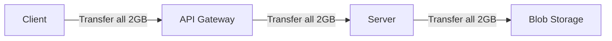
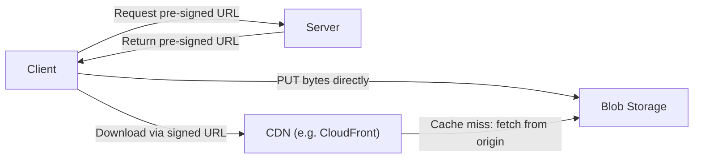
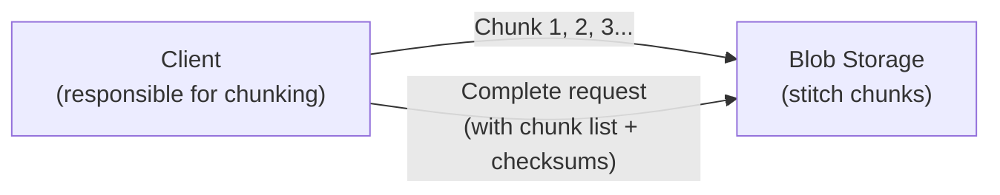
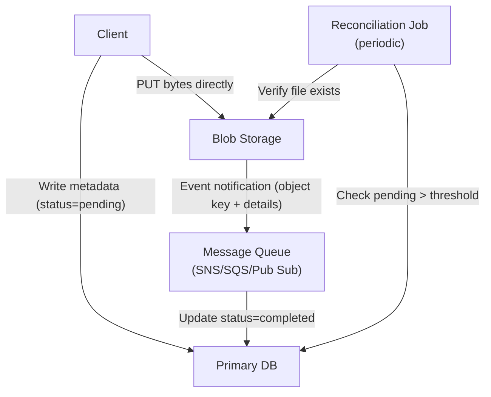

# 處理大型檔案 (Handling Large Blobs)

> 核心洞察:別讓 bytes 流過你自己的伺服器——改成**編排存取權限**,讓客戶端直接和儲存服務互動。

## 問題：伺服器當冤枉管道

影片、圖片這類大型檔案應放在 [[blob-storage|Blob Storage]](如 S3),而非資料庫。資料庫擅長複雜查詢的結構化資料,但很不擅長大型二進位物件——一個 100 MB 的 BLOB 會讓查詢效能、備份時間與 replication 全部崩掉。

粗略判斷標準:**超過 10 MB 且不需要 SQL 查詢**的東西,就應放進 Blob Storage。

傳統做法讓 bytes 走過 application server(客戶端 → API Gateway → Server → Blob Storage),對小檔案無礙,但檔案越大問題越嚴重:



伺服器對傳輸毫無貢獻,卻憑空製造瓶頸、增加延遲與成本。

---

## 解法：客戶端直傳 + CDN 下載

你的 application server 角色從「資料傳輸者」變成「**存取控制者**」:它驗證請求、產生憑證,然後退出舞台;實際的 bytes 永遠不碰你的伺服器。



---

## 簡單直傳上傳 (Simple Direct Upload)

客戶端請求「上傳許可」,伺服器驗證用戶、檢查配額,再產生一個 [[presigned-url|Presigned URL]]。這個 URL 編碼了「在限定時間內(通常 15 分鐘到 1 小時)把特定檔案上傳到特定位置」的權限。

產生 Presigned URL 完全在 application 記憶體裡進行,**不需要呼叫 Blob Storage 的網路請求**。

你可以在產生時把限制條件烘焙進簽名:

- `content-length-range` — 設定最小/最大檔案大小,防止用小圖片端點上傳 10 GB
- `content-type` — 確保頭像端點只接受圖片,不接受影片

客戶端對這個 URL 發出 HTTP PUT,把檔案放在 body 裡。你的基礎設施從不碰那些 bytes。

---

## 簡單直傳下載 (Simple Direct Download)

下載可直接從 Blob Storage 取得,或透過 [[cdn|CDN]] 分發:

| 方式 | 適合場景 |
|---|---|
| 直接從 [[blob-storage]] 下載 | 不頻繁存取、成本較低 |
| 透過 [[cdn]] 下載 | 頻繁存取、地理分散、低延遲 |

CDN 簽名(如 CloudFront Signed URL)由邊緣伺服器用公私鑰密碼學驗證,**CDN 不需要再向你的伺服器或原始儲存發送請求**,可在全球各地的邊緣節點就地驗證。

---

## 大型檔案斷點續傳 (Resumable Uploads)

一個 5 GB 影片在 100 Mbps 網路上需要七分多鐘;99% 時斷線就得從頭來過。解法是 [[chunked-upload|分塊上傳]]。



各家雲端供應商做法略有不同,但核心邏輯相同:

- **AWS S3**:Multipart Upload,每塊 ≥ 5 MB,各有獨立 Presigned URL
- **Google Cloud Storage**:Resumable Uploads,單一 session URL,透過 Range header 上傳
- **Azure**:Block Blobs,每塊 4 MB – 100 MB

連線斷掉時,客戶端查詢哪些分塊已成功(S3 用 `ListParts`、GCS 查 resumable session 狀態),從失敗的那塊繼續,不需重傳。

所有分塊上傳完後,客戶端呼叫**完成端點**帶上分塊編號與 [[checksum|校驗和]] 清單,儲存服務才把分塊組裝成最終物件。

> ⚠️ 未完成的 Multipart Upload 是有費用的——應設定 **生命週期規則**,在 24–48 小時後自動清理。

---

## 狀態同步的挑戰

把伺服器移出傳輸路徑後,資料庫與 Blob Storage 是在不同時間點更新的**兩個獨立系統**,需要對齊狀態。

常見 metadata 表設計:

```sql
CREATE TABLE files (
  id UUID PRIMARY KEY,
  user_id UUID NOT NULL,
  storage_key VARCHAR(500), -- s3://bucket/user123/files/abc-123.pdf
  status VARCHAR(50)        -- 'pending' | 'uploading' | 'completed' | 'failed'
  ...
);
```

**信任客戶端通知**有幾個問題:

- **Race condition** — 資料庫可能在檔案實際存在於 Storage 之前就顯示「completed」
- **孤兒檔案** — 客戶端崩潰於上傳後、通知前,Storage 留下無資料庫記錄的檔案
- **惡意客戶端** — 用戶可在沒上傳任何東西的情況下把狀態標為已完成

### 推薦做法：事件通知 + 對帳



- **[[event-notification|事件通知]]** 是主要更新機制:Blob Storage 上傳完成後自動發布事件,由儲存服務本身確認檔案存在,客戶端被移出信任鏈。
- **[[reconciliation|對帳]]** 是安全網:定期任務掃描卡在 pending 的記錄,與 Storage 比對,撈起漏網之魚。

---

## 防濫用策略

- **隔離區 (quarantine bucket)**:上傳先進隔離區 → 病毒掃描 + 內容驗證 → 通過後才移到正式 bucket,資料庫狀態更新為「available」
- **Presigned URL 條件**:務必加上 `content-length-range`,沒有這個,有人可以用設計給小圖片的 URL 上傳幾 TB 資料
- **延遲處理天然抑制濫用**:攻擊者無法立刻知道上傳是否成功,讓自動化攻擊更難執行

---

## 快速下載優化

- **[[cdn]]**:透過地理分散快取解決延遲問題;第一個用戶從源站拉取,之後該地區請求從快取取得(200 ms → 5 ms)
- **[[range-request|Range Request]]**:HTTP 只下載檔案特定 byte 範圍(`Range: bytes=0-10485759`),讓下載支援斷點續傳
- **平行分塊下載**:極端場景(大型資料集、遊戲資源)才考慮,通常不值得

---

## 什麼時候不適合用

| 場景 | 原因 |
|---|---|
| 小於 10 MB 的檔案 | 兩步驟增加延遲,沒有實質好處 |
| 需要同步驗證(如 CSV 匯入) | 必須在接受前即時驗證,需讓資料流過伺服器 |
| 合規要求(金融、醫療) | 法規要求資料通過認證系統或在儲存前掃描 |
| 需要即時回饋(如即時人臉偵測) | 非同步本質破壞互動式使用者體驗 |

---

## 面試情境速查

**YouTube / 影音平台**:用戶上傳 2 GB 4K 影片 → Web App 產生 [[presigned-url]] → 客戶端直傳 S3(Multipart 確保可續傳)→ S3 事件觸發轉碼工作流程。下載透過 CloudFront 簽署 URL 分段，啟用自適應位元率串流 (adaptive bitrate streaming)。

**Instagram / 相片分享**:行動 App 取得原始圖片 Presigned URL(現代相機可能超過 50 MB)→ 直傳 S3 → S3 事件觸發非同步 worker 產生縮圖、套用濾鏡。Feed 透過 CloudFront 搭配簽署 URL 防止盜連。

**Dropbox / 檔案同步**:拖入 500 MB 影片 → 取得分塊上傳 Presigned URL → 直傳 Blob Storage → 觸發同步工作流程。分享時產生有時限的簽署 URL。

> 💡 **面試心法**:只要聽到「影片上傳」「檔案分享」「相片儲存」，立刻說出這個模式。超過 10 MB 就用 [[presigned-url]]；大型檔案加上 [[chunked-upload]]；狀態同步靠 [[event-notification]] + [[reconciliation]]。

```glossary
{
  "blob-storage": {
    "term": "Blob Storage 物件儲存",
    "short": "專為儲存非結構化大型二進位物件設計的服務(如 AWS S3、GCS、Azure Blob)。提供近乎無限容量、極高耐久性(11個九)、按物件計費。超過 10 MB 且不需 SQL 查詢的資料應放這裡。",
    "deeper": "為什麼資料庫不適合存大型 BLOB?會造成什麼具體問題?"
  },
  "presigned-url": {
    "term": "Presigned URL 預簽名網址",
    "short": "伺服器用雲端憑證預先簽名的臨時 URL,讓客戶端在有限時間內直接對 Blob Storage 做特定操作(上傳/下載)。產生完全在記憶體內進行,不需網路請求。可烘焙 content-length-range、content-type 等限制條件。",
    "deeper": "Presigned URL 和 CDN Signed URL 的簽名驗證機制有何不同?"
  },
  "cdn": {
    "term": "CDN (Content Delivery Network) 內容分發網路",
    "short": "在全球各地部署邊緣節點的快取網路。第一個用戶從源站拉取後,同地區之後的請求從邊緣快取取得,延遲從 200ms 降到個位數毫秒。對頻繁存取的檔案效益最大。"
  },
  "chunked-upload": {
    "term": "Chunked Upload 分塊上傳",
    "short": "把大型檔案切成 5 MB 左右的分塊逐一上傳。連線中斷後只需重傳失敗的那塊,不必從頭開始。各家實作:AWS 叫 Multipart Upload、GCS 叫 Resumable Uploads、Azure 叫 Block Blobs。",
    "deeper": "分塊上傳的「完成端點」在整個流程中扮演什麼角色?沒呼叫它會發生什麼事?"
  },
  "checksum": {
    "term": "Checksum 校驗和",
    "short": "對上傳資料計算的雜湊值,用來驗證分塊是否完整到達。完成分塊上傳時需帶上各塊的 checksum 清單,讓儲存服務確認資料完整性再組裝。"
  },
  "event-notification": {
    "term": "Event Notification 事件通知",
    "short": "Blob Storage 上傳完成後,透過訊息服務(AWS SNS/SQS、GCS Pub/Sub、Azure Event Grid)自動發布包含物件 key 的事件。讓資料庫狀態由儲存服務本身確認更新,把客戶端移出信任鏈。"
  },
  "reconciliation": {
    "term": "Reconciliation 對帳",
    "short": "定期執行的背景任務,掃描卡在 pending 狀態超過閾值的記錄,與 Blob Storage 比對確認檔案是否真正存在。作為事件通知失敗的安全網,撈起漏網之魚。"
  },
  "range-request": {
    "term": "Range Request HTTP 範圍請求",
    "short": "HTTP 功能,允許只下載檔案特定 byte 範圍(如 `Range: bytes=0-10485759`)。讓大型檔案下載支援斷點續傳:追蹤已完成範圍,重連後只請求遺失部分。現代瀏覽器和 CDN 原生支援。"
  }
}
```
