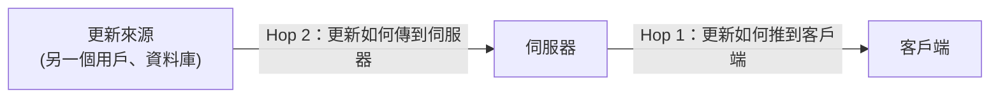
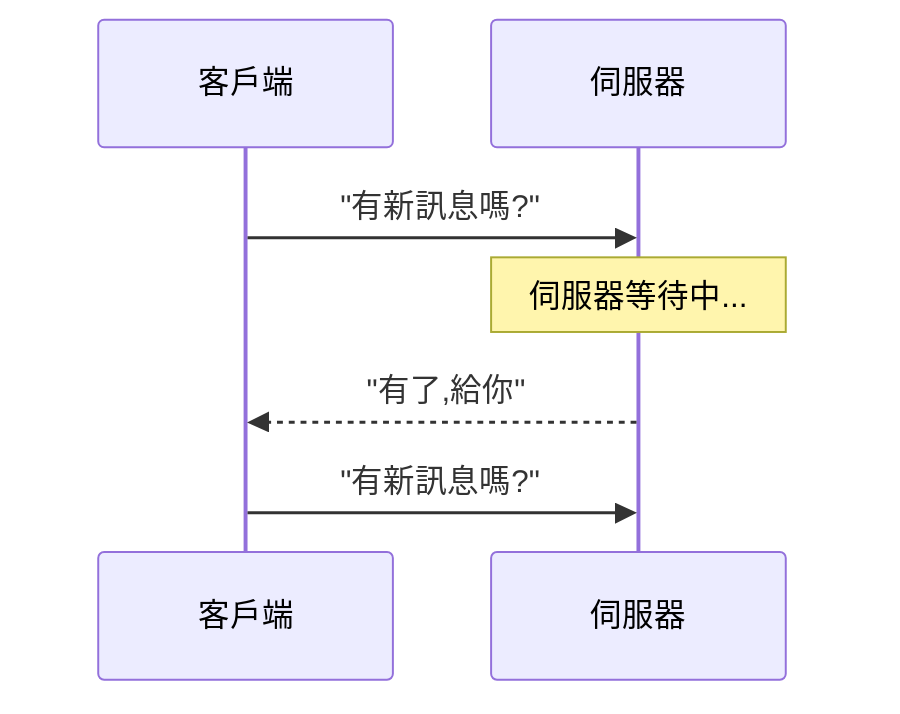
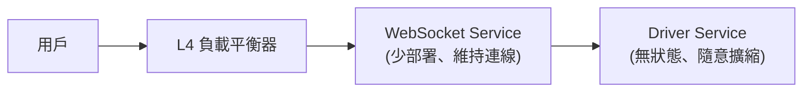
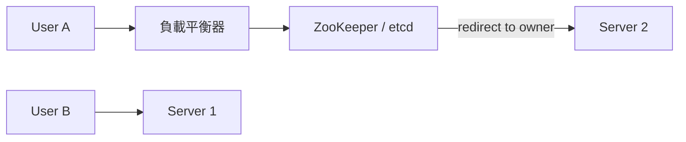

# 即時更新 (Real-time Updates)

> 核心問題:HTTP 是「問才答」的模型,伺服器無法主動推送。想讓畫面即時反映其他人的操作,就必須選一種「持久通道」策略——而不同策略有截然不同的取捨。

## 問題框架:兩個 Hop

即時系統的挑戰可以拆成**兩段**獨立問題:



- **Hop 1** — 客戶端與伺服器之間用什麼協定通訊?
- **Hop 2** — 伺服器怎麼知道有新更新要推送?

兩段各有自己的取捨,我們分別拆解。

---

## Hop 1:四種客戶端-伺服器協定

### 簡單輪詢 (Simple Polling)

客戶端定時用標準 [[http-request|HTTP 請求]] 問伺服器「有沒有新的?」

**適用時機**:延遲幾秒可以接受、問題核心不在即時性時,直接提議這個方案,把面試時間留給更重要的部分。

優點:無狀態、不需要特殊基礎設施、實作說明極短。  
缺點:延遲 = 輪詢間隔 + 請求處理時間;大量客戶端時反覆建立 [[tcp|TCP]] 連線消耗可觀。

> 面試技巧:可搭配 [[http-keep-alive|HTTP keep-alive]] 把 TCP 連線保持比輪詢間隔更久,大幅減少重連 overhead。

---

### 長輪詢 (Long Polling)

客戶端發出請求,伺服器「掛著不回」直到有新資料才回應;客戶端收到回應後立刻再發一個。



優點:建立在標準 HTTP 上;伺服器端無狀態;更新不頻繁時近乎即時。  
缺點:高頻更新時延遲倍增(第二條訊息最多要等:第一條回應 + 新請求 + 網路往返);瀏覽器對同域並發連線數有限制。

適用場景:付款處理之類「等一個長時間非同步流程完成」的場景。  
面試注意:記得說清楚 timeout 設定(例如 15–30 秒),避免負載平衡器提前切斷連線。

---

### Server-Sent Events (SSE)

一條長存的 HTTP 連線,伺服器隨時有資料就「串流」一塊下來;使用 `Transfer-Encoding: chunked`(不像普通 HTTP 有固定 `Content-Length`)。

瀏覽器原生的 `EventSource` 物件支援 [[sse|SSE]],並且內建自動重連與「last event ID」補漏機制。

優點:原生瀏覽器支援;不需要反覆建立/拆除連線;實作比 WebSocket 簡單。  
缺點:單向(伺服器→客戶端);部分 proxy 不支援串流回應;監控因為連線存活久而稍複雜。

熱門使用案例:AI 聊天應用的 token 逐字串流。  
常見模式:讀用 SSE 訂閱,寫用普通 HTTP POST — 不一定要 WebSocket。

---

### WebSocket

透過 HTTP Upgrade 握手把既有 [[tcp|TCP]] 連線切換成 WebSocket 協定,建立後雙向都能隨時傳訊息([[full-duplex|全雙工]])。

優點:全雙工;比 HTTP 延遲更低(沒有 header overhead);高頻訊息效率最佳;廣泛瀏覽器支援。  
缺點:有狀態連線讓負載平衡與擴展複雜;伺服器重新部署會切斷連線;需要自己處理重連邏輯。

**基礎設施建議**:用 [[l4-lb|L4 負載平衡器]] 前置(天然支援持久 TCP),並把 WebSocket 連線終止到一個**專門的 WebSocket 服務**,讓核心業務邏輯保持無狀態可自由部署。



決策原則:**需要高頻雙向通訊才用 WebSocket**;候選人常過於急切採用它。

---

### WebRTC

瀏覽器之間直接 [[p2p|P2P]] 通訊,不需要透過伺服器中繼資料。

連線建立流程:
1. 雙方都連到[[signaling-server|訊號伺服器]]互相發現。
2. 用 [[stun|STUN]] 伺服器做「打洞」,取得可路由的公開 IP/port。
3. 打洞失敗時改用 [[turn|TURN]] 中繼伺服器(fallback)。
4. 建立 P2P 連線,直接交換資料。

優點:延遲最低;減少伺服器成本;原生音訊/視訊支援。  
缺點:設定最複雜;NAT/防火牆問題;連線建立有延遲。

適用:視訊/音訊通話、螢幕分享、多人遊戲。案例:Canva 畫布用 WebRTC 同步游標位置。

> 訊號伺服器本身也需要即時機制(WebSocket / SSE)才能讓 peer 互相找到彼此。

---

### 協定選擇速查

| 需求 | 推薦方案 |
|---|---|
| 不在意延遲 | [[simple-polling]] |
| 單向推送、不需高頻雙向 | [[sse]] |
| 高頻雙向通訊 | [[websocket]] |
| 音訊/視訊通話 | [[webrtc]] |

---

## Hop 2:三種伺服器端更新觸發模式

### 拉取:簡單輪詢 + 資料庫

更新來源寫入資料庫,客戶端定期去資料庫拉。生產者與消費者完全解耦。

優點:極簡單;狀態集中在資料庫。  
缺點:延遲高;客戶端量大時資料庫讀取壓力驚人(100 萬客戶端 × 每 10 秒 = 每秒 10 萬次讀取)。

---

### 推送:一致性雜湊 (Consistent Hashing)

[[websocket]] / SSE 這類持久連線需要某台固定伺服器負責推送。用 [[consistent-hashing|一致性雜湊]] 把用戶 ID 映射到雜湊環上,每個用戶的連線屬於環上順時針第一台伺服器。

用 [[zookeeper|ZooKeeper]] 或 etcd 等協調服務記錄映射關係;要送訊息給用戶 C,就先查出他連哪台伺服器再轉發。



優點:伺服器分配可預測;擴縮容時只有環上相鄰段落的用戶需要遷移。  
缺點:需要協調服務;伺服器失效時連線狀態遺失;實作正確有難度。

適合場景:連線需要維護大量狀態(如 Google Docs 的協作文件)。

---

### 推送:Pub/Sub

導入一個專門的 [[pub-sub|Pub/Sub]] 服務(Redis、Kafka 等)。客戶端連到任意一台「端點伺服器」,端點伺服器向 Pub/Sub 訂閱對應 topic;有新更新時,Pub/Sub 廣播給所有訂閱的端點伺服器,端點再轉發給連接的客戶端。

**連線建立**:客戶端連任意端點 → 端點訂閱該用戶 topic。  
**訊息廣播**:更新服務發布到 topic → Pub/Sub 廣播 → 端點轉發。

優點:端點伺服器完全無狀態;負載平衡用「最少連線數」策略即可;廣播效率高。  
缺點:Pub/Sub 服務是單點故障與瓶頸;多了一層間接層;不感知客戶端連線/斷線事件。

面試延伸:用 Redis Cluster 對 Pub/Sub 分片擴展吞吐量。延遲影響很小(< 10 ms)。

---

## 進階議題

### 連線失敗與重連

真實網路不可靠:行動用戶頻繁斷線、伺服器重啟。需要:

- **心跳機制 (heartbeat)**:偵測「殭屍連線」(客戶端以為連著但伺服器已清掉)。
- **訊息序列號 / last event ID**:重連時客戶端帶上最後收到的序號,伺服器補發遺漏訊息。Redis Stream 是熱門實作選擇。

### 名人問題 (Celebrity / Hot Key)

百萬追蹤者同時需要同一個更新 → 天真的逐人寫入會製造巨大 [[fan-out|fan-out]]。  
解法:只快取一次更新,透過多個層次分發;各地區伺服器拉取後再推送本地客戶端。

### 訊息排序

多台伺服器處理更新時,不同網路路徑可能導致亂序。方案:

- **Vector clock / 邏輯時間戳記**:建立訊息的偏序關係。
- **單一 partition / 主機**:所有相關訊息流經同一台,直接打上全序時間戳記 — 面試中最實際的答案。

---

## 總結

即時系統的兩個核心決策:

1. **Hop 1**:從簡單輪詢開始,只有真正需要低延遲雙向才升級到 WebSocket。
2. **Hop 2**:Pub/Sub 是大多數場景的最佳平衡;連線狀態複雜時才考慮一致性雜湊。

```glossary
{
  "http-request": {
    "term": "HTTP Request HTTP 請求",
    "short": "標準的請求-回應模型:客戶端問、伺服器答、連線關閉。適合傳統網頁但無法讓伺服器主動推送。"
  },
  "tcp": {
    "term": "TCP (Transmission Control Protocol)",
    "short": "傳輸層面向連線協定,確保資料正確且按序送達;建立連線需三次握手,關閉需四次揮手。"
  },
  "http-keep-alive": {
    "term": "HTTP keep-alive 持久連線",
    "short": "讓同一條 TCP 連線可複用於多個 HTTP 請求,避免每次都重新握手;搭配輪詢可大幅降低 overhead。"
  },
  "sse": {
    "term": "Server-Sent Events SSE 伺服器推送事件",
    "short": "一條長存 HTTP 連線,伺服器用 chunked 串流持續推資料給客戶端;單向(伺服器→客戶端),瀏覽器原生支援 EventSource。",
    "deeper": "SSE 的 last event ID 機制如何在重連後補漏訊息?"
  },
  "websocket": {
    "term": "WebSocket 全雙工連線",
    "short": "透過 HTTP Upgrade 握手建立的雙向持久通道,客戶端和伺服器都能隨時傳訊息;適合高頻雙向通訊,但有狀態連線讓擴展更複雜。",
    "deeper": "為什麼建議把 WebSocket 連線終止到專門的 WebSocket Service 而非直接連到業務邏輯服務?"
  },
  "full-duplex": {
    "term": "Full-duplex 全雙工",
    "short": "通訊雙方可以同時傳送與接收資料,不需等對方先說完;WebSocket 即是全雙工協定。"
  },
  "webrtc": {
    "term": "WebRTC (Web Real-Time Communication)",
    "short": "讓瀏覽器之間直接 P2P 通訊的標準;需要訊號伺服器協助發現,STUN/TURN 處理 NAT 穿透。適合視訊通話、遊戲。"
  },
  "p2p": {
    "term": "P2P (Peer-to-Peer) 點對點",
    "short": "兩個客戶端直接通訊,不需要資料流過中央伺服器;可降低延遲並減少伺服器成本。"
  },
  "signaling-server": {
    "term": "Signaling Server 訊號伺服器",
    "short": "WebRTC 連線建立時用來讓雙方互相發現、交換連線資訊(SDP offer/answer)的中央服務;連線建立後訊號伺服器就不再參與資料傳輸。"
  },
  "stun": {
    "term": "STUN (Session Traversal Utilities for NAT)",
    "short": "幫助客戶端發現自己在 NAT 後的公開 IP 和 port,使 P2P 雙方能互相找到對方(打洞技術)。"
  },
  "turn": {
    "term": "TURN (Traversal Using Relays around NAT)",
    "short": "當 STUN 打洞失敗時的 fallback:透過中繼伺服器轉發 WebRTC 流量,確保連線能建立但會增加延遲與伺服器成本。"
  },
  "simple-polling": {
    "term": "Simple Polling 簡單輪詢",
    "short": "客戶端用 setInterval 定期發 HTTP 請求詢問更新;最簡單、最好解釋,延遲等於輪詢間隔。面試中「不在意延遲」時的預設答案。"
  },
  "l4-lb": {
    "term": "L4 Load Balancer 第四層負載平衡器",
    "short": "在 TCP/UDP 層做路由,不看封包內容;一旦分配好後端伺服器,TCP 連線直通到底。天然適合 WebSocket 這類持久連線。"
  },
  "consistent-hashing": {
    "term": "Consistent Hashing 一致性雜湊",
    "short": "把伺服器和用戶 ID 都雜湊到同一個環上,用戶沿環順時針找到的第一台伺服器即負責其連線;增減伺服器時只搬動環上相鄰段落的用戶,大幅降低連線遷移量。",
    "deeper": "擴縮容過渡期間,一致性雜湊系統如何避免訊息遺失?"
  },
  "zookeeper": {
    "term": "ZooKeeper / etcd 協調服務",
    "short": "分散式協調服務,用來儲存和管理「哪個用戶由哪台伺服器負責」的映射關係;客戶端連線時查詢以確認應重導向到哪台伺服器。"
  },
  "pub-sub": {
    "term": "Pub/Sub (Publish-Subscribe) 發布訂閱",
    "short": "更新來源把訊息發布到 topic,所有訂閱了該 topic 的端點伺服器都會收到並轉發給客戶端;端點伺服器無狀態,負載平衡簡單。常見實作:Redis、Kafka。",
    "deeper": "Pub/Sub 作為單點故障時,Redis Cluster 如何分片擴展?"
  },
  "fan-out": {
    "term": "Fan-out 扇出",
    "short": "一個更新需要廣播給大量接收方的情況;名人發文需要通知百萬追蹤者即是典型 fan-out 問題,天真做法會讓系統過載。"
  }
}
```
