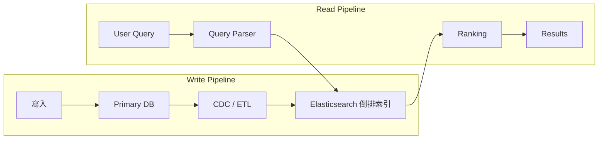
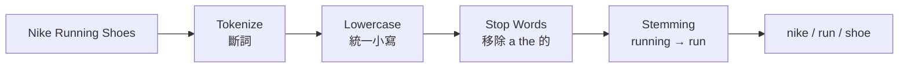
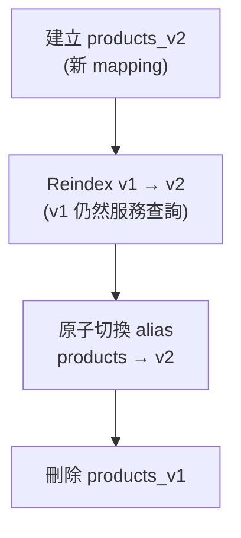
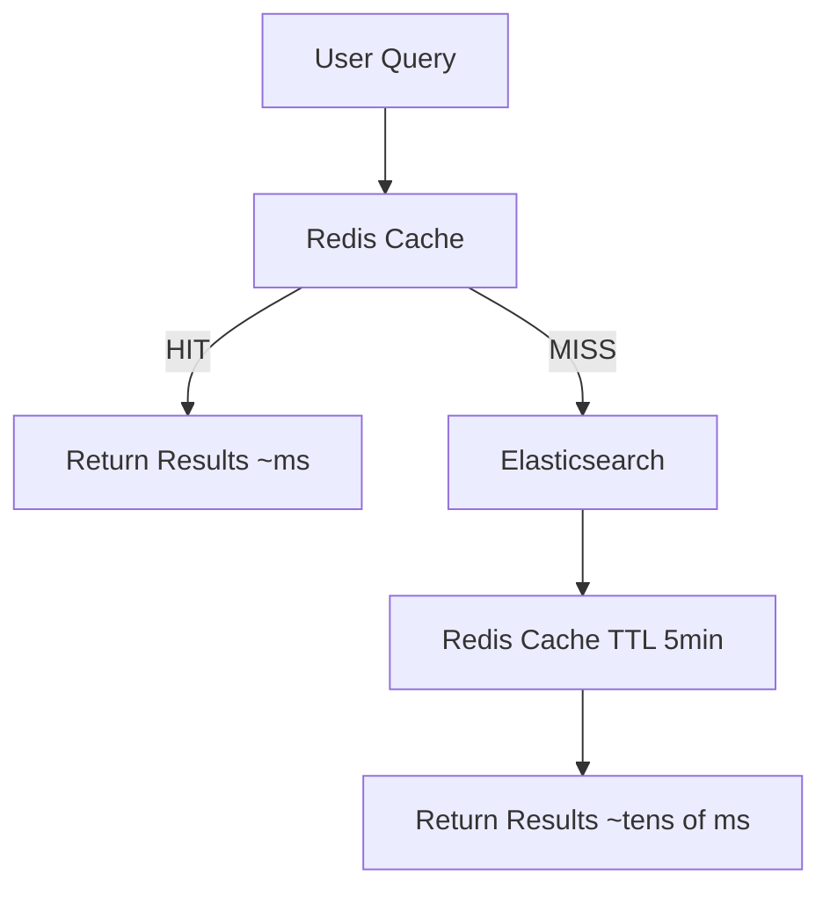

# 搜尋系統 (Search System)

> 一句話:**搜尋不是資料庫查詢。** 用 `LIKE '%keyword%'` 做全表掃描、無法處理語義近似;搜尋系統需要完全不同的資料結構——[[inverted-index|倒排索引]]。

## 為什麼 LIKE 查詢不夠用

資料庫的 `LIKE '%running shoes%'` 有兩個致命傷:

1. **效能**:無法使用索引,幾百萬筆資料可能跑幾十秒。
2. **語義**:「跑步鞋」不匹配「慢跑鞋」;「running shoes」不匹配「run shoe」。

搜尋做的是**相關性排序**,不是精確比對——這需要獨立的搜尋引擎架構。

## 整體架構:兩條管線

搜尋系統由「寫入管線」與「讀取管線」組成,中間共用一個 [[inverted-index|倒排索引]]。



- **[[search-index|搜尋索引]]不是主資料庫**——它是建在主資料庫上的次要索引(secondary index)。主資料庫負責寫入與一致性;搜尋索引負責高效全文搜尋。

## 倒排索引 (Inverted Index)

傳統資料庫是「文件 → 詞彙」的映射。[[inverted-index|倒排索引]]反過來,建立「詞彙 → 文件清單 (Posting List)」的映射:

| Term | Posting List |
|---|---|
| "run" | [P1, P5, P12] |
| "shoe" | [P1, P3, P5, P8] |
| "nike" | [P3, P8] |

搜尋「running shoes」→ 取 `run` 和 `shoe` 兩個清單的**交集** → [P1, P5]，速度與全表掃描完全不在同一量級。

### 文字分析管線 (Text Analysis Pipeline)

原始文字進入索引前必須先分析:



- **[[tokenization|斷詞 (Tokenization)]]**:切成個別詞元。
- **Lowercasing**:統一小寫。
- **Stop word removal**:移除無意義詞(「的」「a」「the」)。
- **[[stemming|Stemming]]**:還原詞形,把「running」「runs」「ran」都當成「run」。

查詢時,用戶輸入也走同樣的分析流程,確保查詢詞與索引詞能匹配。

## Indexing Pipeline:資料怎麼進入搜尋索引

### 方案一:雙寫 (Dual Write)

應用程式在寫入主資料庫的同時也寫入搜尋索引。

**問題**:兩個寫入不是原子操作——資料庫成功但 Elasticsearch 失敗時資料不一致。複雜度被推到應用層,容易出錯。

### 方案二:CDC (Change Data Capture) ← 推薦

監聽資料庫的 [[wal|WAL (Write-Ahead Log)]],把每個資料變更轉成事件,非同步同步到搜尋索引。


**優點**:
- 應用程式只需寫主資料庫,搜尋同步完全**解耦**。
- Kafka 作緩衝,Elasticsearch 暫時不可用也不遺失資料。
- Indexer 可做資料轉換(合併多表、重算欄位)。

**缺點**:資料有延遲——從寫入到可搜尋通常幾秒到幾十秒。**大多數搜尋場景可接受。**

### 零停機重建索引 (Zero-Downtime Reindexing)

改變 mapping(新增欄位、換分詞器)時需重建整個索引。用 **Alias** 切換可避免停機:



用 alias 做零停機的索引切換,是 [[elasticsearch|Elasticsearch]] 的標準做法。

## Query Pipeline:讓結果有意義

### BM25 相關性排序

[[bm25|BM25]] 是 Elasticsearch 的預設排序演算法,綜合三個因素:

- **TF (Term Frequency)**:詞在文件裡出現越多次分數越高,但非線性。
- **IDF (Inverse Document Frequency)**:詞在所有文件越少見分數越高——「Gore-Tex」比「鞋」更有辨別力。
- **欄位長度**:同樣出現一次,在短標題比長描述的權重更高。

### Boosting(欄位權重)

商品名稱裡的關鍵字比描述裡更重要,可以設定欄位倍率:名稱 `^3`、分類 `^2`、描述 `^1`。

### 業務邏輯排序

純文字相關性分數往往不夠。真實排序通常是相關性加業務指標的組合:

```
最終分數 = 相關性 × 0.6 + 銷量分數 × 0.2 + 評分分數 × 0.1 + 新品加成 × 0.1
```

## 常見進階功能

### Autocomplete(自動補全)

用戶輸入「runn」,需要在 **100ms 內**回應建議詞。

- **[[edge-ngram|Edge N-gram]]**:建索引時把「running」拆成 `["r","ru","run","runn",…,"running"]`,每個前綴都建索引,查詢時直接精確匹配,速度極快。
- **補全詞來源**:靜態(預建商品名稱)或動態(從搜尋歷史統計高頻詞)。
- **快取**:在 Autocomplete 索引上加 Redis 快取確保 100ms 以內回應。

### Faceted Search(多面向過濾)

電商側欄的品牌、價格範圍、顏色過濾——點選後結果縮小,各過濾項目計數也同步更新(如「Nike (143)」)。用 [[elasticsearch|Elasticsearch]] 的 **Aggregation API** 一次查詢同時返回結果與各維度統計。

### 分頁 (Pagination)

| 方式 | 適用場景 | 注意 |
|---|---|---|
| [[from-size]] | 有頁碼的搜尋(電商) | 限制最大 offset 避免深分頁效能問題 |
| [[search-after]] | 無限下拉 feed | 效能穩定但不能跳頁 |
| [[pit-cursor]] | 翻頁需保持一致資料視角 | 成本最高 |

### 查詢快取 (Query Cache)

熱門搜尋詞會被大量重複查詢,加 Redis 快取大幅降低 Elasticsearch 負載：



快取 key = 查詢詞 + 過濾條件;TTL 設短(幾分鐘)讓新上架/下架商品及時反映。

## 擴展:Sharding 與 Replica

Elasticsearch 透過 [[shard|Shard]] 把索引分散到多個節點,查詢並行後在 Coordinator 合併;Replica 提供讀取吞吐量與容錯。

**Shard 數量決策**:建立索引時就固定,之後無法修改,只能靠 Reindex。官方建議每個 Shard 控制在 **10GB–50GB**。估算：預估資料量 ÷ 目標 Shard 大小。例：500GB 索引、目標每 Shard 25GB → 設 **20 個 Primary Shard**。寧可設多一點。

## 面試心法

> 「搜尋功能我會用 Elasticsearch 建立獨立的搜尋索引,資料透過 [[cdc|CDC]] + Kafka 從主資料庫非同步同步。這樣搜尋和業務系統完全解耦,搜尋索引的壓力不影響主資料庫。」

說出「不走 LIKE 查詢、有獨立的 indexing pipeline」這一句,就展示了你理解搜尋是個獨立的設計問題。

```glossary
{
  "inverted-index": {
    "term": "Inverted Index 倒排索引",
    "short": "建立「詞彙 → 文件清單 (Posting List)」的映射。搜尋時取多個詞的交集即可快速定位相關文件,是搜尋引擎的核心資料結構。",
    "deeper": "倒排索引的 Posting List 交集操作為什麼比資料庫全表掃描快得多?"
  },
  "search-index": {
    "term": "Search Index 搜尋索引",
    "short": "建在主資料庫上的次要索引 (secondary index)。主資料庫負責寫入和一致性;搜尋索引負責高效全文搜尋,兩者職責分離。"
  },
  "tokenization": {
    "term": "Tokenization 斷詞",
    "short": "把原始文字切成個別詞元的過程。例如「Nike Running Shoes」→ [nike, running, shoes]。是 [[inverted-index|倒排索引]] 建立前文字分析管線的第一步。"
  },
  "stemming": {
    "term": "Stemming 詞幹還原",
    "short": "把不同詞形還原到共同詞根。例如「running」「runs」「ran」都還原成「run」,讓查詢詞能匹配到索引中的各種詞形變化。"
  },
  "cdc": {
    "term": "CDC Change Data Capture",
    "short": "監聽資料庫的 [[wal|WAL]],把每個資料變更轉成事件,非同步同步到下游系統(如搜尋索引)。讓應用程式只需寫主資料庫,同步完全解耦。",
    "deeper": "CDC 方案和雙寫方案各有什麼取捨?什麼情況下你會選哪個?"
  },
  "wal": {
    "term": "WAL Write-Ahead Log",
    "short": "資料庫在實際修改資料前先寫入的順序日誌。[[cdc|CDC]] 工具(如 Debezium)透過監聽 WAL 捕捉每一筆變更事件。"
  },
  "elasticsearch": {
    "term": "Elasticsearch",
    "short": "基於 [[inverted-index|倒排索引]] 的分散式搜尋引擎。提供全文搜尋、[[bm25|BM25]] 排序、Aggregation、Shard/Replica 擴展等功能,是目前最常見的搜尋索引選擇。"
  },
  "bm25": {
    "term": "BM25 Best Match 25",
    "short": "Elasticsearch 的預設相關性排序演算法。綜合詞頻 (TF)、逆文件頻率 (IDF)、欄位長度計算每個文件對查詢的相關分數。"
  },
  "edge-ngram": {
    "term": "Edge N-gram",
    "short": "建索引時把詞拆成所有前綴並分別建索引(如「running」→ r, ru, run…)。讓 [[autocomplete|Autocomplete]] 用前綴精確匹配,速度極快。"
  },
  "autocomplete": {
    "term": "Autocomplete 自動補全",
    "short": "用戶輸入部分字元後,系統在 100ms 內返回補全建議。通常用 [[edge-ngram|Edge N-gram]] 索引搭配 Redis 快取實現。"
  },
  "shard": {
    "term": "Shard 分片",
    "short": "Elasticsearch 把索引切分成多個 Shard 分散到不同節點,讓查詢並行執行。Shard 數量在建立索引時固定,之後無法修改,只能靠 Reindex 調整。"
  },
  "from-size": {
    "term": "From/Size Pagination 頁碼分頁",
    "short": "Elasticsearch 最直覺的分頁方式,適合有頁碼的搜尋。需限制最大 offset(通常 10,000)避免深分頁效能問題。"
  },
  "search-after": {
    "term": "Search After 游標分頁",
    "short": "用上一頁最後一筆結果的排序值做為游標繼續翻頁。效能穩定,適合手機無限下拉 feed,但不能跳到任意頁。"
  },
  "pit-cursor": {
    "term": "PIT Cursor Point-in-Time 游標",
    "short": "翻頁過程中保持同一份資料快照,確保結果視角一致。成本最高,適合翻頁期間資料頻繁變動的場景。"
  }
}
```
