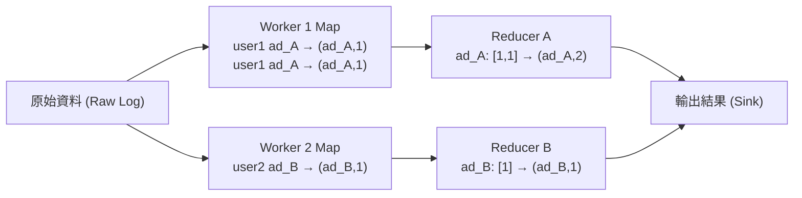
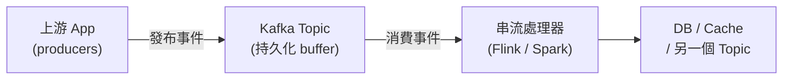
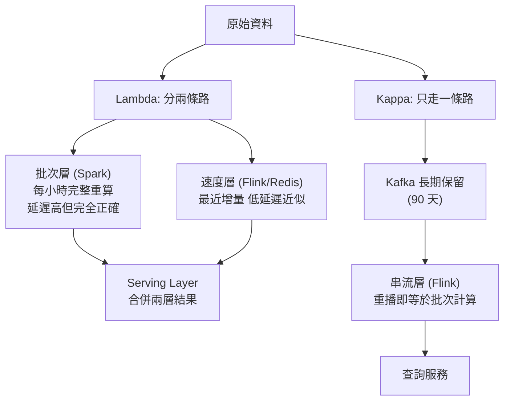
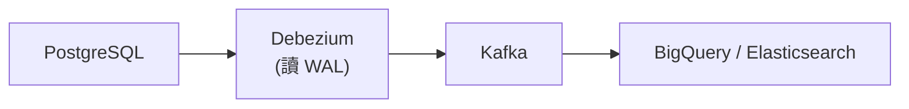

# 資料管線設計 (Data Pipeline Design)

> 你的 App 每天產生大量原始資料——用戶點擊、購買、感測器、log。這些資料本身沒用,真正有價值的是從中提煉出的洞察。**[[data-pipeline|Data Pipeline]]** 就是把資料從來源 (source) 自動搬移、轉化到能被分析的地方 (sink) 的整套系統。

## 核心決策:批次 vs 串流

設計管線的第一個問題:「**資料多快要被看到?**」

| 延遲需求 | 處理模式 | 代表技術 |
|---|---|---|
| 幾秒內 | [[stream-processing]] | [[apache-kafka]] + [[apache-flink]] |
| 幾分鐘 | 微批次 | Spark Streaming、短視窗 Flink |
| 幾小時 / 隔天 | [[batch-processing]] | [[apache-spark]] |

---

## Batch Processing 批次處理

[[batch-processing|批次處理]] 把「靜止的資料」(data at rest) 積累後一次跑完。

**適合場景:**
- 每日銷售報表、月底帳單計算(精確比速度重要)
- 大規模 log 轉 training data、機器學習模型訓練
- 任何「幾小時延遲可接受」的場景

**優點:** 吞吐量高、成本低(可在離峰砸算力)
**缺點:** 延遲高,資料從產生到可用至少等一個批次

### MapReduce 思想

現代批次框架都源自 Google 2004 年提出的 [[mapreduce|MapReduce]] 模型:



- **Map 階段**: 把輸入拆成小塊,平行轉成 key-value pair。
- **Reduce 階段**: 把相同 key 的 value 聚合計算最終結果。
- 強大之處:有多少資料就開多少 worker,天然水平擴展。

### Apache Spark

[[apache-spark|Apache Spark]] 是現代批次處理的主流框架。它把 MapReduce 最大的痛點——每步都寫磁碟——改成**中間結果盡量留在記憶體**,比 Hadoop MapReduce 快 10–100 倍。

核心抽象: RDD + **DataFrame API**(類 SQL 語法,框架自動分散執行)。

> 面試心法: 需要處理 TB 級以上歷史資料、跑 ETL、或訓練 ML 模型 → 直接說「用 Spark 跑批次」。

---

## Stream Processing 串流處理

[[stream-processing|串流處理]] 把每筆進來的資料視為事件,**來一筆立刻處理**,處理「移動中的資料」(data in motion)。

**適合場景:**
- 詐欺偵測:刷卡當下就要判斷異常
- 即時儀表板:「過去 5 分鐘訂單數」
- 異常告警:CPU 飆升立刻觸發,不等批次報告
- 個人化推薦:用戶剛看完電影,下一秒更新推薦

**優點:** 低延遲(秒甚至毫秒級)
**缺點:** 複雜度高——失敗如何重試?如何避免重複計算?亂序事件怎麼辦?

### Apache Kafka 作為事件骨幹

[[apache-kafka|Kafka]] 是串流架構的中心,一個**高吞吐、持久化的分散式事件串流平台**。



- 上游發布事件到 topic;下游以自己的速度訂閱消費。
- 事件預設保留 7 天,consumer 可以**重播 (replay)** 歷史事件——這在 Kappa 架構裡至關重要。

### Apache Flink 與視窗

[[apache-flink|Flink]] 是串流處理的現代主流框架(Airbnb、Uber、阿里巴巴都在用)。串流無法等所有資料到齊,必須在某個時間範圍內聚合,這就是**視窗 (Window)**:

| 視窗類型 | 說明 | 範例 |
|---|---|---|
| [[tumbling-window]] | 固定大小、不重疊 | 每 5 分鐘一個視窗的訂單數 |
| [[sliding-window]] | 固定大小、重疊滑動 | 每分鐘更新的最近 5 分鐘訂單數 |
| [[session-window]] | 依活動分組、變動大小 | 閒置超 30 分鐘算新 session |

### Event Time vs Processing Time

事件的「發生時間」和「到達處理器的時間」往往不同——手機離線時產生的事件,網路恢復才送到。

- **Processing Time**: 用事件到達時間分窗,簡單但可能分錯窗。
- **Event Time**: 用事件本身記錄的真實發生時間,更準確,但需要處理**遲到事件**。

[[watermark|Watermark]] 是 Flink 的解法——處理器聲明「這個時間點之前的事件都已到達」,視窗才關閉輸出。合理設定 watermark 延遲(例如允許最多遲到 10 秒),在準確性與輸出延遲之間取得平衡。

---

## 兩種架構哲學



### Lambda Architecture

同時跑批次和串流兩條管線:
- **批次層**: 定期對全部歷史資料完整計算,結果完全正確但延遲高。
- **速度層**: 只處理最近增量,低延遲但可能有微小誤差。
- **服務層**: 查詢時合併兩層結果。

**問題**: 批次和串流實現同樣的業務邏輯,任何改動都要同步修改兩套程式碼——維護負擔很重。

### Kappa Architecture

[[kappa-architecture|Kappa]] 的核心思想: 把所有資料保存在 Kafka,邏輯改變時從最早的 offset 重播一遍,等於做了一次批次計算。只維護**一套串流邏輯**。

- **優點**: 架構簡單,只有一套邏輯。
- **缺點**: 重播超大規模歷史資料效能不如 Spark;長期保留大量資料的 Kafka 儲存成本較高。
- **面試選擇**: 現代公司傾向 Kappa;題目強調「TB 級以上歷史分析」時 Lambda 或純批次更合理。

---

## ETL vs ELT

| 模式 | 流程 | 特點 |
|---|---|---|
| [[etl]] | 抽取→轉換→載入 | 傳統資料倉儲方式,進倉前清洗完畢 |
| [[elt]] | 抽取→載入→轉換 | 先存原始資料,在倉儲內用 SQL 轉換 |

現代雲端資料倉儲(BigQuery、Snowflake)計算能力強大,**大多數新系統傾向 ELT**——保留原始資料,轉換邏輯可隨時修改重跑。

---

## 資料去哪裡?Data Warehouse vs Data Lake

| 類型 | 特點 | 代表技術 |
|---|---|---|
| [[data-warehouse]] | Schema-on-write,查詢快,適合 BI 報表 | BigQuery、Snowflake、Redshift |
| [[data-lake]] | Schema-on-read,儲存便宜,適合 ML 和探索分析 | S3+Parquet、HDFS |
| [[data-lakehouse]] | 結合兩者:低成本物件儲存 + ACID 支援 | Delta Lake、Apache Iceberg |

---

## 三個常見管線模式

### 1. Change Data Capture (CDC)

[[cdc|CDC]] 監聽資料庫的 [[wal|WAL (Write-Ahead Log)]],把每一筆 INSERT / UPDATE / DELETE 作為事件捕捉,實時同步到下游系統——比定期全量複製高效得多。



**[[debezium|Debezium]]** 是最常用的 CDC 工具,支援 PostgreSQL、MySQL、MongoDB。

> 面試心法: 需要在不影響線上 DB 效能的情況下把資料同步到另一個系統 → CDC + Kafka 是標準答案。

### 2. Fan-out Pipeline 扇出管線

一個上游事件觸發多個下游處理。**錯誤做法**:App server 直接呼叫所有下游服務——強耦合,一個慢就全卡。

**正確做法**: [[fan-out|Kafka pub/sub 扇出]]——App server 只發一個事件到 Kafka topic,各下游服務各自訂閱,獨立消費互不影響。新增下游只需訂閱 topic,不改 App server 程式碼。

### 3. Data Enrichment Pipeline 資料豐富化

點擊事件只有 `user_id`,分析需要地區、年齡、訂閱方案——在串流管線中動態從 side input 補充資訊。

> 注意: 高吞吐管線裡每筆事件都查 DB 會成為嚴重瓶頸。實務上在本地維護熱點資料的快取(Redis 或記憶體),定期更新。

---

## 容錯機制

資料管線最怕的不是速度慢,而是**資料搞錯**——重複計算兩次,或有一批沒被處理到。

### 三種語意保證

| 保證 | 說明 | 代價 |
|---|---|---|
| [[at-most-once]] | 最多一次,可能遺失 | 實作最簡單,但遺失資料通常無法接受 |
| [[at-least-once]] | 至少一次,可能重複 | 大多數系統預設,失敗重試可能導致重複 |
| [[exactly-once]] | 恰好一次,不遺失不重複 | 最強保證,需框架與下游協作,有效能代價 |

**實務最佳組合**: 管線保證 **[[at-least-once]]** + 下游寫入設計成 **[[idempotency|冪等 (idempotency)]]**——比追求 exactly-once 更簡單也更可靠。

```sql
-- 非冪等: 重複執行會多插一行
INSERT INTO events VALUES (user_id, event_type, timestamp);

-- 冪等: 重複執行結果相同
INSERT INTO events VALUES (user_id, event_type, timestamp)
ON CONFLICT (event_id) DO NOTHING;
```

### Checkpointing 檢查點

[[checkpointing|Checkpointing]] 讓串流處理器定期把當前處理狀態(已處理到哪個 offset、中間聚合結果)寫到持久化儲存(如 S3)。崩潰後從最近的 checkpoint 恢復,不需從頭來過。

**取捨**: 頻率太高 → I/O 開銷大影響吞吐;頻率太低 → 崩潰後要重處理的資料量多。

---

## 面試攻略:四步驟框架

1. **先問清楚延遲需求** — 「幾秒內?幾分鐘?幾小時?」再選批次或串流。不要上來就說「用 Kafka + Flink」。
2. **識別來源和目的地** — 「來源是 PostgreSQL + App log,目的地是 BigQuery(報表)+ Redis(即時排行榜)。」
3. **說明轉換邏輯複雜度** — 簡單過濾用 Kafka + consumer 就夠;複雜 join、視窗聚合才需要 Flink 或 Spark。
4. **主動說明容錯策略** — 「透過 Kafka offset 保證 at-least-once,寫入操作冪等,實際上達到 exactly-once 效果。」

```glossary
{
  "data-pipeline": {
    "term": "Data Pipeline 資料管線",
    "short": "把原始資料從來源 (source) 自動搬移、轉化到能被分析或消費的目的地 (sink) 的整套系統。核心挑戰是大量、容錯、格式演化。",
    "deeper": "設計一個資料管線時,第一個要問的問題是什麼?"
  },
  "batch-processing": {
    "term": "Batch Processing 批次處理",
    "short": "把「靜止的資料」積累後定期一次跑完。吞吐量高、成本低,但延遲高(至少等一個批次跑完)。適合報表、帳單、ML 訓練。"
  },
  "stream-processing": {
    "term": "Stream Processing 串流處理",
    "short": "把每筆進來的資料視為事件,產生後立刻處理「移動中的資料」。低延遲,但複雜度高——需處理失敗重試、重複計算、亂序事件。"
  },
  "mapreduce": {
    "term": "MapReduce",
    "short": "Google 2004 年提出的分散式計算模型。Map 階段平行轉成 key-value pair,Reduce 階段聚合同 key 的結果。現代批次框架的基礎思想。"
  },
  "apache-spark": {
    "term": "Apache Spark",
    "short": "現代批次處理主流框架。把 MapReduce 的中間結果留在記憶體而非磁碟,比 Hadoop MapReduce 快 10–100 倍。提供 DataFrame API,支援類 SQL 語法。",
    "deeper": "Spark 比 Hadoop MapReduce 快的核心原因是什麼?"
  },
  "apache-kafka": {
    "term": "Apache Kafka",
    "short": "高吞吐、持久化的分散式事件串流平台。上游 producer 發布事件到 topic,下游 consumer 訂閱消費。事件預設保留 7 天,支援 [[stream-processing|串流]] 重播。"
  },
  "apache-flink": {
    "term": "Apache Flink",
    "short": "串流處理的現代主流框架,支援 [[tumbling-window|滾動視窗]]、[[sliding-window|滑動視窗]]、[[session-window|會話視窗]] 與 [[watermark|Watermark]] 機制。Airbnb、Uber 等大型公司廣泛使用。"
  },
  "tumbling-window": {
    "term": "Tumbling Window 滾動視窗",
    "short": "固定大小、不重疊的視窗。每筆事件恰好屬於一個視窗。範例:每 5 分鐘一個視窗的訂單計數。"
  },
  "sliding-window": {
    "term": "Sliding Window 滑動視窗",
    "short": "固定大小、但會重疊滑動的視窗。範例:每分鐘更新一次、覆蓋過去 5 分鐘的訂單數——前後視窗有重疊。"
  },
  "session-window": {
    "term": "Session Window 會話視窗",
    "short": "依用戶活動分組、大小可變的視窗。閒置超過閾值(如 30 分鐘)就結束一個 session,開新視窗。"
  },
  "watermark": {
    "term": "Watermark 水位線",
    "short": "Flink 用來處理遲到事件的機制。Watermark 聲明「此時間點之前的事件都已到達」,讓視窗得以關閉輸出。設定延遲越大,準確性越高但輸出延遲也越大。",
    "deeper": "Watermark 延遲設太小或太大各會造成什麼問題?"
  },
  "kappa-architecture": {
    "term": "Kappa Architecture Kappa 架構",
    "short": "只用一套串流邏輯取代 Lambda 的批次+串流雙管線。把資料長期保留在 [[apache-kafka|Kafka]],需要重算時從頭重播即可。架構更簡單,但大規模歷史重算效能不如 Spark。"
  },
  "lambda-architecture": {
    "term": "Lambda Architecture Lambda 架構",
    "short": "同時維護批次層(完全正確但延遲高)和速度層(低延遲但近似),查詢時合併兩層結果。優點是結果準確;缺點是需要維護兩套邏輯,維護成本高。"
  },
  "etl": {
    "term": "ETL Extract-Transform-Load",
    "short": "先抽取資料,在中間層清洗轉換,最後載入目的地。傳統資料倉儲方式,資料進倉前已清洗完畢。"
  },
  "elt": {
    "term": "ELT Extract-Load-Transform",
    "short": "先把原始資料直接載入強大的分析型資料庫,再在裡面用 SQL 轉換。保留原始資料,轉換邏輯可隨時修改重跑。現代雲端倉儲的主流方式。"
  },
  "data-warehouse": {
    "term": "Data Warehouse 資料倉儲",
    "short": "存放結構化、已清洗資料,針對分析查詢優化。Schema-on-write(寫入前定好結構),查詢速度快,適合 BI 報表。代表:BigQuery、Snowflake、Redshift。"
  },
  "data-lake": {
    "term": "Data Lake 資料湖",
    "short": "存放原始、未處理的各種格式資料(結構化、半結構化、非結構化)。Schema-on-read,儲存便宜彈性高,適合 ML 訓練和探索分析。代表:S3+Parquet、HDFS。"
  },
  "data-lakehouse": {
    "term": "Data Lakehouse 湖倉一體",
    "short": "結合 [[data-lake|資料湖]] 的低成本儲存與 [[data-warehouse|資料倉儲]] 的 ACID 支援。透過 Delta Lake、Apache Iceberg 格式層,在 S3 上支援事務和高效查詢。"
  },
  "cdc": {
    "term": "CDC Change Data Capture 變更資料捕捉",
    "short": "監聽資料庫的 [[wal|WAL]],把每筆 INSERT/UPDATE/DELETE 作為事件捕捉並實時同步到下游。比定期全量複製高效得多。搭配 [[debezium|Debezium]] + [[apache-kafka|Kafka]] 是面試標準答案。",
    "deeper": "為什麼 CDC 比定期全量複製更適合用於資料同步?"
  },
  "wal": {
    "term": "WAL Write-Ahead Log 預寫日誌",
    "short": "資料庫在修改資料前先把操作記錄到的日誌檔。[[cdc|CDC]] 工具透過讀取 WAL 捕捉資料庫的每一個變更事件。"
  },
  "debezium": {
    "term": "Debezium",
    "short": "最常用的 [[cdc|CDC]] 工具,支援 PostgreSQL、MySQL、MongoDB。把資料庫的每個變更轉成 [[apache-kafka|Kafka]] 事件,下游訂閱後可做同步分析倉儲、更新搜尋索引、快取失效等。"
  },
  "fan-out": {
    "term": "Fan-out Pipeline 扇出管線",
    "short": "一個上游事件觸發多個下游處理。透過 [[apache-kafka|Kafka]] pub/sub:App server 只發一個事件,各下游服務各自訂閱獨立消費,上下游完全解耦。",
    "deeper": "Fan-out 模式如何解決上下游強耦合的問題?"
  },
  "at-most-once": {
    "term": "At-most-once 最多一次",
    "short": "每筆資料最多處理一次,可能遺失。實作最簡單,但遺失資料通常無法接受。"
  },
  "at-least-once": {
    "term": "At-least-once 至少一次",
    "short": "每筆資料至少處理一次,可能重複。大多數系統的預設保證——失敗就重試,重試可能導致重複計算。搭配 [[idempotency|冪等寫入]] 可實際達到 exactly-once 效果。"
  },
  "exactly-once": {
    "term": "Exactly-once 恰好一次",
    "short": "每筆資料精確處理一次,不遺失不重複。最強保證但有效能代價,需要框架與下游系統協作。實務上常用 [[at-least-once]] + [[idempotency|冪等寫入]] 替代。"
  },
  "idempotency": {
    "term": "Idempotency 冪等性",
    "short": "同一操作執行多次結果都相同。管線設計中用冪等寫入(如 upsert、ON CONFLICT DO NOTHING)搭配 [[at-least-once]] 保證,達到實質上的 [[exactly-once]] 效果。"
  },
  "checkpointing": {
    "term": "Checkpointing 檢查點",
    "short": "串流處理器定期把當前狀態(已處理到哪個 offset + 中間聚合結果)寫到持久化儲存(如 S3)。崩潰後從最近 checkpoint 恢復,不需從頭來過。頻率是吞吐量與恢復代價的取捨。",
    "deeper": "Checkpointing 的頻率該怎麼選擇?太頻繁和太少各有什麼問題?"
  }
}
```
