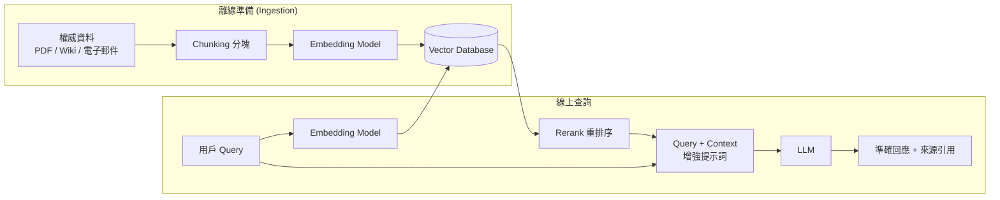
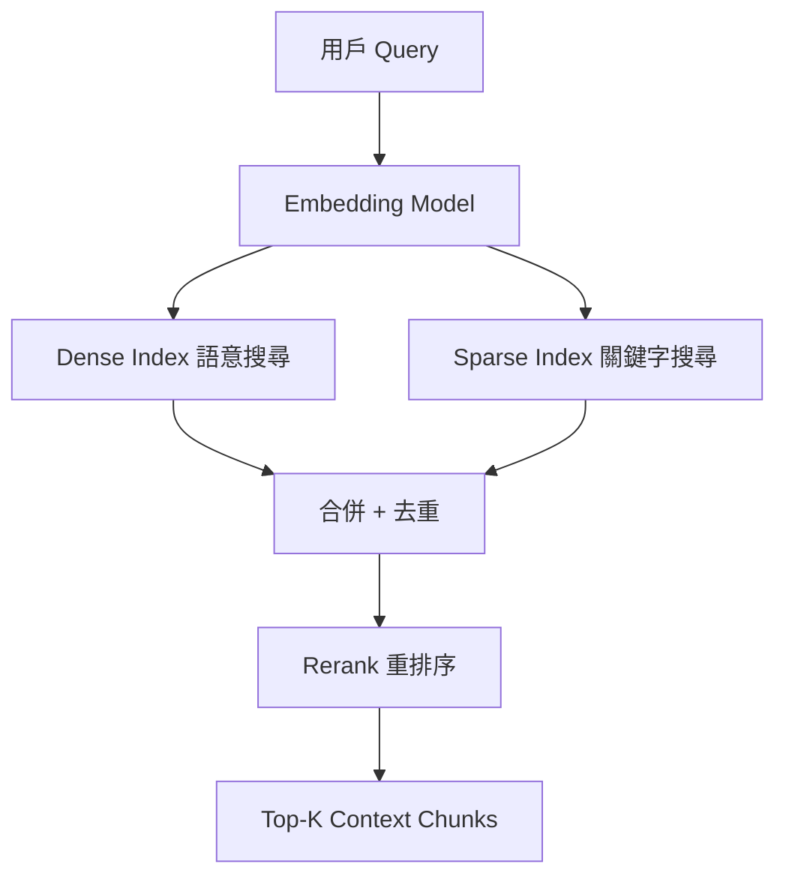
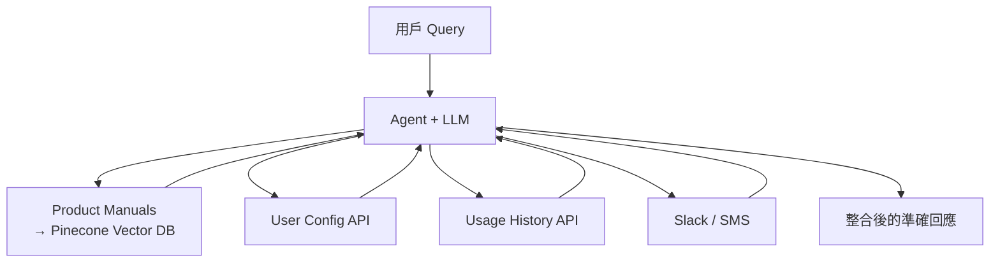

# RAG — 檢索增強生成 (Retrieval-Augmented Generation)

> 一句話:**把外部的權威資料「即時塞進」提示詞,讓語言模型回答得更準、更可信。**

---

## 為什麼需要 RAG？Foundation Model 的三大先天限制

純粹建立在 [[foundation-model|Foundation Model]] 上的產品很聰明,卻有三個根本缺陷:

**1. 知識截止日期 (Knowledge Cutoff)**
模型在海量資料上訓練完畢後,知識就凍結在某個時間點。問它上週的新聞或最新產品功能,它可能給出聽起來合理卻完全錯誤的答案——這就是 [[hallucination|幻覺 (Hallucination)]]。

**2. 缺乏特定領域深度**
公開訓練資料廣而淺。高度專業的領域(如罕見疾病、內部法規)資料量不足,模型回答往往不完整或不相關。

**3. 缺乏私有 / 專有資料**
你公司的內部流程、客戶資料、商業機密不存在於公開訓練集。通用模型根本不知道你的業務細節。

這三個限制共同導致用戶失去信任。RAG 就是為了解決這些問題而生的。

---

## 什麼是 RAG？

[[rag|RAG (Retrieval-Augmented Generation)]] 利用**具有權威性的外部資料**來提升模型輸出的準確性、相關性和實用性。它由四個核心元件組成:

| 元件 | 作用 |
|---|---|
| [[ingestion]] | 把權威資料切塊、向量化、存入資料庫(離線準備) |
| [[retrieval]] | 根據用戶 query 從資料庫檢索最相關的片段 |
| [[augmentation]] | 把檢索結果與 query 合併成一個增強後的提示詞 |
| [[generation]] | LLM 根據增強提示詞生成最終回應 |



---

## RAG 帶來的好處

- **存取即時 / 專有資料** — 引入當前事件、客戶資料、公司內部知識。
- **建立信任** — 結果附帶來源引用,支援人工審查。
- **更強的控制能力** — 可控制資料來源、存取授權、guardrail、成本,並獨立調整每個元件。
- **比替代方案更划算** — 自行訓練或 [[fine-tuning|Fine-tuning]] 模型成本高昂;把大量資訊塞進 [[context-window|Context Window]] 每次都要付費,RAG 只在需要時撈取。

---

## 四步走：RAG 如何運作

### 第一步：Ingestion（資料攝取）

把你的權威資料（文字、PDF、電子郵件、內部 Wiki、資料庫）載入 [[vector-database|Vector Database]] 的流程:

1. **清洗資料** — 去除雜訊、格式化。
2. **[[chunking|Chunking 分塊]]** — 把長文件切成較小片段。分塊策略需依資料類型與查詢模式選擇。
3. **向量化 (Embedding)** — 用 [[embedding-model|Embedding Model]] 把每個 chunk 轉成數值向量,代表語意。
4. **存入 Vector Database** — 通常是離線批次進行;若資料即時變動(如商品庫存),可即時更新索引。

### 第二步：Retrieval（檢索）

收到用戶 query 後:

1. 把 query 也向量化。
2. 在 Vector Database 中搜尋語意相似的片段。
3. 更好的做法是用 **[[hybrid-search|Hybrid Search]]**:同時結合 [[semantic-search|Semantic Search]](Dense Vector,理解語意)和 [[lexical-search|Lexical Search]](Sparse Vector,比對關鍵字 / 縮寫 / 產品名)。
4. 用 [[reranking|Reranking Model]] 統一排序,回傳最相關的結果。



### 第三步：Augmentation（增強）

把檢索結果和原始 query 組合成一個增強提示詞,告訴模型「用這些搜尋結果來回答問題;若結果裡沒有答案,就說不知道」。這一步鼓勵模型優先使用提供的事實,而非依賴訓練時的記憶。

### 第四步：Generation（生成）

LLM 收到增強提示詞後,根據附帶的上下文生成回應,大幅降低 [[hallucination|Hallucination]] 的機率,並可在回答中引用來源。

---

## Agentic RAG：下一步演進

傳統 RAG 是「一次搜尋 + 一次生成」的線性流程。**[[agentic-rag|Agentic RAG]]** 把 AI Agent 作為整個流程的 Orchestrator:

- **構建更有效的 query** — 改寫、分解複雜問題。
- **存取多種 retrieval 工具** — Vector DB、API、資料庫、Slack、SMS 等。
- **評估檢索結果** — 判斷是否夠準確、夠相關,或需要再搜尋。
- **推理與驗證** — 決定相信或捨棄特定片段,迭代式地組合資訊。



在 Agentic RAG 中,LLM 自行決定要使用哪些工具、何時使用、如何組合結果——這比單次靜態搜尋更靈活,也更適合複雜的企業場景。

---

## RAG vs. 替代方案

使用 RAG 之前,先問:「**我真的需要 RAG 嗎?**」

需要先建立 **[[ground-truth-eval|Ground Truth Evaluation]]**:確定一組 query 與預期答案,作為衡量應用是否正常運作的 baseline。RAG 本身只是一種優化手段;其他手段還有 query rewriting、chunk expansion、knowledge graph 等,要靠評估結果決定該用哪個。

| 方案 | 優點 | 缺點 |
|---|---|---|
| [[rag]] | 低成本、即時更新、可引用來源 | 需維護 Vector DB 與 Ingestion pipeline |
| [[fine-tuning]] | 模型深度習得特定風格/知識 | 成本高、重新訓練費時、知識仍有截止日 |
| 大 [[context-window]] | 實作簡單 | 每次呼叫 token 費用高、latency 高 |

---

> 💡 **面試心法**:被問「怎麼讓 LLM 知道公司私有資料?」→ 先說 RAG(不重新訓練、成本低、可追溯),再說何時才需要 Fine-tuning(固定領域風格、頻繁使用同樣知識)。

```glossary
{
  "rag": {
    "term": "RAG (Retrieval-Augmented Generation) 檢索增強生成",
    "short": "在向 LLM 提問前,先從外部權威資料庫撈出相關片段,把它們一起塞進提示詞,讓模型根據這些事實回答,降低 [[hallucination|Hallucination]] 並可引用來源。",
    "deeper": "RAG 與 Fine-tuning 各自適合什麼場景?什麼時候該選哪個?"
  },
  "foundation-model": {
    "term": "Foundation Model 基礎模型",
    "short": "在海量公開資料上預訓練的大型模型(如 GPT、Claude),訓練完後知識凍結在截止日,不知道私有資料或最新事件。"
  },
  "hallucination": {
    "term": "Hallucination 幻覺",
    "short": "模型生成聽起來合理但實際錯誤的內容。成因包括訓練資料矛盾、knowledge cutoff、機率性 sampling 等,是 [[foundation-model|Foundation Model]] 的固有風險。",
    "deeper": "RAG 如何減少 Hallucination?它能完全消除嗎?"
  },
  "ingestion": {
    "term": "Ingestion 資料攝取",
    "short": "RAG 的準備階段:把權威資料清洗、[[chunking|分塊]]、向量化後存入 [[vector-database|Vector Database]]。通常離線批次執行。"
  },
  "retrieval": {
    "term": "Retrieval 檢索",
    "short": "RAG 線上查詢的第一步:把用戶 query 向量化,在 Vector Database 搜尋語意相近的片段,再用 [[reranking|Reranking]] 排序後回傳 Top-K 結果。"
  },
  "augmentation": {
    "term": "Augmentation 增強",
    "short": "把 [[retrieval|Retrieval]] 拿到的 context 與原始 query 組合成一個新提示詞,告訴 LLM「用這些資料回答」。這是 RAG 魔法真正發生的地方。"
  },
  "generation": {
    "term": "Generation 生成",
    "short": "RAG 的最後一步:LLM 根據 [[augmentation|增強提示詞]] 生成回應,因為有了具體事實支撐,準確度大幅提升。"
  },
  "chunking": {
    "term": "Chunking 分塊",
    "short": "把長文件切成較小片段再向量化,讓檢索更精準。分塊大小與策略需依資料類型和查詢模式調整。"
  },
  "embedding-model": {
    "term": "Embedding Model 嵌入模型",
    "short": "把文字轉成數值向量(embeddings)的模型,向量空間中距離近的代表語意相似。RAG 的 Ingestion 與 Retrieval 步驟都需要它。"
  },
  "vector-database": {
    "term": "Vector Database 向量資料庫",
    "short": "專門儲存與搜尋向量的資料庫(如 Pinecone),能在百萬筆向量中快速找出與 query 語意最相近的片段。"
  },
  "hybrid-search": {
    "term": "Hybrid Search 混合搜尋",
    "short": "同時使用 [[semantic-search|Semantic Search]](Dense Vector)和 [[lexical-search|Lexical Search]](Sparse Vector)再合併結果,比單一方法涵蓋更多查詢類型。"
  },
  "semantic-search": {
    "term": "Semantic Search 語意搜尋",
    "short": "用 Dense Vector 比對語意相似度,理解「同一意思的不同說法」,適合自然語言查詢。"
  },
  "lexical-search": {
    "term": "Lexical Search 詞彙搜尋",
    "short": "用 Sparse Vector 做關鍵字比對,適合搜尋縮寫、產品名稱、內部術語等精確字串。"
  },
  "reranking": {
    "term": "Reranking 重排序",
    "short": "在 Retrieval 後用 Reranking Model 對候選片段重新評分排序,確保送給 LLM 的 context 最相關。"
  },
  "agentic-rag": {
    "term": "Agentic RAG 代理式 RAG",
    "short": "以 AI Agent 作為 RAG 流程的 Orchestrator:自主決定要用哪些工具、如何 query、迭代驗證 context,比傳統一次性 RAG 更靈活、更適合複雜場景。",
    "deeper": "Agentic RAG 和傳統 RAG 的主要差異是什麼?什麼場景才值得用 Agentic RAG?"
  },
  "fine-tuning": {
    "term": "Fine-tuning 微調",
    "short": "在預訓練模型上用特定資料繼續訓練,讓模型深度習得某種風格或知識。成本高、耗時,且仍有 knowledge cutoff 問題,適合固定領域而非即時更新的需求。"
  },
  "context-window": {
    "term": "Context Window 上下文視窗",
    "short": "LLM 單次能處理的最大 token 數。把大量資料直接塞進 context window 雖然簡單,但每次呼叫都要付全部 token 費用,成本高且 latency 長。"
  },
  "ground-truth-eval": {
    "term": "Ground Truth Evaluation 基準評估",
    "short": "事先準備一組 query 與預期答案作為 baseline,用來衡量 RAG 應用是否正常運作,以及改進措施是否真的有效。"
  }
}
```
