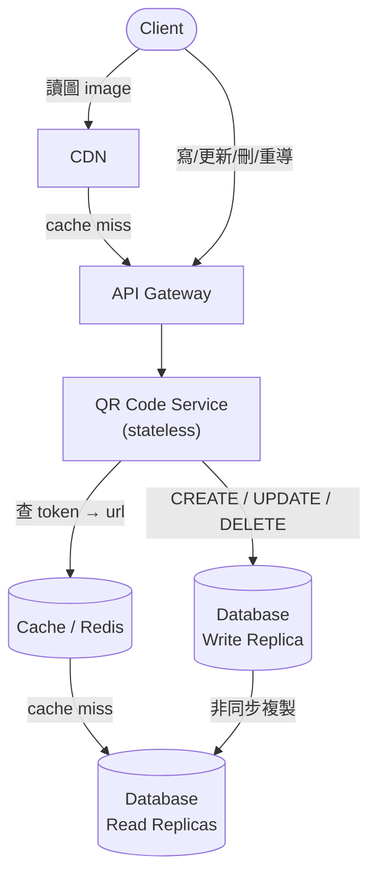

# 07 / 01. Design QR Code Generator — 影片筆記 (video notes)

> 來源：影片 gemini_digest_lesson，2026-06-13。**影片轉述（pattern 級，非逐字）**；尚未入庫 KG。投影片逐字原文另見同資料夾 digest.md。

---

## 1. 問題與需求 (Functional / Non-Functional)

### 功能需求 Functional Requirements (00:46)
1. 使用者可以上傳 URL，服務回傳對應的 QR Code。
2. 使用者可以編輯或刪除自己建立的 QR Code。
3. 掃描 QR Code 會將使用者重新導向到原始 URL。

> 問題範圍先簡化為「QR Code 嵌入一個 URL」。(00:28)

### 非功能需求 Non-Functional Requirements (02:14)
1. **高可用性 (High Availability)**：服務須 24/7 不中斷。
2. **低延遲 (Low Latency)**：重新導向過程須快速，目標 **< 100ms**。
3. **可擴展性 (Scalability)**：需支援至多 **10 億個 QR Code**、**1 億名使用者**。

---

## 2. 容量估算 (Back-of-Envelope)

影片中未做詳細的容量估算數字演算；規模目標直接帶入非功能需求（1 billion QR codes、100 million users）作為設計驅動力。

---

## 3. API 設計 (API Design) (05:07)

採用 RESTful 風格：

| 方法 | 路徑 | 說明 |
|------|------|------|
| `POST` | `/v1/qr_code` | 建立 QR Code；Request body 帶 `url`，回傳唯一 `qr_token` |
| `GET` | `/v1/qr_code_image/{qr_token}` | 取得 QR Code 圖片；可選參數 `dimension`、`color`、`border`；回傳 binary image |
| `PUT` | `/v1/qr_code/{qr_token}` | 更新 QR Code 對應的 URL |
| `DELETE` | `/v1/qr_code/{qr_token}` | 刪除 QR Code |

**重新導向設計** (16:12)：QR Code 圖片本身嵌入的 URL 是服務自己的中繼 URL（如 `https://myQrCode/{qr_token}`）。掃描時打到服務，服務查出原始 URL 後回傳 **HTTP 302（暫時重新導向）**。

好處：
- 可在不重印 QR Code 的情況下更改目的地 URL。
- 可在中間層收集點擊分析 (analytics)。

---

## 4. 高層架構 (High-Level Design) (17:19)

### 初版架構（三層 CRUD）(17:40)

```
Client → API Gateway → QR Code Service → Database
```

### 資料庫 Schema (17:58)

表名：`QrCode`

| 欄位 | 說明 |
|------|------|
| `id` | 主鍵 |
| `user_id` | 建立者（外鍵關聯 User） |
| `qr_token` | 公開用的短編碼字串 |
| `url` | 原始長 URL |
| `created_at` | 建立時間戳 |
| `updated_at` | 最後修改時間戳 |

---

### 最終架構（加入快取 + CDN + 讀寫分離）(36:51 起)



**資料流說明：**

**讀流：掃描重新導向**
1. 使用者掃 QR Code → 瀏覽器打 `https://myQrCode/{qr_token}`
2. 請求進 API Gateway → QR Code Service
3. Service 先查 **Cache**（Redis）：
   - Cache hit → 取得 `url`，回 302 重新導向
   - Cache miss → 查 **Read Replica DB** → 把結果寫入 Cache → 回 302

**讀流：取得 QR Code 圖片**
1. Client 向 **CDN** 請求圖片
2. CDN hit → 直接回傳靜態圖片
3. CDN miss → 轉發 API Gateway → Service 產生/取圖 → CDN 快取後回傳

**寫流：建立/更新/刪除**
1. Client → API Gateway → QR Code Service
2. Service 將資料寫入 **Write Replica（主庫）**
3. 資料非同步複製至 **Read Replicas**

---

## 5. 核心元件與設計決策

### 5-1. 產生 `qr_token`（Deep Dive）(25:59)

目標：短、唯一、URL-friendly。

**做法：**
1. 將 `url + 使用者專屬 secret`（防止不同使用者對同 URL 產生相同 token）組合後，用 **SHA-256** 計算 hash。
2. 取 hash 結果的 byte value，用 **Base62 編碼**（`[0-9A-Za-z]`）轉成可讀短字串。

> Base62 是 URL-friendly 的編碼方案，避免 URL 特殊字元問題。

---

### 5-2. 快取（Cache / Redis）(35:45)

- 系統是**讀寫比嚴重失衡**的服務（大量掃描 vs 少量建立）。
- 快取 `qr_token → url` 的映射，大幅減少 DB 讀取壓力。
- 快取置於 QR Code Service 與 Database 之間。

---

### 5-3. CDN (36:44)

- QR Code 圖片為靜態資源 → 適合放 CDN。
- CDN 部署於 API Gateway 前方，把圖片快取在靠近使用者的邊緣節點，降低延遲。
- 注意：QR Code 更新時需做 **cache invalidation**（CDN 快取失效）。

---

### 5-4. 資料庫讀寫分離 (42:27)

- 單一資料庫在大量讀取下會成為瓶頸。
- 拆成 **Write Replica（主庫）** + 多個 **Read Replicas（讀庫）**：
  - 所有 `POST`、`PUT`、`DELETE` → Write Replica
  - 所有 `GET`（重新導向查詢）→ Read Replicas
- 讀寫工作負載可**獨立擴展**。

---

## 6. 架構演進 (Architecture Evolution)

| 階段 | 架構變化 | 解決的問題 |
|------|----------|------------|
| 初版 (17:40) | Client → Gateway → Service → DB | 基本 CRUD，驗證可行性 |
| 加快取 (35:52) | Service ↔ Cache ↔ DB | 讀寫比失衡，降低 DB 讀取壓力 |
| 加 CDN (36:51) | Client → CDN → Gateway → ... | 靜態圖片延遲高，地理分散使用者 |
| DB 讀寫分離 (42:27) | Write Replica + Read Replicas | 大規模讀取，防止主庫成瓶頸 |

---

## 7. 面試重點 / 老師強調的地方

1. **為什麼用 302 而非 301？** (16:12)
   302 是暫時重新導向，瀏覽器不會長期快取，每次掃描都會打到服務 → 才能收 analytics、才能在不換 QR Code 的情況下改目的地。

2. **qr_token 的唯一性要靠 user secret** (25:59)
   同一個 URL 被不同使用者建立時，加入用戶 secret 才能產生不同 token，避免碰撞。

3. **先問非功能需求再設計** (02:14)
   - 可用性、延遲、規模三者直接決定後續要不要加快取、CDN、讀寫分離。

4. **循序漸進的架構演進**
   先畫最簡單可行的 CRUD，再根據 NFR 逐步加料（Cache → CDN → Replication）。這是面試答題的標準節奏。

5. **讀寫分離是擴展讀取的標準解法** (42:27)
   當系統讀遠多於寫，先考慮 Read Replicas；不要一開始就分片 (Sharding)。

---

*影片長度估算：約 45 分鐘。筆記涵蓋完整講課內容，未使用 ask_video 補充。*
