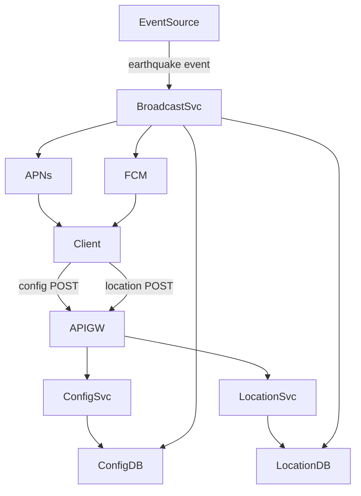
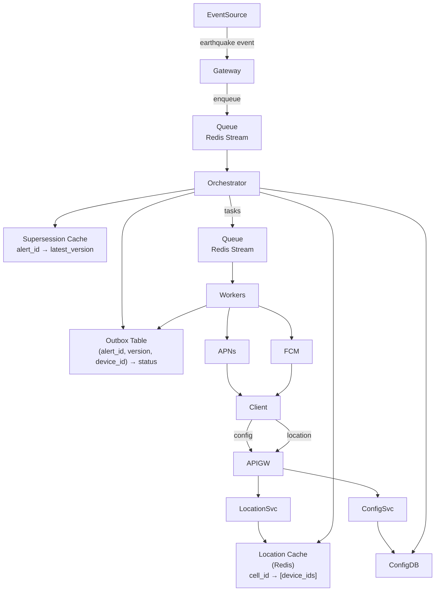

# 07 / 02. Design Earthquake Notification — 影片筆記 (video notes)

> 來源：影片 `gemini_digest_lesson`，2026-06-13。**影片轉述（pattern 級，非逐字）**；尚未入庫 KG。投影片逐字原文見同資料夾 `digest.md`。

---

## 1. 問題與需求

**服務定位**：這是一個 *自製的 App 層地震通知服務*，不是政府的公共警報系統（Public Warning System）。[00:40]

### Functional Requirements [01:30]
- 使用者可設定警報偏好（如：最低震度、最大距離）
- 地震發生時，系統依使用者偏好與即時位置，發送通知

### Non-Functional Requirements [02:44]
- **低延遲**：警報須在 **100ms 內送出**
- **高擴展性**：支援 **2,000 萬**使用者
- **防重複**：同一地震同一使用者，不能收到重複通知

---

## 2. 容量估算

影片未做詳細數字估算，但 NFR 明確點出規模基準：
- 目標使用者規模：**20 million users**
- 延遲 SLA：**< 100ms**

---

## 3. 高層架構 — 含資料流

### 3a. 初版架構（High-Level Design）[07:25]

**資料流說明：**
1. **設定流**：用戶透過 API Gateway → Configuration Service → Config DB，儲存偏好（震度、距離）
2. **位置流**：裝置定期透過 API Gateway → Location Service → Location DB，更新目前位置
3. **廣播流**：外部 Event Source（氣象局等）觸發 Broadcast Service，後者查詢 Config DB + Location DB，找出受影響使用者，再呼叫 APNs / FCM 推播

---

### 3b. 最終詳細架構（Final Architecture）[32:50, 40:49]

**資料流說明：**
1. Gateway 收到地震事件，放入 Queue（Redis Stream）
2. Orchestrator 消費事件，查 Supersession Cache 確認為最新版本，計算受影響地理範圍
3. 用地理索引（cell_id）查 Location Cache，取得可能受影響的 device_id 清單
4. 逐一查 Config DB 驗證使用者偏好
5. 對每筆通知，在 Outbox Table 寫入狀態 `ENQUEUED`（已存在則跳過，即去重）
6. 把通知任務推入下一個 Queue，由 Workers 消費
7. Workers 檢查 Outbox Table 確認未被新版本取代，更新狀態為 `ATTEMPTED`，發送至 APNs / FCM
8. 完成後將 Outbox Table 更新為 `VENDOR_ACCEPTED` 或 `FAILED`

---

## 4. 核心元件與設計決策

### 4a. API 設計 [04:37]
| 端點 | 方法 | 用途 |
|------|------|------|
| `/config` | POST | 使用者設定震度閾值、距離偏好 |
| `/location` | POST | 裝置定期回報目前位置 |

### 4b. 地理空間索引（Geospatial Indexing）[14:34–19:53]

**問題**：若以原始經緯度（lat/long）查詢資料庫，需對兩個欄位各自建 index，實際上是取「dataset 1（符合緯度）∩ dataset 2（符合經度）」的交集，代價極高。[15:49]

**解法**：把 2D 座標轉成 1D 索引，讓查詢退化為單欄位範圍掃描。

| 方案 | 特點 |
|------|------|
| **GeoHash** | 將地球切成均等格網，編碼為字串；前綴相同代表地理上相鄰 [17:28] |
| **Google S2** | 以球面希爾伯特曲線切分，可用 cell 集合精確覆蓋任意形狀 [19:53] |
| **Uber H3** | 六角格（hexagon）切分，覆蓋圓形/任意形狀時邊緣更均勻 [19:53] |

老師建議：S2 和 H3 在覆蓋不規則震源影響範圍時明顯優於 GeoHash。

### 4c. Location Cache 結構 [32:50]
- **舊**：Location DB 存 `(device_id, lat, long)`
- **新**：Location Cache（Redis）存 `cell_id → [device_id, ...]`
- 好處：查詢「某 cell 內的所有裝置」變成單一 Redis key lookup，極快

### 4d. Broadcast Service 拆解 [32:38]

| 元件 | 職責 |
|------|------|
| **Gateway** | 訂閱 Event Source，將原始事件放入 Queue |
| **Queue（Redis Stream / Kafka）** | 解耦、緩衝，讓各元件可獨立擴展 |
| **Orchestrator** | 核心邏輯：查位置、查偏好、寫 Outbox、分發任務 |
| **Workers**（無狀態池）| 從 Queue 取任務，呼叫 APNs / FCM |

**Queue 的兩大好處** [35:46]：
- **解耦（Decoupling）**：Gateway 故障不影響 Workers，反之亦然
- **緩衝（Buffering）**：大地震瞬間流量尖峰，Queue 吸收後 Workers 均速處理

---

## 5. 深入探討 / 取捨

### 5a. 重複通知與亂序事件 [40:53]

地震局可能發出多個版本的同一地震資訊（如：初報 M5.0 → 修正 M6.2），也可能因網路延遲**亂序抵達**。若舊版本在新版本之後被處理，使用者會收到錯誤資訊。

**解法一：Supersession Cache** [42:04]
- KV 結構：`alert_id → latest_version`
- Orchestrator 收到事件時先查此 Cache；若當前版本 < 已知最新版本，丟棄不處理
- Workers 發送前也再確認一次

**解法二：Outbox Table** [42:04]
- 複合主鍵：`(alert_id, version, device_id)`
- 寫入時：若記錄已存在 → 跳過（冪等，防重複）
- Workers 成功送出後更新狀態，記錄最終結果
- 結合 Supersession Cache：即使 Worker 在舊任務上才發現有更新版本，仍可在發送前放棄

### 5b. 架構取捨小結
| 問題 | 解法 | 代價 |
|------|------|------|
| 地理查詢慢 | Geospatial index（S2/H3）| 需維護 cell_id 映射 |
| Broadcast Service 成為瓶頸 | 拆解 + Queue | 引入分散式複雜度 |
| 通知重複 | Outbox Table（冪等） | 額外 DB 寫入 |
| 亂序事件 | Supersession Cache | Cache 需維護一致性 |

---

## 6. 面試重點

1. **NFR 即核心約束**：100ms 延遲 + 20M 用戶 → 直接驅動選用 Cache（非 DB）存位置、Queue 解耦廣播。
2. **地理查詢必考題**：直接問「為何不用 lat/long 雙欄位 index」能馬上展示對資料庫索引的理解；答案是 2D 無法用 B-tree 高效交集，需轉成 1D（GeoHash / S2 / H3）。
3. **S2 vs H3 vs GeoHash**：能說出 S2 適合球面精確覆蓋、H3 適合均勻六角格是加分項。
4. **Outbox Table Pattern**：地震通知是「最少送達一次」而非「恰好一次」的典型場景；Outbox 是達成冪等的標準手法，跟 Saga pattern / CDC 等都有關。
5. **架構演進邏輯**：從 monolithic Broadcast Service → Queue 解耦 → 再加 Supersession + Outbox，能清晰說出每步演進的**問題→解法**是面試的加分展示。
6. **Supersession vs Deduplication**：兩者不同——Supersession 處理「版本衝突（舊 vs 新）」，Deduplication 處理「完全相同的重複請求」，各有不同機制。[47:28]
