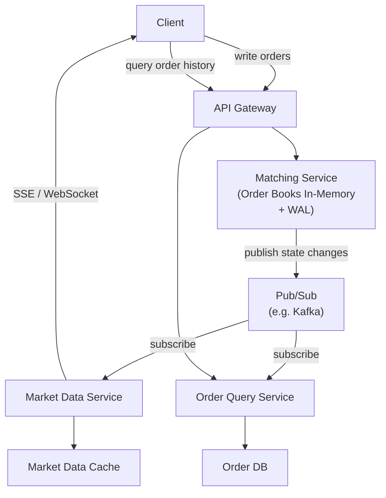

# 07 / 03. Design Polymarket — 影片筆記 (video notes)

> 來源:影片 gemini_digest_lesson,2026-06-13。**影片轉述(pattern 級,非逐字)**;尚未入庫 KG。投影片逐字原文見同資料夾 digest.md。

---

## 1. 問題與需求

### 背景
Polymarket 是一個建立在區塊鏈技術上的**預測市場平台 (Prediction Market Platform)**,讓使用者用加密貨幣對現實世界事件的二元 (YES/NO) 結果下注 (00:08)。加密貨幣被換成「結果代幣 (Outcome Tokens)」代表使用者的押注 (01:42)。

### 核心交易術語 (03:18)
- **限價單 (Limit Order)**:指定價格掛單等待成交
- **市價單 (Market Order)**:以當前最優價立即成交
- **買價 (Bid)**:買方願意出的最高價
- **賣價 (Ask)**:賣方願意接受的最低價
- **價差 (Spread)**:Ask 與 Bid 之間的差距
- **訂單簿 (Order Book)**:所有未成交掛單的即時列表

### 功能需求 (06:05)
- 支援二元市場交易 (Binary Market Trading)
- 使用者訂單管理:建立、修改、取消
- 檢視即時市場資料 (Live Market Data)

### 非功能需求 (08:20)
- **高擴展性**:每日最多 2000 萬活躍使用者 (20M DAU)、每日 1 億筆交易 (100M trades/day)
- **強一致性 (Strong Consistency)**:訂單管理不可有資料遺失
- **低延遲 (Low Latency)**:所有交易操作與資料更新皆需低延遲

---

## 2. 容量估算

影片未明確展示詳細容量估算計算過程,但非功能需求中提到的規模數字如下 (08:20):
- 20M 日活使用者
- 100M 筆交易/天

---

## 3. 高層架構 — 含資料流

架構分四個演進版本:

### v1：基本訂單流程 (16:05)

```
Client → API Gateway → Matching Service
```

最初的三層架構,Matching Service 處理所有邏輯。

---

### v2：Matching Service 內部結構 (16:35)

在 v1 基礎上,為了同時滿足「低延遲」與「資料持久性」:

```
                    ┌─────────────────────────────────┐
Client → API GW → │        Matching Service           │
                    │  ┌────────────┐  ┌───────────┐  │
                    │  │Order Books │  │    WAL    │  │
                    │  │(In-Memory) │  │(Disk,     │  │
                    │  │            │  │append-only│  │
                    │  └────────────┘  └───────────┘  │
                    └─────────────────────────────────┘
```

**資料流**:訂單進來 → **先寫入 WAL(磁碟)** → 再由 In-Memory Order Books 處理。WAL 確保即使服務崩潰也不會遺失訂單。

---

### v3：Off-chain / On-chain 分離 (20:10)

區分高頻交易(速度優先,off-chain)與最終金融結算(安全優先,on-chain):

```
   ┌── OFF-CHAIN ─────────────────────────────┐
   │  Client → API GW → Matching Service      │
   └──────────────────────────┬───────────────┘
                (dotted line boundary)
   ┌── ON-CHAIN ───────────────▼───────────────┐
   │  Settlement Service → Smart Contract      │
   │                            ↕              │
   │                       User Wallet         │
   └───────────────────────────────────────────┘
```

- **Off-chain**:訂單撮合,速度快、成本低
- **On-chain**:最終資金轉移,透過 Smart Contract 執行,利用區塊鏈的安全性與不可篡改性

---

### v4：解耦服務架構(最終設計)(26:36)



**寫路徑 (Write Path)**:Client → API Gateway → Matching Service → Pub/Sub

**讀路徑 1(即時市場資料)**:Pub/Sub → Market Data Service → Market Data Cache → Client (via SSE/WebSocket)

**讀路徑 2(歷史訂單查詢)**:Pub/Sub → Order Query Service → Order DB ← Client (via API Gateway)

---

### v5：容錯——Primary-Replica 複製 (43:13)

```
                   ┌─────────────────────────────────┐
                   │   Matching Service Cluster       │
                   │                                  │
  Client → GW → [Primary]  ---WAL replication-->  [Replica 1]
                   │                             [Replica 2]
                   │                                  │
                   │   Zookeeper (Consensus / Leader  │
                   │   Election / Raft/Paxos)         │
                   └─────────────────────────────────┘
```

- **所有寫入**皆進 Primary
- Primary 將 WAL 複製到 Replicas
- 寫入確認需等到**多數 Replica(Quorum)**持久化完成才回 ACK (47:01)
- 若 Primary 宕機,由 Zookeeper 透過 Raft/Paxos 協議進行 **Leader Election**,將一個 Replica 晉升為新 Primary

---

## 4. 核心元件與設計決策

| 元件 | 職責 | 關鍵設計決策 |
|---|---|---|
| **Matching Service** | 訂單撮合核心 | In-Memory Order Book + WAL;單點負責所有寫入 |
| **WAL (Write-Ahead Log)** | 持久化所有訂單操作 | Append-only,寫入在記憶體處理前先落磁碟 |
| **Pub/Sub (Kafka)** | 事件總線,解耦寫/讀服務 | Matching Service 為 Producer;下游服務為 Consumer |
| **Market Data Service** | 提供即時價格資料 | 訂閱 Pub/Sub;透過 WebSocket/SSE 推播給 Client |
| **Market Data Cache** | 即時市場資料的快取層 | 降低讀取延遲 |
| **Order Query Service** | 歷史訂單查詢 | 訂閱 Pub/Sub,物化 (materialize) 到 Order DB |
| **Settlement Service** | On-chain 結算橋接 | 呼叫 Smart Contract 進行資金轉移 |
| **Smart Contract** | 區塊鏈上的資金轉移邏輯 | 不可篡改,安全但慢;只用於最終結算 |
| **Zookeeper** | 共識管理,Leader Election | 管理 Primary-Replica failover |

---

## 5. 深入探討 / 取捨

### Off-chain vs. On-chain 的取捨 (20:10)
- **Off-chain**:高頻、低延遲、低成本 → 適合訂單撮合
- **On-chain**:不可篡改、安全、去中心化 → 但速度慢、成本高 → 只用於最終金融結算
- **設計原則**:只把必要的操作放上鏈,其餘在鏈下完成

### CQRS 模式 (Command Query Responsibility Segregation) (26:36)
- 寫入(Command)與查詢(Query)職責徹底分離
- Matching Service 只專注寫入與撮合
- Market Data Service 和 Order Query Service 各自維護適合自己讀取模式的資料結構(Cache vs. DB)
- **好處**:各服務可獨立擴展、資料模型最佳化

### In-Memory Order Book + WAL 的搭配 (16:35)
- **In-Memory**:撮合速度極快
- **WAL**:萬一服務崩潰可以重播(replay)所有操作恢復狀態
- **取捨**:記憶體容量有限;但 WAL 確保持久性不靠磁碟 I/O 成為瓶頸

### Primary-Replica Quorum Write (47:01)
- 寫入需 Quorum 確認,犧牲些許延遲換取更強的持久性保證
- Raft/Paxos 共識協議確保 Leader Election 的一致性

### Pub/Sub 作為解耦層 (31:54)
- Matching Service 不需知道下游有哪些消費者
- 下游服務可以獨立 scale、獨立失敗不影響核心撮合路徑
- WAL 的內容可以直接 stream 到 Pub/Sub,實現 Change Data Capture (CDC) 概念

---

## 6. 面試重點

1. **為什麼 Order Book 放 In-Memory?** → 撮合需要極低延遲;搭配 WAL 確保不遺失資料 (16:35)
2. **Off-chain vs. On-chain 怎麼切?** → 速度/成本考量:高頻操作 off-chain,資金轉移 on-chain (20:10)
3. **如何擴展讀取?** → CQRS:分離 Market Data Service 和 Order Query Service,各自獨立擴展 (26:36)
4. **Pub/Sub 的作用?** → 解耦 Matching Service 與下游;讓架構可以彈性擴展消費者數量 (31:54)
5. **Matching Service 的容錯?** → Primary-Replica + WAL Replication + Quorum Write + Raft/Paxos Leader Election (43:13)
6. **Smart Contract 的角色?** → 利用區塊鏈的不可篡改性做最終資金結算,不用在 off-chain 建立完整信任機制

---

*ask_video 使用:否(digest 已完整涵蓋所有架構細節)*
