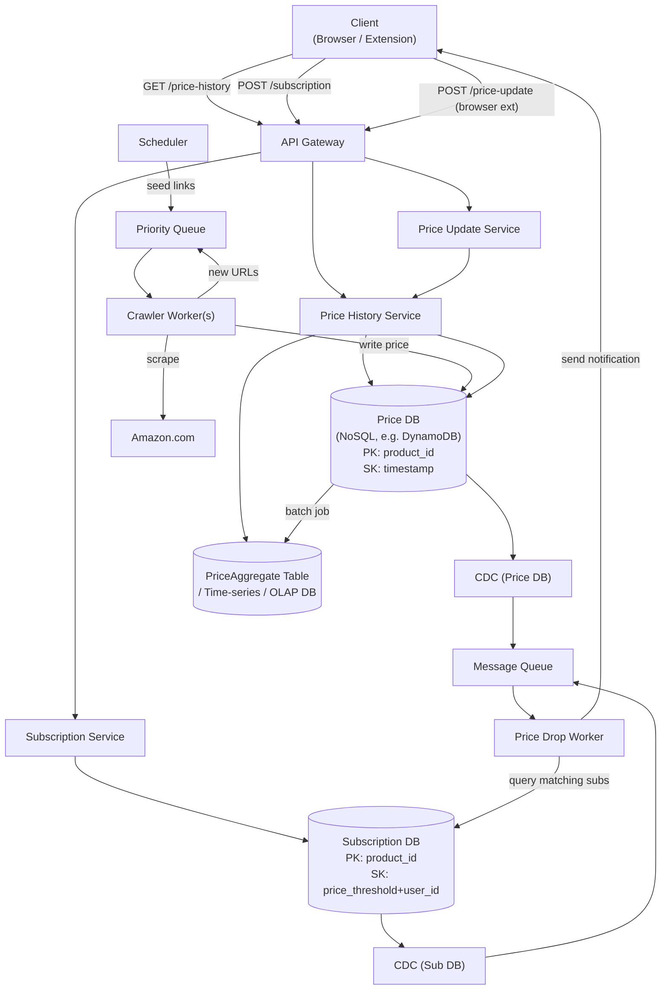

# 07 / 04. Design Amazon Price Tracking — 影片筆記 (video notes)

> 來源:影片 gemini_digest_lesson，2026-06-13。**影片轉述（pattern 級，非逐字）**；尚未入庫 KG。投影片逐字原文見同資料夾 digest.md。

---

## 1. 問題與需求

**目標系統**：類似 `camelcamelcamel.com` 的 Amazon 商品價格追蹤服務 (00:31)。
核心功能：查看商品歷史價格走勢圖、設定降價通知（e-mail 或推播）。

### 功能需求（Functional Requirements）(02:14)

| # | 需求 |
|---|------|
| 1 | 使用者可查詢任一商品的**歷史價格**（圖表）|
| 2 | 使用者可**訂閱降價通知**（設定閾值，低於即通知）|

### 非功能需求（Non-Functional Requirements）(03:40)

| 面向 | 目標 |
|------|------|
| 可用性 vs 一致性 | **高可用性優先**，允許最終一致（短暫陳舊資料可接受）|
| 規模 | Amazon 商品數約 **5 億（500 million）**，需橫向擴展 |
| 查詢延遲 | 歷史價格查詢要低延遲 |
| 通知時效 | 降價後 **1–2 小時內**通知使用者 |

---

## 2. 容量估算

影片提及商品規模約 **5 億筆**，以此作為 Crawler 與資料庫設計的主要驅動參數。
其他詳細數字（QPS、儲存量）影片未深入展開。

---

## 3. 高層架構 — 含資料流

### 3-1. 初版高層設計（Initial HLD）(09:02)

```
Client
  │
  ▼
API Gateway
  ├──► Price History Service ──► Price DB
  ├──► Subscription Service ──► Subscription DB
  │
Crawler ──────────────────────────► Price DB (寫入爬取到的新價格)

Notification Cron（輪詢）
  ├── 定期掃描 Price DB + Subscription DB
  └── 符合閾值 → 寄通知給使用者
```

### 3-2. 最終完整架構（Final Architecture）(35:40)



**關鍵資料流說明：**

| 流向 | 路徑 |
|------|------|
| 讀取歷史價格 | Client → API Gateway → Price History Service → Price DB（原始）或 AggDB（聚合）|
| 建立訂閱 | Client → API Gateway → Subscription Service → Subscription DB |
| Crawler 寫入 | Scheduler → Priority Queue → Crawler Worker → Amazon.com → Price DB |
| 眾包更新 | Client（瀏覽器擴充套件）→ API Gateway → Price Update Service → Price DB |
| 降價通知 | Price DB 變更 → CDC → Queue → Price Drop Worker → 查 Subscription DB → 通知 Client |

---

## 4. 核心元件與設計決策

### 4-1. Price DB（價格資料庫）

- 類型：NoSQL（示例用 DynamoDB）；**寫入密集（write-heavy）**
- Schema：
  - Partition Key：`product_id`
  - Sort Key：`timestamp`
  - 欄位：`price`

### 4-2. Subscription DB（訂閱資料庫）

- Schema：
  - Partition Key：`product_id`
  - Sort Key：`price_threshold + user_id`（composite）
  - 欄位：`subscription_id`、`user_id`、`price_threshold`
- 以 `product_id` 為 PK 的設計讓「當某商品降價時，快速撈出所有訂閱該商品且閾值符合的使用者」成為高效查詢 (30:21)

### 4-3. Crawler 系統 (19:33)

- 初版：單一 Crawler，速度不足以涵蓋 5 億商品
- 改進：
  - **Scheduler + Priority Queue**：依商品熱門程度（popularity scoring）決定爬取頻率 (24:24)
  - **Crawler Worker Pool**：分散式多 Worker 並行
  - **URL 發現回饋**：Worker 爬到頁面後發現的新連結，推回 Priority Queue 形成閉環

### 4-4. 眾包（Crowdsourcing）(27:04 / 27:11)

- 使用者安裝**瀏覽器擴充套件（browser extension）**
- 當使用者正常瀏覽 Amazon 時，擴充套件即時回報看到的價格
- 資料進入 `Price Update Service` → 寫入 `Price DB`
- **效益**：補充 Crawler 空隙，增加資料即時性，減輕 Crawler 負擔

### 4-5. 通知系統演進 (30:21 → 33:32)

| 版本 | 方式 | 問題 |
|------|------|------|
| v1 Notification Cron | **Poll-based**：定時輪詢 DB | 延遲高（取決於輪詢間隔）、浪費資源 |
| v2 CDC + Queue + Worker | **Push-based / Event-driven** | 近即時；僅在有變更時觸發 |

**CDC（Change Data Capture）機制** (33:32)：
- 監聽 `Price DB` 變更事件
- 將變更事件推送至 Message Queue
- `Price Drop Worker` 消費 Queue，查詢 Subscription DB 是否有滿足閾值的訂閱
- 找到後立即送出通知

### 4-6. 歷史查詢優化（Pre-Aggregation）(35:25 → 37:10)

- **問題**：查詢長達數月的價格走勢時，即時從原始細粒度資料聚合（on-the-fly aggregation）非常慢
- **解法**：
  - 獨立 **Batch Job** 定期處理原始 `Price DB`，生成每日/每週/每月平均值
  - 結果寫入 `PriceAggregate Table`（或專用時序/OLAP 資料庫）
- **讀取時**：Price History Service 依查詢時間範圍，決定讀原始 DB 或 AggDB

---

## 5. 深入探討 / 取捨

### 5-1. Crawler 優先權策略

- 熱門商品（高瀏覽量、常被訂閱）→ 排程更頻繁
- 冷門商品 → 降低爬取頻率，節省資源
- 具體指標（如瀏覽量、訂閱數）用來計算 priority score (24:24)

### 5-2. 眾包 vs Crawler 取捨

| | Crawler | 眾包（Browser Ext）|
|---|---|---|
| 覆蓋率 | 系統化、可控 | 依賴使用者行為，不均勻 |
| 即時性 | 取決於排程週期 | 近即時（使用者訪問時）|
| 成本 | 伺服器爬取成本 | 幾乎無（用戶端執行）|
| 可信度 | 高（直接爬取）| 需驗證（防惡意提交）|

### 5-3. 一致性取捨

- 系統選擇**高可用性（AP）**，允許短暫的陳舊資料
- 使用者看到的價格最多落後幾分鐘至幾小時仍屬可接受範圍 (03:40)

### 5-4. 時序資料庫 vs OLAP (39:27)

- **Time-series DB**（如 InfluxDB、TimescaleDB）：原生支援時間區間查詢、降採樣（downsampling）
- **OLAP**（如 ClickHouse、Redshift）：適合複雜分析聚合
- 兩者均比通用 NoSQL 更適合歷史價格查詢場景

---

## 6. 面試重點

1. **先從需求定義規模**：5 億商品數直接驅動 Crawler 設計從單機演進到分散式 Priority Queue。
2. **通知系統要從 Poll → Push**：Cron Job 是直覺解，但面試官期待候選人主動識別延遲問題，並提出 CDC + Event-driven 方案。
3. **CDC 是關鍵技術**：知道 CDC 能將 DB 變更事件推送至 Message Queue，是這題的核心進階知識點 (33:32)。
4. **讀寫分離 + 預聚合**：時序查詢從原始資料做 on-the-fly 聚合是反模式；要主動提出 pre-aggregation 層，並根據查詢視窗選擇合適的 DB（原始 vs 聚合）。
5. **眾包是加分亮點**：Browser Extension 作為資料來源的設計思路，展現系統設計的創意和對使用者行為的洞察。
6. **Subscription DB Schema 設計**：以 `(product_id, price_threshold+user_id)` 為 PK/SK，讓降價事件觸發時能以最小代價撈出所有符合訂閱，是重要的 Schema 設計選擇。
