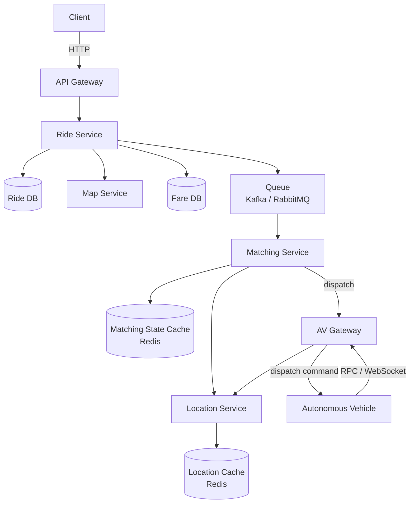

# 07 / 05. Design Tesla RoboTaxi — 影片筆記 (video notes)

> 來源：影片 gemini_digest_lesson，2026-06-13。**影片轉述（pattern 級，非逐字）**；尚未入庫 KG。投影片逐字原文見同資料夾 digest.md。

---

## 1. 問題與需求

### 情境 (00:00–01:49)

設計一個類似 Tesla Robotaxi / Waymo 的自動駕駛叫車系統。使用者流程與一般 Uber 相似：
輸入目的地 → 取得費用估算 → 確認叫車 → 被分配到一輛自動駕駛車（AV）→ 追蹤到達 → 上車行駛 → 下車 → 評分回饋 (00:18–00:50)。

### 功能需求 (02:13)

1. 乘客可取得費用估算（fare estimate）
2. 乘客可請求叫車（request a ride）
3. 系統將乘客與一輛可用 AV 配對（match）
4. 系統將 AV 派遣至乘客位置（dispatch）

### 非功能需求 (04:53)

| 需求 | 說明 |
|---|---|
| **低延遲配對** | 在 1 分鐘內完成乘客與車輛的配對 |
| **強一致性** | 防止競爭條件（race condition）：一輛車不能被同時派給兩位乘客；一位乘客不能被同時指派兩輛車 |
| **高吞吐量** | 需應對尖峰時段（如演唱會散場）的請求湧入 |

---

## 2. 容量估算

影片於 (23:36) 提到：以 1,000 萬輛車隊（10M fleet）為基準，每輛 AV 每秒回報一次位置，系統需承受約 **200 萬次/秒的位置寫入（~2M writes/sec）**。這個數字用來說明為何位置資料不能存進傳統 DB，而必須用 in-memory cache（Redis）。

---

## 3. 高層架構 — 含資料流

### 最終架構元件

```
[Autonomous Vehicle] ──RPC/WebSocket──> [AV Gateway] ──> [Location Service] ──> [Location Cache (Redis)]
                                                                                        ↑
[Client] ──HTTP──> [API Gateway] ──> [Ride Service] ──> [Ride DB]
                                            │
                                          [Queue (Kafka/RabbitMQ)]
                                            │
                                     [Matching Service] ──> [Matching State Cache (Redis)]
                                            │
                                     query nearby AVs
                                            │
                                     [Location Service] ──> [Location Cache]
                                            │
                                     dispatch via [AV Gateway] ──> [AV]
                                            │
                                     confirm → update [Ride DB]
```



### 資料流（叫車 + 配對全流程）

1. `Client` 透過 `API Gateway` 發送叫車請求到 `Ride Service` (20:18)
2. `Ride Service` 在 `Ride DB` 建立新的 ride 記錄（狀態：pending），再將配對任務推入 `Queue` (39:08)
3. `Matching Service` 從 `Queue` 消費任務
4. `Matching Service` 查詢 `Location Service`，取得附近可用 AV 清單 (24:59)
5. `Location Service` 從 `Location Cache`（Redis）讀取即時位置與狀態
6. `Matching Service` 在 `Matching State Cache` 中鎖定該 ride，逐一對候選車輛嘗試派遣 (46:26)
7. 選定的 AV 透過 `AV Gateway` 確認或拒絕派遣指令 (43:30)
8. 確認後，`Matching Service` 更新 `Ride DB`，寫入 `av_id` 並將狀態改為 in-progress；DB 上的 unique index 確保同一時間一輛車只能對應一筆 active ride (51:11)

---

## 4. 核心元件與設計決策

### API Gateway
所有 Client HTTP 請求的單一入口，路由到 `Ride Service`。

### Ride Service
核心業務邏輯服務，處理：
- 費用估算：呼叫 `Map Service`（路線/時間）+ 查 `Fare DB`（計費規則）(18:02)
- 叫車請求：寫入 `Ride DB`，再入隊 `Queue`

### Location Cache（Redis）(30:45)
- 儲存每輛 AV 的即時位置與狀態
- 選用 Redis（in-memory）而非傳統 DB，因為：
  - 寫入頻率極高（2M/sec），傳統 DB 撐不住
  - 不需要歷史位置，只要最新狀態
  - 讀取延遲需極低（配對時快速查詢）

### Queue（Kafka / RabbitMQ）(38:27)
- 置於 `Ride Service` 與 `Matching Service` 之間
- 目的：**解耦（decouple）** + **削峰（buffer spikes）**
- 配對邏輯耗運算資源，同步呼叫會阻塞 user-facing service；Queue 讓兩者非同步運作

### AV Gateway
- AV 端的持久連線入口（RPC / WebSocket）
- 雙向：接收 AV 位置更新；傳送派遣指令給 AV

### Matching State Cache（Redis）(45:21)
- 儲存每筆 ride 的配對中間狀態，用於**鎖定（lock）**
- 防止多個 Matching Service worker 同時搶著為同一筆 ride 派車
- 確保配對過程的原子性

---

## 5. 深入探討 / 取捨

### 一致性問題：Race Condition (42:08–51:11)

**問題**：多個 Matching Service worker 並行工作時，可能同時挑中同一輛 AV，造成一輛車被分配給多個乘客。

**雙層防護方案**：

| 層次 | 機制 | 說明 |
|---|---|---|
| **第一層（應用層）** | Matching State Cache（Redis）鎖 | Matching Service 在處理一筆 ride 時，先在 cache 鎖定，其他 worker 看到鎖就跳過 (45:21) |
| **第二層（資料庫層）** | Ride DB 上 `av_id` 的 unique index（僅限 in-progress 狀態） | 即使應用層鎖失效，DB ACID 保證兩筆 in-progress ride 不能有相同 `av_id`；重複寫入會報 constraint violation (51:11) |

第一層是效能優化（快速fail），第二層是最終一致性保證（final guarantee）。

### 同步 vs. 非同步

- **費用估算**：同步（使用者即時需要結果）
- **配對流程**：非同步（透過 Queue，匹配完成後再通知 Client，例如透過 WebSocket 或 push notification）

### 為什麼 AV 不直接連 Ride Service？
AV 的連線協定、頻率、規模與一般 HTTP Client 差異極大，獨立的 `AV Gateway` 讓兩者的擴展策略可以分開處理。

---

## 6. 面試重點

1. **從使用者流程出發**：先清楚說明 app 的操作流程，再反推系統需求 (00:18)
2. **非功能需求的優先順序**：此題強調 **一致性 > 可用性**（配對錯誤比短暫無法叫車更嚴重）(04:53)
3. **高寫入場景 → in-memory cache**：AV 位置更新是典型的「高頻寫入、只需最新值」場景，Redis 是標準解法 (30:45)
4. **Queue 作為解耦工具**：當有一個重量級消費者（Matching Service）時，Queue 既能削峰也能防止背壓（back-pressure）傳遞到前端 (38:27)
5. **多層一致性防護**：應用層鎖（cache）+ 資料庫層 unique constraint，兩者搭配是應對 race condition 的成熟模式 (45:21, 51:11)
6. **Unique Index 的妙用**：在 `(av_id, status='in_progress')` 上建 unique index，是利用 DB 既有 ACID 特性來保證業務邏輯的低成本方案
