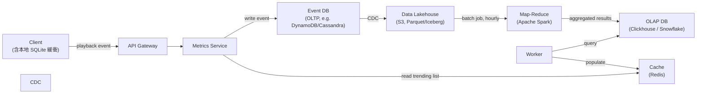
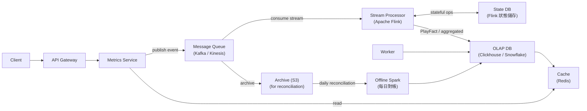

# 07 / 06. Design Spotify Trending Songs — 影片筆記 (video notes)

> 來源：影片 gemini_digest_lesson，2026-06-13。**影片轉述（pattern 級，非逐字）**；尚未入庫 KG。投影片逐字原文見同資料夾 digest.md。

---

## 1. 問題與需求

### Functional Requirements (00:54)
- 從用戶端收集播放事件（listening events）
- 依不同維度（country、genre 等）提供 Top K（例如 100）首排行榜歌曲
- 典型使用場景：「Today's Top Hits in the US」(00:24)

### Non-Functional Requirements (02:08)
- **低延遲更新**：排行榜在「分鐘到小時」內反映最新資料
- **大規模**：Spotify 有 7 億月活躍用戶（MAU）、1 億首歌曲
- **資料準確性**：防止重複計數或漏計；實作「30 秒規則」（見 §5）

---

## 2. 容量估算 (10:41)

- 老師計算了每日 / 每小時的播放事件量，結論是：**直接對原始事件 DB 做分析查詢是不可行的**（太慢、太貴）
- 這個計算結果直接推動了引入獨立的分析處理層（OLAP + Batch/Stream）

---

## 3. 高層架構 — 含資料流

### 3A. 批次處理架構（Batch Processing Architecture）(08:18)

第一個可行設計：週期性（例如每小時）處理大量事件。

**資料流：**
1. Client 送播放事件 → API Gateway → Metrics Service → 寫入 Event DB
2. CDC 把事件複製到 Data Lakehouse（S3，以 Parquet/Iceberg 格式儲存）
3. Spark 批次 Job 定期讀 S3、聚合計算 Top K → 寫入 OLAP DB
4. Worker 查詢 OLAP DB → 更新 Cache
5. 使用者請求排行榜 → Metrics Service 從 Cache 直接回傳

> ⚠️ 批次架構延遲以「小時」計，不符合「分鐘內更新」的需求 → 推動架構升級

---

### 3B. 串流架構（Streaming Architecture）(25:03)

將批次管道中的 Event DB 換成訊息佇列，Spark 換成串流處理器，以達到分鐘級延遲。

**主要變更：**
- `Event DB` → **Message Queue（Kafka/Kinesis）**：解耦寫入與處理 (25:39)
- `Spark batch job` → **Stream Processor（Apache Flink）**：持續消費、即時聚合 (25:50)
- 新增 **State DB**：Flink 用來跨事件維持狀態（例如某 session 已播放的累計秒數）(34:38)
- 新增 **離線 Spark 對帳（Reconciliation）**：每日從 S3 歸檔資料重新計算，修正串流可能的誤差 (35:42)

---

## 4. 核心元件與設計決策

### API 設計 (05:41)
| 端點 | 用途 |
|------|------|
| `POST /metrics/events` | 客戶端送播放事件 |
| `GET /metrics/top-tracks?dimension=country&value=US&k=100` | 取得 Top K 排行榜 |

### Client 本地緩衝 (08:42)
- Client 內建 **SQLite** 本地緩衝，離線時暫存事件，上線後再批次送出，避免資料遺失

### OLTP vs OLAP 分離 (14:28)
- **OLTP**（Event DB）：優化高頻寫入的原始事件
- **OLAP**（Clickhouse/Snowflake）：優化複雜分析查詢，儲存預聚合結果
- 兩者分離是核心設計原則，避免分析查詢拖垮寫入效能

### Map-Reduce 概念說明 (20:17)
- **Mapper**：把每筆播放記錄轉成 `(SongID, 1)` 鍵值對
- **Shuffle**：把相同 key 的資料集中到同一個 Reducer
- **Reducer**：對每個 SongID 的所有 1 加總，得到播放次數

---

## 5. 深入探討 / 取捨

### 30 秒規則與串流狀態管理 (29:17)
- Spotify 規定：**一首歌必須播放超過 30 秒，才算一次有效播放**
- 實作方式：
  1. Flink Stream Processor 為每個 `(userID, sessionID, songID)` 在 **State DB** 中記錄累計播放秒數
  2. 每次收到播放事件就累加
  3. 累積超過 30 秒 → 發出一個 **PlayFact**（有效播放事件），才計入排行榜
  4. 這樣可防止短暫點播或惡意刷榜

### 批次 vs 串流的取捨
| 面向 | 批次（Spark） | 串流（Flink） |
|------|--------------|--------------|
| 延遲 | 小時級 | 分鐘級 |
| 複雜度 | 較低 | 較高（需管理狀態） |
| 準確性 | 高（完整批次） | 可能有小誤差 |
| 適用 | 每日 Top Charts | 即時 Trending |

### 混合方案（Hybrid）(35:42)
- **串流**：提供即時、低延遲的排行榜
- **離線 Spark 批次（每日）**：從 S3 歸檔重新計算，**對帳修正**串流的累積誤差
- 兩者互補，兼顧即時性與準確性

---

## 6. 面試重點

### 擴展性（Scaling）(37:26)
- **Metrics Service**（無狀態）：水平擴展，直接加機器
- **Message Queue（Kafka）**：增加 partition 數量來擴展吞吐量
- **Stream Processor（Flink）**：增加 partition 數，對應增加 worker 數

### Hot Key / Hot Shard 問題 (38:51)
- 問題：`US` 這個 partition 流量遠大於其他國家
- 解法：**Sub-partitioning**（細分 partition），例如把 `US` 拆成 `US-1`、`US-2`、`US-3` 等，分散到多個 partition 上
- 設計時需依照資料量評估 partition 粒度

### 面試作答架構
1. **釐清需求**：Functional（collect + serve Top K）、Non-Functional（latency、scale、accuracy）
2. **估算量級**：日/時事件量 → 論證不能直接查 OLTP
3. **批次架構**先講清楚（Event DB → CDC → S3 → Spark → OLAP → Cache）
4. **升級串流**：為何要換（延遲）、換什麼（Kafka + Flink）、如何保狀態
5. **準確性深探**：30 秒規則 + Flink 狀態管理
6. **擴展與 Hot Key**：sub-partitioning + 混合對帳方案
