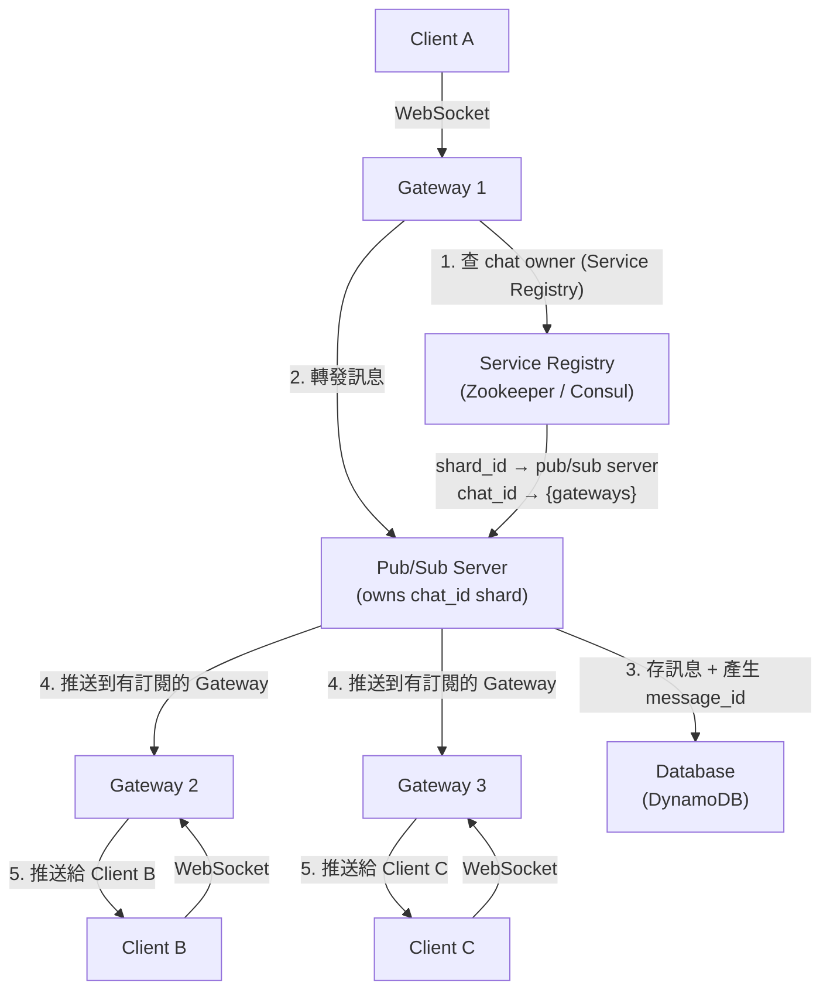

# 07 / 07. Design Messenger — 影片筆記 (video notes)

> 來源:影片 gemini_digest_lesson,2026-06-13。**影片轉述(pattern 級,非逐字)**;尚未入庫 KG。投影片逐字原文見同資料夾 digest.md。

---

## 1. 問題與需求

### 功能需求 (Functional Requirements) [1:09]

- 1 對 1 私訊與群組聊天 (group chat)
- 傳送 / 接收文字訊息
- 取得離線期間錯過的訊息 (offline message delivery)
- 開啟群組對話 (start group chat)

### 功能需求外 (Out of Scope) [2:56]

- 檔案附件、圖片、影片
- 視訊 / 語音通話
- 線上狀態指示器 (online presence)

### 非功能需求 (Non-Functional Requirements) [3:40]

- **低延遲**:訊息端對端傳遞 < 500ms
- **耐久性 (Durability)**:訊息不能遺失
- **一致性 (Consistency)**:所有使用者看到相同的訊息順序
- **可擴展性 (Scalability)**:支援 1 億 (100M) 使用者

---

## 2. 容量估算

影片未提供詳細的容量估算數字,僅以「1 億使用者」作為設計目標規模。

---

## 3. 高層架構 — 含資料流

### 最終架構:Gateway + Pub/Sub 雙層架構 [25:24]

**訊息傳遞流程:**
1. Client A 將訊息送到連線的 Gateway 1
2. Gateway 1 查詢 Service Registry,找出負責該 `chat_id` 的 Pub/Sub Server
3. Gateway 1 將訊息轉發給該 Pub/Sub Server
4. Pub/Sub Server 指派唯一有序的 `message_id`,將訊息存入 DB
5. Pub/Sub Server 查詢 Service Registry,找出哪些 Gateway 有此聊天的訂閱者
6. Pub/Sub Server 將訊息推送給 Gateway 2 和 Gateway 3
7. Gateway 2、3 各自透過 WebSocket 推送給 Client B、C

---

## 4. 核心元件與設計決策

### 4.1 網路協定選擇 [6:04]

| 協定 | 特性 | 適用場景 |
|---|---|---|
| **HTTP Short Polling** | Client 不斷主動發 request,多數返回空資料 | 不適合即時訊息 |
| **HTTP Long Polling** | Server 持住連線到有資料才回應,Client 立刻再發下一個 | 可用但仍是單向 |
| **WebSocket** | 持久雙向連線,Client / Server 皆可主動推送 | **聊天系統首選** |

**結論**:WebSocket 因雙向持久連線特性,最適合即時聊天。

### 4.2 API 設計 [9:18]

採 RPC 風格端點,例如:
- 建立對話 (create chat)
- 傳送訊息 (send message)
- 取得訊息 (get messages / fetch offline messages)

### 4.3 資料模型 (Database Schema) [14:02]

資料庫選用 **DynamoDB (NoSQL)**,三個核心資料表:

- **Chats**:對話的基本資訊 (chat_id、建立時間等)
- **Memberships**:哪些 user 屬於哪個 chat (chat_id + user_id)
- **Messages**:訊息本體 (message_id、chat_id、sender_id、content、timestamp)

### 4.4 Gateway 層 [25:24]

- **Stateless**:Gateway 只負責維護 WebSocket 連線,不儲存聊天狀態
- 每個 Gateway 管理一部分 Client 的連線
- 可獨立水平擴展

### 4.5 Pub/Sub Server 層 [25:24]

- **Stateful**:每個 Pub/Sub Server「擁有 (owns)」特定的 chat shards,以 `chat_id` 做分片
- 負責訊息定序 (message sequencing) — 確保一致的訊息順序
- 將訊息廣播給有訂閱的 Gateway

### 4.6 Service Registry [25:24]

- 使用 **Zookeeper** 或 **Consul**
- 儲存兩種映射關係:
  - `shard_id → Pub/Sub Server`(哪台 server 負責哪個分片)
  - `chat_id → {Gateway 集合}`(哪些 Gateway 有此聊天的訂閱者)

---

## 5. 深入探討 / 取捨

### 5.1 架構演進過程 [21:51]

**第一版:單台 Chat Server** [13:22]
- 簡單直覺:Client → Chat Server → Database
- 缺點:單點失敗 (SPOF),無法水平擴展

**第二版:一致性雜湊 + 多台 Chat Server (以 user_id 分片)** [22:42]
- 用 Consistent Hashing 按 `user_id` 將 Client 分配到不同 Server
- 引入 Service Registry 記錄 user → server 映射
- **致命問題:N Fanout** — 傳一則群組訊息,Server 1 必須找出每個成員所在的 Server 並逐一轉發,Server 間通訊量爆炸

**第三版:Gateway + Pub/Sub,改以 chat_id 分片** [25:24]
- 分離「連線管理」(Gateway) 與「聊天邏輯」(Pub/Sub)
- 改用 `chat_id` 做分片鍵,每個聊天有唯一的負責 Server → 訊息定序天然集中
- Fanout 只需推到「有訂閱此 chat 的 Gateway」,大幅減少不必要的廣播

### 5.2 Consistent Hashing 概念 [23:30]

- Hash Ring:連續鍵空間 (0 ~ 1024)
- Node (Server) 散佈在 Ring 上
- 給定 `hash(user_id) = 200`,順時針找第一個 Node 即為 owner
- 好處:新增 / 移除 Node 時只需遷移相鄰 Key,影響範圍小

### 5.3 全域有序 message_id 的生成策略 [35:25]

分散式系統中確保訊息嚴格單調遞增 ID 的幾種做法:
1. **Auto-increment counter** (資料庫自增):簡單但有擴展瓶頸
2. **Timestamp-based UUID**:以時間戳為基礎,時鐘偏移可能造成衝突
3. **Twitter Snowflake ID**:結合時間戳 + 機器 ID + 序列號,高效且分散式友好

---

## 6. 面試重點

1. **先確立 scope**:明確說明哪些功能 in / out of scope,展示系統化思維 [00:33]
2. **協定選擇有理由**:WebSocket > Long Polling > Short Polling,說清楚為何 [6:04]
3. **架構演進法**:從最簡單的單台 server 開始,逐步識別瓶頸再迭代 [21:51]
4. **識別 fanout 問題**:user_id 分片 → N fanout 是常見陷阱,要主動提出 [27:30]
5. **兩層架構的優點**:Gateway (stateless) + Pub/Sub (stateful, chat_id sharding) 是解法核心 [30:25]
6. **message_id 定序**:提到 Snowflake ID 等方案展示對分散式 ID 的了解 [35:25]
7. **非功能需求貫穿全程**:每個設計決策都要能對應回低延遲、耐久性、一致性、可擴展性
