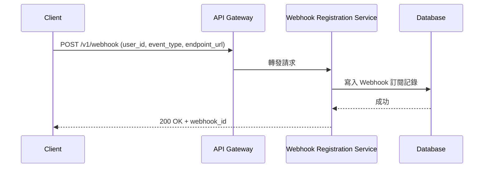
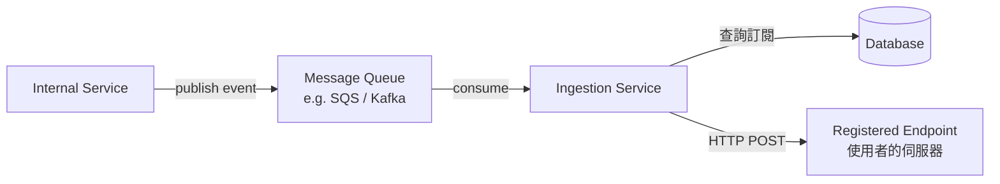
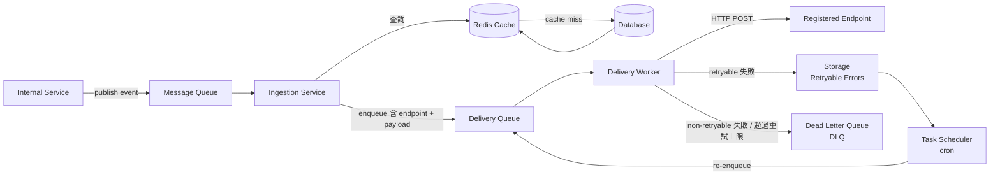

# 07 / 08. Design Webhook Platform — 影片筆記 (video notes)

> 來源：影片 gemini_digest_lesson，2026-06-13。**影片轉述（pattern 級，非逐字）**；尚未入庫 KG。投影片逐字原文見同資料夾 digest.md。

---

## 1. 問題與需求

### Webhook 是什麼？(00:19)
Webhook 是一種「反向 API（reverse API）」機制：伺服器在事件發生時，主動把通知推送到客戶端預先登記好的 endpoint，而不需要客戶端不斷輪詢（polling）。

**現實案例** (01:25)
- **GitHub**：push 事件、PR 合併等觸發外部 CI/CD 系統。
- **Stripe**：payment.succeeded、payment.failed 等支付事件通知商家後端。

### 功能需求 (02:34)
1. 使用者能夠管理（建立 / 更新 / 刪除）自己的 webhook endpoint。
2. 內部服務能夠發布（publish）事件。
3. 平台負責把事件送達給對應的訂閱者 endpoint。

### 非功能需求 (04:28)
- **規模**：1 億使用者。
- **即時性**：近即時（near-real-time）送達。
- **可靠性**：**at-least-once** 投遞保證；即使使用者的 endpoint 暫時不可用，仍要重試，最長容忍 **3 天**不可用。

---

## 2. 容量估算 (27:52)

課程中以「需要 caching 層」為理由進行推算：
- 寫入（registration）量遠低於讀取（查訂閱 endpoint）量。
- 每次事件觸發都需要查「哪些 endpoint 訂閱了此事件」，讀取壓力集中在此對應查詢（`user_id` + `event_type` → `endpoint`）。
- 結論：在 Ingestion Service 前加 **Redis cache** 以應對高讀取負載。

另外提到 Message Queue 可能需要 **partitioning**（分區）才能處理高吞吐量 (35:23)。

---

## 3. 高層架構 — 含資料流

架構分成「**登記流程（Registration Flow）**」與「**投遞流程（Delivery Flow）**」兩條主線，並隨設計深入而演進。

### 3-A 登記流程 (09:32)

**Database schema（Webhook 表）**：`id`、`user_id`、`event_type`、`endpoint`、`status`、`created_at`、`updated_at`。

---

### 3-B 事件投遞流程（初版）(13:14)

---

### 3-C 加入 Cache + Delivery Worker（最終架構）(33:11)

**元件說明**

| 元件 | 職責 |
|---|---|
| Message Queue | 解耦事件生產者與消費者，作為高吞吐緩衝；需 partitioning |
| Ingestion Service | 消費事件、查詢對應訂閱 endpoint，放入 Delivery Queue |
| Redis Cache | 快取 `(user_id, event_type) → endpoint` 對應，降低 DB 讀壓 |
| Database | webhook 訂閱的 source of truth |
| Delivery Queue | 第二條佇列，持有「已知目標 endpoint」的待投遞訊息 |
| Delivery Worker | 實際向使用者 endpoint 發 HTTP POST；處理投遞結果 |
| Storage (Retryable) | 暫存投遞失敗但可重試的事件，記錄 `scheduled_retry_time` |
| Task Scheduler | 定期掃 Storage，把到期的重試事件放回 Delivery Queue |
| Dead Letter Queue | 存放無法投遞（non-retryable 或超過重試次數）的事件，供稽核 |

---

## 4. 核心元件與設計決策

### API Design (07:16)
採用標準 RESTful：
- `POST /v1/webhook` — 建立訂閱
- `PUT /v1/webhook/{id}` — 更新訂閱
- `DELETE /v1/webhook/{id}` — 刪除訂閱

### 為何使用兩條 Queue？
- **Message Queue（第一條）**：解耦內部服務（生產者）與 Ingestion Service；允許削峰。
- **Delivery Queue（第二條）**：分離「查詢訂閱」與「實際投遞」兩個工作，使 Delivery Worker 可以獨立 scale，也讓重試邏輯更清晰（重試直接入 Delivery Queue，不需重跑 Ingestion）。

### Ingestion Service 拆分為兩段 (22:52)
原設計讓 Ingestion Service 直接投遞；為加入 retry loop，將「投遞」獨立出來成為 **Delivery Worker**，中間插入 Delivery Queue。

---

## 5. 深入探討 / 取捨

### 失敗處理與重試 (22:52)

**失敗分類**：
- **Retryable**（可重試）：5xx 伺服器錯誤、連線超時 → 寫入 Storage，排定下次重試時間。
- **Non-retryable**（不可重試）：4xx 客戶端錯誤（endpoint 無效）→ 直接送 DLQ。
- **超過重試上限**（至多重試 3 天）→ 送 DLQ。

### Exponential Backoff with Jitter (24:43)
重試間隔策略：
- 基礎間隔：100 ms → 200 ms → 400 ms → …（指數增長）
- 加上隨機 **jitter**，避免大量 worker 同時在同一時間點打同一個 endpoint（thundering herd）。

### Dead Letter Queue (DLQ) (25:56)
- 存放所有最終投遞失敗的事件。
- 用途：稽核（audit）、人工檢查、手動重送。
- 確保沒有事件「無聲消失」。

### Cache 設計 (27:52 / 31:04)
- Cache key：`(user_id, event_type)`；value：`endpoint` URL。
- 採用 **Cache-aside** 模式：Ingestion Service 先查 cache，miss 才查 DB，並回填 cache。
- 大幅降低 DB 讀取壓力（100M 使用者，每個事件都需要查詢訂閱）。

### Message Queue Partitioning (35:23)
- 單一 queue partition 在極高吞吐下會成為瓶頸。
- 需要對 queue 進行分區（partition）以水平擴展消費者數量。

### 認證與安全性 (39:51)
兩個層面的驗證：
1. **驗證 endpoint 擁有者（Registration 時）**：確認使用者真的擁有所登記的 endpoint（如發送挑戰請求 challenge request）。
2. **驗證 webhook 發送者（Delivery 時）**：用 **shared secret 對 payload 簽名**，讓接收方能驗證請求確實來自平台（HMAC signature）。

---

## 6. 面試重點

1. **Webhook = reverse API**：主動推送，消除 polling。先能清楚解釋「為什麼需要 webhook」。

2. **At-least-once 保證的代價**：系統設計必須接受「重複投遞」的可能，接收端需要做 **idempotency（冪等）** 處理（影片提及此概念）。

3. **兩條 Queue 的設計理由**：Ingestion（查訂閱）與 Delivery（送 HTTP）職責分離，使重試邏輯乾淨，各自可獨立 scale。

4. **Exponential Backoff + Jitter**：標準重試策略，必須能說出為何加 jitter（防止 thundering herd）。

5. **DLQ 的必要性**：任何非同步投遞系統都應有 DLQ，不讓訊息無聲消失。

6. **Cache 的取捨**：加快 endpoint lookup，但需處理 cache 與 DB 的一致性（特別是使用者更新 / 刪除 endpoint 時，要使 cache 失效）。

7. **安全性雙層驗證**：registration 時驗 ownership；delivery 時驗簽名（HMAC）。

8. **Scale 討論切入點**：100M 使用者 → queue partitioning、Redis cache，自然引出各元件的水平擴展方案。
