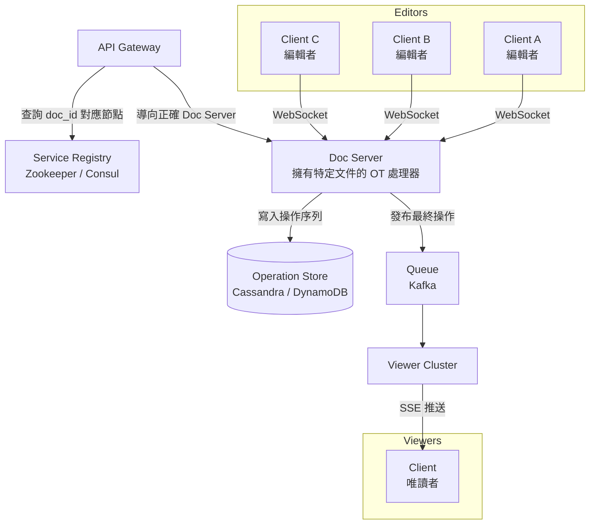

# 07 / 09. Design Google Docs — 影片筆記 (video notes)

> 來源:影片 gemini_digest_lesson，2026-06-13。**影片轉述（pattern 級，非逐字）**；尚未入庫 KG。投影片逐字原文見同資料夾 digest.md。

---

## 1. 問題與需求

### 功能需求 (01:17)
- 使用者可線上建立並編輯文件。
- 多名使用者可同時協作同一份文件。
- 所有變更與游標位置須即時同步給所有參與者。

### 非功能需求 (02:27)
- **高可用 & 高可擴展**：支援最多 10 億份文件、1 億線上使用者。
- **低延遲**：確保即時協作的流暢體驗。
- **最終一致性 (eventual consistency)**：跨用戶的文件狀態最終一致即可。

---

## 2. 容量估算

影片中未詳細進行容量估算，僅於非功能需求階段提及目標規模（1B 文件、100M 線上用戶）。

---

## 3. 高層架構 — 含資料流

### 3a. 文件建立流程（CRUD，08:26）

```
Client
  └─ POST /v1/docs ──► API Gateway
                            └──► Metadata Service
                                      └──► Metadata Store
                                           (存 doc_id, title, created_by, created_at)
```

- API 使用標準 REST：`POST /v1/docs` 建立文件。
- Metadata Service 建立記錄後回傳 `doc_id`。

---

### 3b. 完整協作編輯架構（21:40 → 44:03）



**資料流說明：**
1. **編輯流程**：Editor（Client A/B/C）與分配到的 Doc Server 建立 WebSocket 雙向連線，送出 edit operations；Doc Server 執行 OT 轉換、持久化到 Operation Store，並廣播給其他 editors。
2. **唯讀流程**：Doc Server 將最終操作發布到 Queue（Kafka）；Viewer Cluster 訂閱後以 SSE（Server-Sent Events）推送給唯讀用戶，降低 Doc Server 負擔。
3. **服務發現**：API Gateway 查詢 Service Registry（Zookeeper/Consul），透過 Consistent Hashing 找到負責該 doc_id 的 Doc Server，再將 client 導向該 server。

---

### 3c. Consistent Hashing Ring（34:31）

```
Hash Ring (0 → 1023)

     0
    /   \
node4   node1
  |       |
node3   node2  ← hash(doc_id) = 200 → 分配給 node2 (下一個順時針節點 250)
    \   /
    1023
```

- 每個 Doc Server 節點被 hash 到 ring 上的固定位置。
- `doc_id` hash 後沿順時針找到第一個節點，即為負責伺服器。
- 新增/移除節點時，只需重新映射少量文件，不影響其他節點。

---

## 4. 核心元件與設計決策

### 4a. API 設計（04:41）
- 文件建立用 **REST**（`POST /v1/docs`）。
- 即時編輯用 **WebSocket**（持久雙向連線），取代 HTTP polling，延遲更低、效率更高。

### 4b. 衝突解決策略（10:05 → 15:06）
- **Snapshot 方式**（淘汰）：每次編輯送整份文件快照 → last-write-wins，不可擴展。
- **Delta 方式**：只送差異（操作）→ 衝突需演算法解決。
  - **OT（Operational Transformation）**：透過中央伺服器強制強一致性；適合每文件編輯者有限（≤100）的場景。本設計採用此方案。
  - **CRDT（Conflict-free Replicated Data Types）**：去中心化，適合大規模分散；不需要單一伺服器協調。本課不採用，但列為對比選項。

### 4c. Doc Server 職責（21:40）
- 每份文件由**唯一一台** Doc Server 負責（OT 需要中央協調）。
- 接收操作、執行 OT 轉換、廣播給同文件的其他 editors、持久化到 Operation Store。

### 4d. Operation Store（21:40）
- 分散式 NoSQL（如 Cassandra / DynamoDB），以 `doc_id` + 序號/時間戳記為 key 儲存所有操作。
- 提供耐久性：server 重啟可從中重建文件狀態。

### 4e. 快取快照 / Compaction（39:12）
- 定期對文件建立快照（snapshot），讓新連線或重新連線的 client 只需載入「最新快照 + 少量最近操作」，不必重播完整歷史。

### 4f. Viewer Cluster + Queue（42:50 → 44:03）
- 唯讀用戶不直接連 Doc Server，改由獨立的 Viewer Cluster 服務。
- Doc Server → Queue（Kafka）→ Viewer Cluster → SSE → 唯讀 Client。
- 兩個 cluster 可獨立擴展，避免大量 viewer 壓垮 Doc Server。

---

## 5. 深入探討 / 取捨

### 用戶狀態管理（24:38）
- **新用戶加入**：載入最新快照 + 快照之後的操作序列，追上目前狀態。
- **離線用戶重連**：同上，僅需補上離線期間的操作差異。

### 游標位置廣播（29:18）
- 游標更新也以 operation 形式透過 WebSocket 傳送，與編輯操作共用同一個連線通道。
- Doc Server 負責將游標位置廣播給同文件的其他 editors，讓所有人即時看到彼此游標。

### OT vs CRDT 取捨（15:06）
| | OT | CRDT |
|---|---|---|
| 一致性模型 | 強一致（中央協調） | 最終一致（去中心化） |
| 適用編輯人數 | 少量（≤100） | 大量分散 |
| 實作複雜度 | 中等 | 較高 |
| 本設計採用 | **是** | 否 |

### WebSocket vs HTTP Polling（04:41）
- WebSocket：持久連線，server 可主動推送，延遲低。
- HTTP Polling：短連線，需頻繁建立連線，延遲高、開銷大。
- 本設計選 WebSocket。

### Consistent Hashing 的意義（34:31）
- 保證同一份文件的所有 editor 連到同一台 Doc Server（OT 的前提）。
- 節點增減時只影響少部分文件重新路由，可用性高。

---

## 6. 面試重點

1. **為何用 WebSocket？** 低延遲雙向推送；polling 成本高且延遲大。
2. **OT vs CRDT 如何選？** 編輯者數量有限 → OT（中央強一致）；大規模去中心化 → CRDT。
3. **為何每份文件要綁定單一 Doc Server？** OT 演算法需要中央序列化所有操作，若多伺服器並行轉換會產生衝突。
4. **Consistent Hashing 解決什麼問題？** 將 doc_id 映射到固定 server，同時在擴縮容時最小化重新分配範圍。
5. **Viewer Cluster + Queue 的用途？** 解耦唯讀流量與核心 Doc Server，讓二者獨立擴展；避免 10M 級 viewer 直接壓垮編輯伺服器。
6. **Compaction / Snapshot 解決什麼？** 避免新用戶需重播完整操作歷史，降低冷啟動時間與資料量。
7. **游標同步怎麼做？** 游標位置作為 operation 透過 WebSocket 廣播，Doc Server 統一處理，與文字 edit 共用相同通道。
