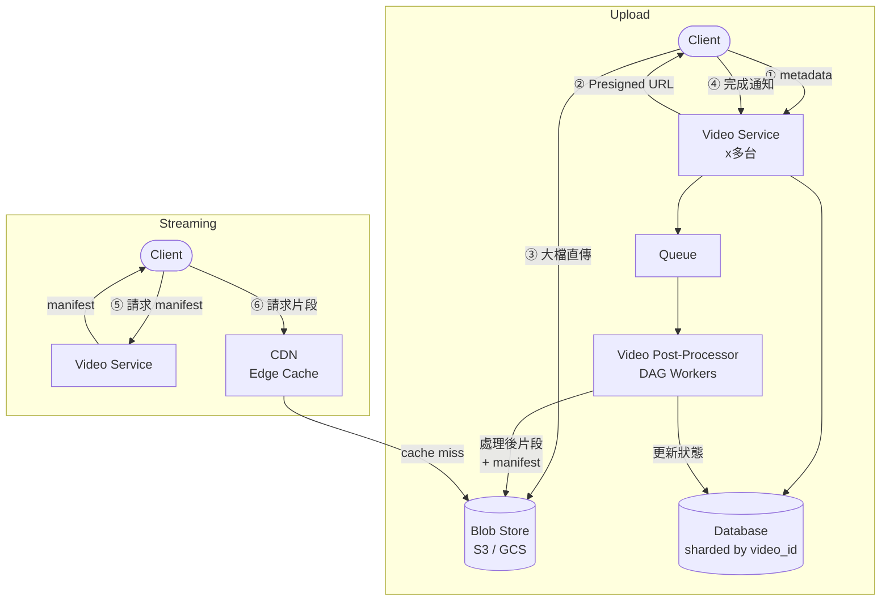

# 07 / 10. Design Youtube — 影片筆記 (video notes)

> 來源:影片 gemini_digest_lesson,2026-06-13。**影片轉述(pattern 級,非逐字)**;尚未入庫 KG。投影片逐字原文見同資料夾 digest.md。

---

## 1. 問題與需求

### 功能需求 (Functional Requirements) [00:50]
- 使用者可以**上傳影片**
- 使用者可以**串流播放影片**
- 明確標注**不在範圍內**:搜尋、留言、推薦系統 [01:15]

### 非功能需求 (Non-Functional Requirements) [01:58]
- **高可用性 (High Availability)**
- **低延遲串流**:即使在低頻寬環境下也能順暢播放
- **大規模擴展性**:每天數百萬次上傳、數億次觀看

---

## 2. 容量估算

影片中未針對容量進行具體數字估算，但透過非功能需求點出規模量級：
- 每日上傳量：數百萬部
- 每日觀看量：數億次
- 需要支援全球各地使用者，因此需要 CDN 分散流量

---

## 3. 高層架構 — 含資料流

### 架構演進歷程

**Phase 1：基本架構 [10:11]**
```
Client → API Gateway → Video Service → Database
```

**Phase 2：加入 Blob Store + Presigned URL [14:04]**
```
Client ──(1) 上傳請求+metadata──→ Video Service ──→ Database (metadata)
  ↑                                     │
  └──(2) Presigned URL ←────────────────┘
  │
  └──(3) 直接上傳影片檔──→ Blob Store (S3 / GCS)
                                │
  (4) 上傳完成通知 → Video Service → Queue
```

**Phase 3：加入非同步後處理 [17:52]**
```
Queue → Video Post-Processor (DAG workers) → Blob Store (處理後片段 + manifest)
                                           → Database (更新 manifest 位置與狀態)
```

**Phase 4：加入水平擴展 + CDN（最終架構）[35:25]**
```
                     ┌─────────────────────────────────────────┐
                     │            Upload Flow                  │
Client ──metadata──→ Video Service (x多台) ──→ Database (sharded by video_id)
  ↑       Presigned URL ←──┘
  └──大檔案直傳──→ Blob Store ←──── CDN (cache miss 才回源)
                     │                 ↑
                     └── Queue ──→ Video Post-Processor
                                       └──處理完→ Blob Store + DB

                     ┌─────────────────────────────────────────┐
                     │            Streaming Flow               │
Client ──(1) 請求 manifest──→ Video Service
Client ──(2) 依 manifest 請求片段──→ CDN ──(cache hit)→ 回傳片段
                                      └──(cache miss)→ Blob Store
```

### Mermaid 架構圖（最終狀態）



---

## 4. 核心元件與設計決策

### 4.1 兩類資料的分離 [11:06]
| 資料類型 | 特性 | 儲存方案 |
|---|---|---|
| **影片檔案**（Video File） | 大型二進位 blob，非結構化 | Blob Store（S3 / GCS） |
| **影片 Metadata** | 小型、結構化文字 | 傳統關聯式資料庫（SQL） |

這個區分是整個設計的核心出發點。

### 4.2 Presigned URL（預簽名 URL）[14:04]
- 客戶端先告知 Video Service 欲上傳的影片
- Video Service 向 Blob Store 產生一個**暫時性、帶授權的 URL**，回傳給客戶端
- 客戶端用此 URL **直接上傳大檔到 Blob Store**，完全繞過 Video Service
- 好處：**卸載**（offload）主服務的大流量負擔

### 4.3 Multipart Upload（分段上傳）[26:12]
- 將超大影片切成多個小塊分批上傳
- 支援**可續傳**（resumable upload）：網路中斷後可從斷點繼續
- 每個 part 上傳後取得 ETag，最後合併

### 4.4 影片後處理 DAG [21:20]
```
Raw Video
    │
    ▼
Video Splitter（切片）
    │
    ├──→ Transcoding Workers（平行轉碼）
    │       ├── 1080p worker
    │       ├── 720p worker
    │       └── 480p worker
    ├──→ Audio Processing Worker
    ├──→ Thumbnails Worker
    └──→ Watermarks Worker
              │
              ▼
         Build Manifest（聚合所有輸出，產生 manifest 檔）
              │
              ▼
         Mark as Complete（更新 DB 狀態）
```
- DAG 確保任務依賴關係正確，且能最大化平行度

### 4.5 影片串流基礎概念 [07:29]
- **Codec（編解碼器）**：壓縮/解壓縮演算法（e.g., H.264, H.265, VP9）
- **Container（容器格式）**：封裝 codec 輸出的檔案格式（e.g., .mp4, .mkv）
- **Bitrate（位元率）**：每秒傳輸的資料量，決定畫質與頻寬需求
- **Manifest File（清單檔）**：告訴播放器「哪裡有哪些片段、各是什麼 bitrate」的 playlist 檔 [08:32]；Adaptive Bitrate Streaming（ABR）的核心

### 4.6 API 設計 [05:21]
| 操作 | Endpoint |
|---|---|
| 上傳影片 | `POST /v1/videos/upload` |
| 串流播放 | `GET /v1/videos/{videoId}` |

---

## 5. 深入探討 / 取捨

### 5.1 水平擴展（Horizontal Scaling）[32:03]
- Video Service 設計為**無狀態（stateless）**，可直接水平擴展（加機器）
- Database 以 `video_id` 進行 **Sharding（分片）** 分散讀寫負載 [32:18]

### 5.2 CDN 全球低延遲 [35:06]
- CDN 在**地理位置靠近使用者的 edge node** 快取熱門影片片段
- 命中快取時直接回傳，大幅降低延遲與來源伺服器壓力
- Cache miss 才回源 Blob Store 抓資料

### 5.3 為何要 Presigned URL 而非讓 Video Service 轉傳？
- 影片動輒數 GB，讓 Video Service 當中繼會造成嚴重瓶頸
- Presigned URL 讓大流量走「旁路」直達 Blob Store，主服務只處理輕量的控制請求

### 5.4 為何後處理要用非同步 Queue + DAG？
- 轉碼耗時（可能數分鐘到數小時），同步處理會讓 API 長時間 blocking
- Queue 解耦上傳與處理，DAG 讓多種格式可平行轉碼，提高吞吐

---

## 6. 面試重點

1. **先釐清範圍**：YouTube 功能很多，面試時主動限縮為「上傳 + 串流」兩條路徑。
2. **資料分類是核心**：大 blob 與小 metadata 分開存，是選型的第一道判斷。
3. **Presigned URL 是經典考點**：解釋「為什麼不讓 server 轉傳」、「如何保護安全性」。
4. **轉碼 Pipeline 設計**：要能說出 DAG 思維、平行任務、Queue 解耦。
5. **Manifest + ABR**：串流的關鍵，播放器如何根據頻寬動態切換解析度。
6. **Multipart Upload**：大檔分塊、斷點續傳，S3 等 Blob Store 原生支援。
7. **擴展三件套**：無狀態 Service 水平擴展、DB sharding by video_id、CDN 快取熱門片段。
