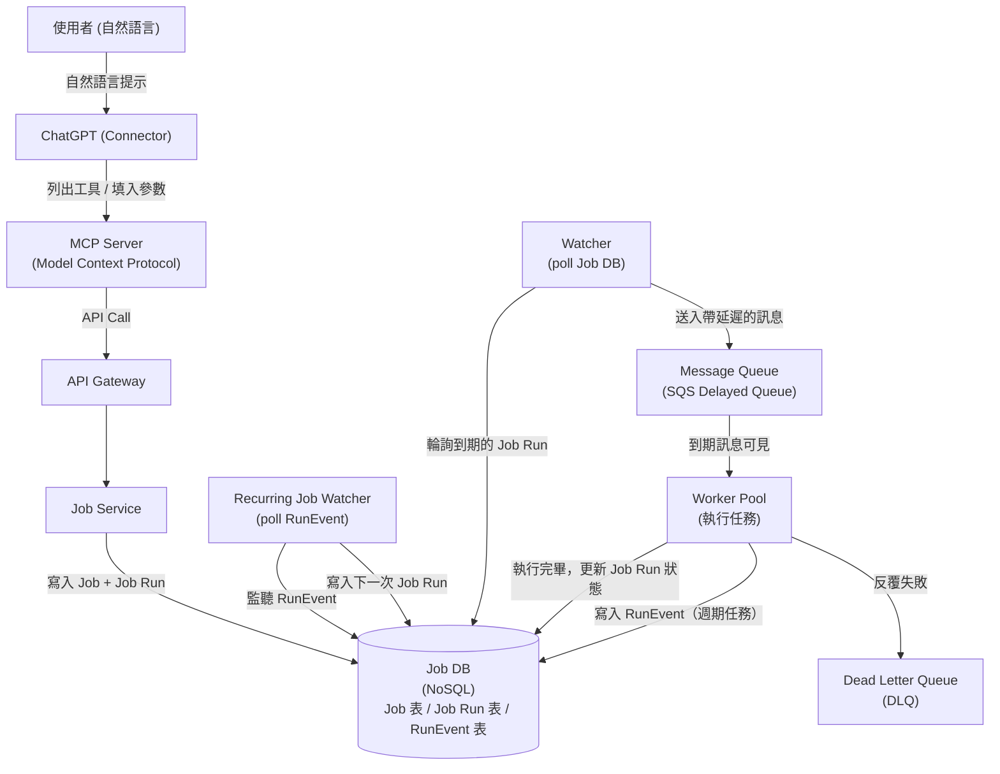

# 07 / 11. Design ChatGPT Tasks — 影片筆記 (video notes)

> 來源:影片 gemini_digest_lesson，2026-06-13。**影片轉述（pattern 級，非逐字）**；尚未入庫 KG。投影片逐字原文見同資料夾 digest.md。

---

## 1. 問題與需求

**設計情境**：實作類似「ChatGPT Tasks」的功能——讓使用者可以請 ChatGPT 在指定時間自動執行某件事，一次性或週期性皆可。範例：每日新聞摘要、語言練習提醒、生日提醒等。(00:00)

**Functional Requirements**（02:00）：
- 使用者可以建立「一次性」或「週期性」排程任務
- 使用者可以查看所有已排程的任務
- 透過與 ChatGPT 對話（自然語言）來建立任務，ChatGPT 再呼叫後端 API

**Non-Functional Requirements**（03:14）：
- **高可用性（HA）**
- **可擴充性**：目標 10,000 jobs/秒
- **至少執行一次（at-least-once）**：保證任務不漏跑
- **儘力達到 exactly-once**：從使用者視角盡量避免重複執行

---

## 2. 容量估算

- 目標吞吐量：**10,000 jobs/秒**（03:14）
- 老師未在影片中詳細展開數學計算，此規模主要作為 Non-Functional Requirement 的設計驅動力

---

## 3. 高層架構 — 含資料流

### 架構演進

| 時間點 | 版本 | 說明 |
|--------|------|------|
| 08:52 | 初始設計 | Client → API Gateway → Job Service → Job DB；Executor 輪詢 DB 執行任務 |
| 09:42 | 引入 Executor | 獨立元件，週期性 poll Job DB 找到期的任務 |
| 27:12 | 解耦執行層 | Executor 拆成 Watcher + Message Queue + Worker 池 |
| 29:38 | 週期任務處理 | 新增 Recurring Job Watcher 負責排程下一次執行 |
| 29:58 | 容錯強化 | 新增 Dead Letter Queue（DLQ）隔離反覆失敗的任務 |
| 22:56 | ChatGPT 整合 | Client 替換為 ChatGPT Connector + MCP Server 層 |

### 最終架構圖

**資料流說明**（逐步）：
1. 使用者以自然語言告知 ChatGPT 要建立任務（24:24）
2. ChatGPT（Connector）向 **MCP Server** 查詢可用工具及其 JSON schema，自動填入參數（24:52）
3. MCP Server 轉呼叫 API Gateway → Job Service
4. Job Service 驗證請求後，分別寫入 `Job` 表（定義）與 `Job Run` 表（執行實例）到 Job DB（09:23）
5. **Watcher** 定期輪詢 Job DB，找出即將到期的 Job Run（09:42）
6. Watcher 將任務送入 **SQS Delayed Queue**，設定延遲至排程時間（28:34）
7. 時間到，訊息對 Worker 可見；Worker 消費訊息並執行任務（29:12）
8. 執行完成後，Worker 更新 Job Run 狀態；若為週期任務，也寫入 `RunEvent` 表
9. **Recurring Job Watcher** 監聽 RunEvent，計算下一次執行時間，寫入新的 Job Run（29:38）
10. 反覆失敗的訊息進入 **DLQ** 供人工檢視（29:58）

---

## 4. 核心元件與設計決策

### 4.1 資料庫 Schema（11:18）

概念拆分為兩張表：

| 表格 | 用途 |
|------|------|
| `Job` | 任務定義（名稱、排程規則、使用者 ID 等） |
| `Job Run` | 每次執行實例（排程時間、狀態、關聯 Job ID） |
| `RunEvent` | 僅用於週期任務，記錄執行結束事件（append-only） |

**選用 NoSQL**（12:21）：
- 高寫入吞吐量需求
- Partition Key 採用 **`time_bucket`**（例如：任務排程時間的「小時」）
- 讓 Watcher 可以用 `time_bucket = 當前小時` 高效查詢即將到期的任務

### 4.2 Watcher + Message Queue + Worker 解耦（27:12）

- 原本的 Executor 單體（直接 poll DB 然後執行）可擴充性差
- 解耦後：
  - **Watcher**：只負責「找到任務」→ 送入 Queue（輕量）
  - **Message Queue（SQS）**：緩衝 + 調度延遲
  - **Worker Pool**：只負責「執行任務」→ 可獨立水平擴展

### 4.3 SQS Delayed Queue 與 Visibility Timeout（31:05 / 36:22）

- 訊息設定延遲（delay）= 任務排程時間，到期前對 Worker 不可見
- **Visibility Timeout**：Worker 取得訊息後，訊息暫時對其他 Worker 隱藏
  - 若 Worker 在 timeout 內未 ack → 訊息重新可見，由其他 Worker 重試
  - 這是實現 **at-least-once** 執行保證的核心機制（36:22）

### 4.4 Idempotency（幂等性）（38:51）

- 由於 at-least-once 語意，Worker 可能收到同一任務訊息超過一次
- Worker 設計必須**幂等**：重複執行同一任務不應產生副作用
- 例如：用 `Job Run ID` 作為 deduplication key，執行前先檢查狀態

### 4.5 MCP 整合（21:28）

- **MCP（Model Context Protocol）Server** 是銜接 ChatGPT 與後端服務的標準中介層
- 流程：
  1. ChatGPT 向 MCP Server 請求可用工具列表（list tools）
  2. MCP Server 回傳工具名稱 + JSON schema（system prompt 形式）
  3. ChatGPT 根據使用者自然語言填入參數（argument filling）
  4. ChatGPT 呼叫 MCP Server，由其代為呼叫後端 API

---

## 5. 深入探討 / 取捨

### MCP 可靠性最佳實踐（42:08）

老師列出讓 LLM 正確呼叫工具的關鍵策略：

| 策略 | 說明 |
|------|------|
| 使用動詞開頭的清晰工具名稱 | 例如 `createScheduledJob`、`listUserJobs`，讓 LLM 易於選擇正確工具 |
| 工具版本化 | API 變更時維持向後相容或明確標示版本 |
| 定義嚴格的 JSON Schema | 明確每個參數的型別、必填/選填、格式（如 ISO 8601 時間） |
| 提供明確的 system instructions | 在 system prompt 中說明工具用途與使用時機 |
| 回傳結構化且可修正的錯誤 | 錯誤訊息應足夠具體，讓 LLM 能理解並自行修正後重試 |

### Recurring Job 設計取捨

- **選擇獨立的 Recurring Job Watcher** 而非在 Worker 內處理：關注點分離，Worker 只執行、Watcher 只排程
- **RunEvent 表（append-only）**：避免直接更新 Job Run 狀態造成 race condition，讓 Recurring Watcher 用事件驅動方式觸發下一次排程

### At-least-once vs. Exactly-once

- 分散式系統中嚴格的 exactly-once 非常昂貴
- 設計選擇：**guarantee at-least-once**（靠 SQS visibility timeout），再靠 **idempotent workers** 從使用者視角達到 exactly-once 的效果

---

## 6. 面試重點

1. **需求釐清**：先區分 one-time vs. recurring job，再定義 at-least-once vs. exactly-once 的立場（03:14）
2. **API Design 先行**：`POST /jobs`（建立）+ `GET /jobs`（查詢）明確設計後再畫架構（05:03）
3. **資料庫選型理由**：NoSQL + `time_bucket` partition key 是高吞吐排程系統的常見解法（12:21）
4. **解耦的三層執行架構**：Watcher → Queue → Worker，面試中能說清楚各層職責與擴展方式是加分點（27:12）
5. **SQS Visibility Timeout 的語意**：能解釋它如何實現 at-least-once，是考官常追問的細節（36:22）
6. **Idempotency 的實現方式**：Job Run ID 作為 dedup key，確保 Worker 重試安全（38:51）
7. **MCP 的角色**：能解釋 ChatGPT 如何透過 MCP 將自然語言轉為結構化 API 呼叫，以及 MCP reliability best practices（21:28 / 42:08）
