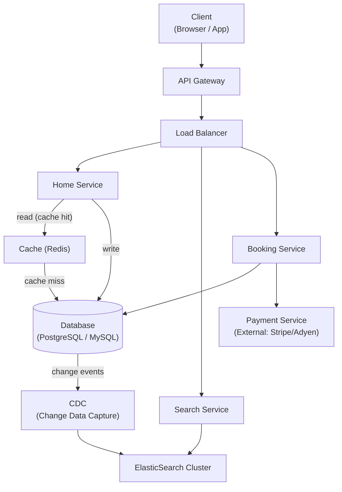

# 07 / 12. Design Airbnb Booking — 影片筆記 (video notes)

> 來源：影片 gemini_digest_lesson，2026-06-13。**影片轉述（pattern 級，非逐字）**；尚未入庫 KG。投影片逐字原文見同資料夾 digest.md。

---

## 1. 問題與需求

### Functional Requirements (00:41)
1. 使用者可依地點與日期搜尋房源（Search listings by location & dates）
2. 使用者可查看房源詳細資料（View home details）
3. 使用者可預訂指定房源（Book a home for specified dates）

### Out of Scope (03:14)
- 圖片上傳/顯示
- 付款系統（初始設計階段暫排除，後期作為外部服務接入）

### Non-Functional Requirements (03:56)
| 功能 | 優先屬性 | 說明 |
|------|---------|------|
| Search | **High Availability** | 搜尋可容忍輕微不一致，但不能掛 |
| Booking | **Strong Consistency** | 防止 double-booking，必須強一致 |
| Scalability | 1.5x–2x 尖峰倍率 | 旺季流量可達離峰 1.5–2 倍 |
| Latency | < 500 ms | 搜尋延遲需低於 500 ms |

---

## 2. 容量估算

影片中未做詳細數字估算，但提到：
- 旺季流量約為離峰的 **1.5x–2x**，需水平擴展能力
- 搜尋為 **read-heavy**，快取效益顯著

---

## 3. 高層架構 — 含資料流

### 架構演進路徑

#### Step 1 — 初始單體架構 (11:32)
```
Client → API Gateway → Server (monolith) → Database
```

#### Step 2 — 拆分微服務 (13:08)
```
Client → API Gateway → Home Service    ─┐
                     → Search Service   ├─→ Database
                     → Booking Service ─┘
                                         └→ Payment Service (external)
```

#### Step 3 — 加入 ElasticSearch + CDC (34:21)
```
Database ──(CDC)──→ ElasticSearch Cluster
Search Service ──→ ElasticSearch（不再直查主 DB）
```

#### Step 4 — 加入 Cache (36:54)
```
Home Service → Cache (Redis) → Database
              （miss 才往 DB，TTL 過期失效）
```

#### Step 5 — 水平擴展 + Load Balancer (39:21)
```
Client → API Gateway → Load Balancer → [Home Service × N]
                                     → [Search Service × N]
                                     → [Booking Service × N]
```

### 最終完整架構圖



---

## 4. 核心元件與設計決策

### API 設計 (06:31)

| 操作 | Method | Endpoint |
|------|--------|----------|
| 搜尋房源 | `GET` | `/home/search?city={}&startDate={}&endDate={}&pageSize={}&pageNumber={}` → `Home[]` |
| 查看房源詳情 | `GET` | `/home/{homeId}` → `Home` |
| 建立預訂 | `POST` | `/home/book?homeId={}&startDate={}&endDate={}` → `Success / Fail` |

### 資料庫 Schema

**Home 表**（靜態房源元資料）
```
id | city | address | type | amenities
```

**Inventory 表**（逐日可用狀態）
```
id | city | date | home_id | status (available | reserved | booked) | expiration_time
```

**Booking 表**（預訂紀錄）
```
id | user_id | home_id | start_date | end_date | status (CREATED | CONFIRMED)
```

### 快取策略 (Cache — Redis) (36:54)
- Key: `home_id`，Value: `home_metadata`
- 使用 **TTL** 做快取失效（避免 stale data）
- 適用情境：Home 元資料 read-heavy，靜態性高，快取效益佳
- Cache miss 才落地查 DB

### ElasticSearch 整合 (32:24)
- 主要解決：複雜搜尋（模糊、全文、多條件篩選），主 DB 做不好
- 使用**倒排索引（inverted index）**，查詢複雜度 O(log n) 甚至更優
- 資料同步：透過 **CDC（Change Data Capture）** 監聽主 DB 異動，近即時同步至 ES

---

## 5. 深入探討 / 取捨

### 防止 Double Booking — 並發控制

#### 方法一：Pessimistic Locking（悲觀鎖）(19:54)
- 預訂時對 Inventory 行加鎖（`SELECT ... FOR UPDATE`）
- **缺點**：鎖持有時間長（整個付款流程），高並發下效能差，用戶體驗差

#### 方法二：Optimistic Locking with Expiration（樂觀鎖 + 過期時間）(23:25)
- 預訂時將 Inventory 狀態改為 `reserved`，並設 `expiration_time`（如 10 分鐘）
- 若付款成功 → 狀態更新為 `booked`
- 若時間到期未付款 → 狀態自動釋放回 `available`（其他使用者可搶）
- **優點**：避免長鎖，使用者有時間完成付款；更符合 Airbnb 實際 UX（搶房時段感）

### 資料庫 Index (28:00)
- 對 Inventory 表的 `home_id`、`date` 建立二級索引（Secondary Index）
- 查詢從全表掃描 O(n) 降至 O(log n)
- 預訂查詢 pattern：`WHERE home_id = X AND date BETWEEN start AND end`

### 水平擴展 (39:21)
- 所有微服務設計為 **Stateless**（無狀態），不在 service 層儲存 session
- 可在 Load Balancer 後任意新增 instance，不影響正確性
- Session / 使用者狀態交給 API Gateway 或外部 session store 管理

---

## 6. 面試重點

1. **需求澄清先行**：一開始就把 Functional vs. Non-Functional 分開，並主動說明 Out of Scope（如圖片、付款）給面試官確認。

2. **Search vs. Booking 一致性取捨**：Search 要 High Availability，Booking 要 Strong Consistency — 兩個子系統的一致性模型不同，要明確說出來。

3. **防 Double Booking 是必考點**：先講 Pessimistic Locking 的問題，再提出 Optimistic Locking + `expiration_time` 的優化方案；說明為何後者在 Airbnb 場景更合適。

4. **ElasticSearch 的引入理由**：別只說「搜尋快」，要說明主 DB 的 LIKE 查詢為何慢（全表掃描），ES 的倒排索引如何解決，以及用 CDC 保持同步的原因。

5. **快取的適用判斷**：Home 元資料靜態、read-heavy → 適合 Cache。Inventory 狀態動態、強一致 → 不適合 Cache（否則可能讀到 stale 狀態而誤判可訂）。

6. **架構演進敘事**：從單體 → 微服務 → 加 ES → 加 Cache → 水平擴展，每一步都有動機，面試時這樣講比直接畫最終架構更有說服力。
