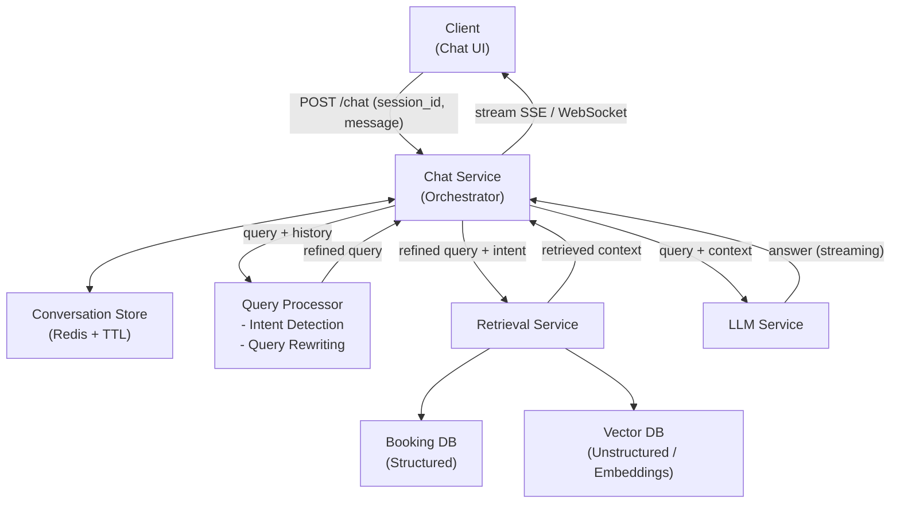
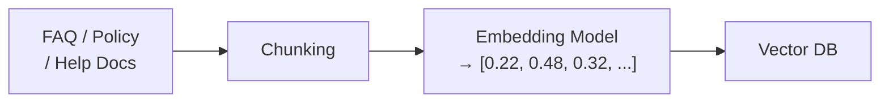

# 07 / 13. Design Agoda AI Support (Q&A Support Agent) — 影片筆記 (video notes)

> 來源:影片 gemini_digest_lesson,2026-06-13。**影片轉述(pattern 級,非逐字)**;尚未入庫 KG。投影片逐字原文見同資料夾 digest.md。

---

## 1. 問題與需求

**核心問題**:如何讓 LLM 回答使用者問題,同時**避免幻覺(hallucination)**——確保回答僅來自受控知識庫,不捏造資訊。(01:02)

**情境**:Hotel booking 網站(類 Booking.com / Agoda)的 AI 客服聊天機器人,負責回答旅客與房東(property partner)的飯店政策與 FAQ 問題。(00:24)

### 功能需求 (Functional Requirements) (01:54)
- 使用者能以**自然語言**提問
- 支援**多輪對話(multi-turn)**,保留對話脈絡
- 從多種來源(FAQ、政策文件等)蒐集知識
- 當系統信心不足時,**fallback 轉接人工客服**

### 非功能需求 (Non-functional Requirements) (04:37)
- **低延遲**:回應時間 2–3 秒 (04:50)
- **高準確度**:零幻覺 (05:25)
- **高可用性**:24/7 不中斷
- **知識新鮮度**:知識庫需即時更新 (06:22)

---

## 2. 容量估算

影片未涉及具體數字估算,跳過此節。

---

## 3. 高層架構 — 含資料流

### 主要架構 (10:43)

**資料流步驟** (10:54)：
1. Client 送訊息至 Chat Service（帶 session_id 維持對話）
2. Chat Service 從 Conversation Store 取歷史對話，送給 Query Processor
3. Query Processor 做 **Intent Detection**（判定是 knowledge-based / booking-related / hybrid）+ **Query Rewriting**（把追問改寫成獨立問句）
4. Chat Service 把精煉後的 query 送給 Retrieval Service
5. Retrieval Service 依 intent 查 Booking DB（結構化）和/或 Vector DB（語意搜尋）
6. 取回的 context 回傳 Chat Service
7. Chat Service 把 query + context 打包送 LLM Service
8. LLM 產生答案，串流回 Client（WebSocket 或 SSE）(11:31)

### 資料擷取管線 (Ingestion Pipeline) (16:21)

- 此管線**離線週期執行**或由文件更新觸發，確保知識庫新鮮度
- Chunking：把大文件切成語意連貫的小段
- Embedding：每段轉成高維向量，供語意相似度搜尋

---

## 4. 核心元件與設計決策

| 元件 | 職責 | 設計重點 |
|---|---|---|
| **Chat Service** | 中央協調者(Orchestrator) | 串接所有下游服務 |
| **Conversation Store** | 儲存多輪對話歷史 | Redis + TTL，按 session 管理 (32:27) |
| **Query Processor** | 查詢前處理 | Intent Detection + Query Rewriting (25:40) |
| **Retrieval Service** | 取回相關資料 | 依 intent 決定查哪個 DB |
| **Booking DB** | 結構化訂房資料 | 標準關聯式/文件 DB |
| **Vector DB** | 非結構化文件語意搜尋 | 儲存 FAQ / Policy 的 embedding |
| **LLM Service** | 自然語言生成 | 以 context 為基礎生成答案 |

**API 設計** (08:06)：
- 端點：`POST /chat`
- 攜帶 session_id 與 message，維持多輪對話狀態

**串流通訊** (11:31)：選用 WebSocket 或 SSE（Server-Sent Events）串流回應，提升使用體驗

---

## 5. 深入探討 / 取捨

### 防止幻覺的四大策略 (28:05)

1. **Prompt Engineering**：在 system prompt 嚴格指示 LLM「只能用給定的 context 回答」
2. **Retrieval Quality**：確保取回的資料高度相關（垃圾進垃圾出）
3. **Output Validation**：用第二個較輕量的模型或規則系統，驗證輸出是否忠於來源 context
4. **Fallback**：系統信心低時自動轉接人工客服

### Query Processor 深入 (25:40)

- **Intent Detection**：把查詢分類為以下三種
  - Knowledge-based（查 FAQ / Policy）
  - Booking-related（查訂房 DB）
  - Hybrid（兩者都需要）
- **Query Rewriting**：多輪對話中，追問往往省略主詞（例：「那明天呢？」），Rewriting 將其改寫成獨立完整問句，再送 Retrieval（33:48）

### RAG 核心框架 (01:34)

整個架構以 **Retrieval-Augmented Generation (RAG)** 為基礎：先 retrieve 相關知識，再 generate 回答，確保 LLM 有「根據」而非自由發揮。

---

## 6. 面試重點

- **RAG 是核心**：LLM 本身不知道你的 FAQ，要先 retrieve 再 generate
- **Vector DB vs Booking DB**：非結構化（文件政策）走 Vector DB 語意搜尋；結構化訂房資料走傳統 DB — 依 intent 路由
- **防幻覺四招**：Prompt Engineering / Retrieval Quality / Output Validation / Fallback，任一環節都可能被追問
- **Query Rewriting 必要性**：多輪對話中追問通常不完整，需 rewrite 成獨立問句才能正確 retrieve
- **Ingestion Pipeline**：知識庫更新需觸發 re-chunk + re-embed，面試常問「知識如何保持新鮮」
- **串流 UX**：WebSocket / SSE 讓使用者看到打字效果，降低感知延遲
- **Conversation Store**：Redis + TTL，session 隔離，避免跨用戶污染
