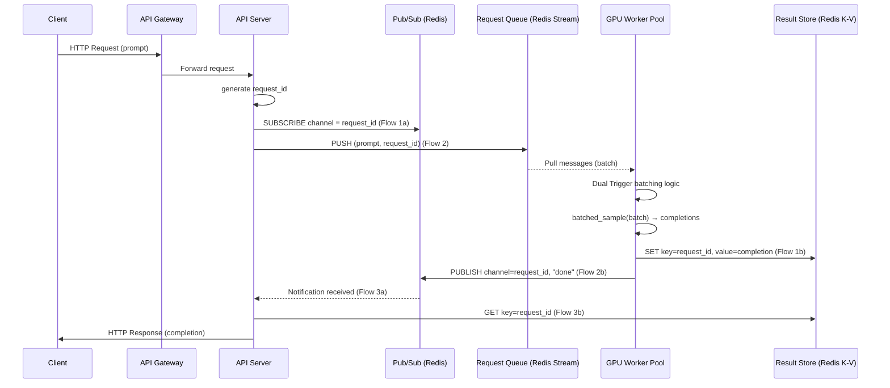

# 07 / 14. Design LLM Inference API — 影片筆記 (video notes)

> 來源：影片 gemini_digest_lesson，2026-06-13。**影片轉述（pattern 級，非逐字）**；尚未入庫 KG。投影片逐字原文見同資料夾 digest.md。

---

## 1. 問題與需求

### 問題定義 (00:01)
設計一個可擴展、低成本的 LLM 推論 API 服務。核心假設：底層有一個 GPU 函式庫 `batched_sample`，能一次處理 **1–100 條 prompt**，每批次固定耗時 **100ms** (00:35)。目標是讓 GPU 盡量跑滿批次，降低每次推論的攤薄成本 (01:51)。

### Functional Requirements (02:24)
- 使用者送出 prompt，系統回傳 completion。
- 系統能將多筆 prompt 合批（batching）一起送上 GPU。

### Non-Functional Requirements (03:50)
| 需求 | 目標 |
|---|---|
| 端到端低延遲 | ~200ms |
| 高吞吐 | 尖峰流量下仍可撐 |
| 成本效率 | 最大化 GPU 使用率 |
| 正確性 | 每位使用者拿到自己的 completion（不能混搭） |

---

## 2. 容量估算

影片未進行詳細的數字估算；著重在「如何讓 GPU 利用率最大化」的設計問題，而非 QPS / 儲存量等量化計算。

---

## 3. 高層架構 — 含資料流

架構從簡單三層逐步演化到含非同步佇列、K-V 結果儲存、與 Pub/Sub 通知的完整方案。

### 最終架構（完整版）(30:52 / 33:36)

### 架構演化時間軸

| 時間點 | 版本描述 |
|---|---|
| (09:11) | 起點：`Client → API Gateway → API Server`，同步模型 |
| (09:51) | 引入 `Request Queue`，讓 API Server 非同步卸除 GPU 等待 |
| (10:50) | 加入 `GPU Worker Pool`，消費佇列訊息 |
| (13:28) | 加入 `Result Store`（K-V），Worker 寫入結果；回傳路徑尚未定案 |
| (27:04) | 方案一：API Server 輪詢（Polling）Result Store — 簡單但浪費 |
| (28:24) | 方案二：API Server 在 Redis List 上做 **Blocking Wait** — 比輪詢好，但連線資源有限 |
| (30:52) | 方案三（最終）：引入 **Pub/Sub**，Worker 發布通知，API Server 訂閱後再去拿結果 |

---

## 4. 核心元件與設計決策

### 4-1. Request Queue：選用 Redis Stream (17:03)
- 比 Kafka 延遲更低；比 SQS 更彈性（可一次拉取大批量訊息）。
- 透過 **Consumer Group** 保證 **at-least-once delivery**（重要：防止 Worker 崩潰時丟單）。

### 4-2. Dual Trigger 批次策略 (11:47)
GPU Worker 以下列兩個條件之一觸發送批：
1. **批次大小到達上限**（例：100 條 prompt）
2. **等待時間到達上限**（`max_wait`，例：50ms）

兩個條件「先到先得」，確保在吞吐量（盡量湊滿批）與延遲（不能等太久）之間取得平衡。

### 4-3. Queue Depth 動態調節 (19:45)
- **Queue Depth**（佇列積壓量）作為流量指標：
  - 流量高 → 積壓深 → 縮短 `max_wait`（快速出批，提升吞吐）
  - 流量低 → 積壓少 → 拉長 `max_wait`（等更多單湊滿批，提升 GPU 效率）
- 同一個 Queue Depth 指標也可驅動 **GPU Worker 自動擴縮容（Auto-scaling）** (34:35)。

### 4-4. 結果回傳：三種方案比較

| 方案 | 機制 | 優點 | 缺點 |
|---|---|---|---|
| 輪詢 Polling (27:04) | API Server 定期查 Result Store | 實作簡單 | 浪費 CPU；延遲不穩定 |
| Blocking Wait (28:24) | API Server 阻塞在 Redis List 上等 | 零浪費輪詢 | 每個 pending request 佔一條連線，高並發時連線耗盡 |
| **Pub/Sub（最終）** (30:32) | Worker 發輕量通知；API Server 收到後再拉結果 | 可擴展；不浪費連線；解耦通知與資料 | 多一跳（通知 + 取資料） |

### 4-5. Result Store
- 使用 Redis K-V。
- Key = `{prefix}:{request_id}`，Value = completion 文字。
- API Server 收到 Pub/Sub 通知後，用 `request_id` 查詢。

---

## 5. 深入探討 / 取捨

### GPU Worker 崩潰容錯 (38:20)
- Redis Stream 的 Consumer Group 具備 **Visibility Timeout** 機制：
  - 若 Worker 在處理訊息途中崩潰，訊息不會被 ack，超時後自動重新可見，由其他 Worker 接手處理。
  - 實現 at-least-once 語義，避免請求遺失。

### Redis 故障場景 (33:33)
影片有討論 Redis 發生故障時的情形（具體細節在時間點 33:33 後展開），強調依賴單一 Redis 的風險，需考慮 Redis 高可用設定（如 Redis Sentinel 或 Cluster）。

### 「正確性」挑戰
- 批次處理時，多條 prompt 混在一起送進 GPU，**必須透過 `request_id` 對應，確保每位使用者拿到自己的 completion**，這是設計正確性的核心要求（呼應 NFR）。

---

## 6. 面試重點

1. **Dual Trigger 批次策略**：面試必答，說明如何同時顧及吞吐量（size trigger）與延遲（time trigger）。
2. **Queue Depth 動態調節**：展示對 backpressure 的理解，能根據負載自動調整系統行為。
3. **Queue 技術選型**：能說明選 Redis Stream 而非 Kafka/SQS 的理由（低延遲 + 彈性 batch pull + at-least-once）。
4. **結果回傳三方案比較**：從 Polling → Blocking Wait → Pub/Sub，能說明取捨，最終推薦 Pub/Sub 的理由（可擴展性）。
5. **`request_id` 設計**：強調 correctness——批次混合處理時如何保證結果與請求一一對應。
6. **GPU Auto-scaling**：Queue Depth 作為 scaling 信號，體現成本意識。
7. **容錯設計**：Redis Stream at-least-once + visibility timeout，處理 Worker 崩潰場景。
