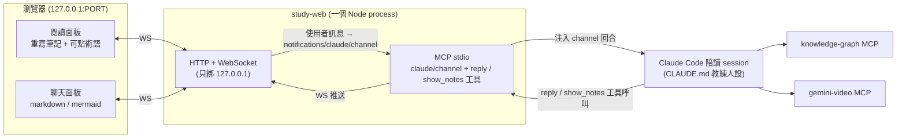
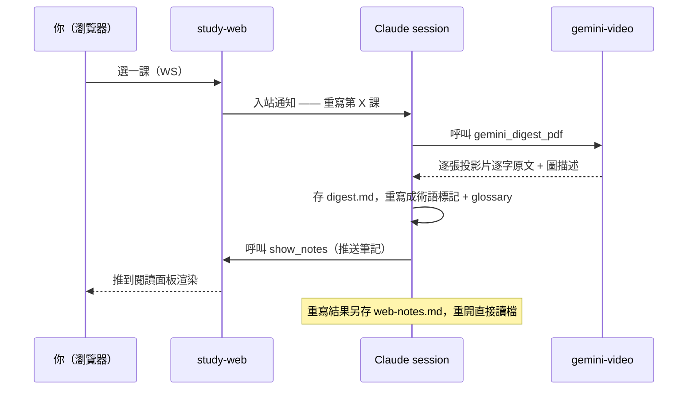
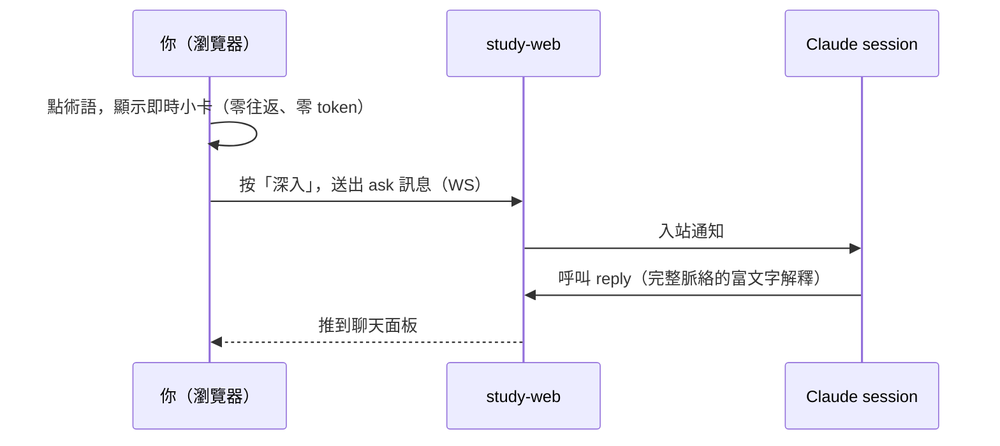

# 系統設計陪讀 Web 平台 (study-web)

> 一句話:做一個**本地 Node 程式**,它同時是 Claude Code 的 **`claude/channel` MCP server** 和一個**只綁 `127.0.0.1` 的網頁伺服器**。你現有的 Claude Code 陪讀 session(`CLAUDE.md` 教練人設 + KG + Gemini)**還是大腦**;瀏覽器只是它一個「沒有終端機顯示 bug、能畫流程圖、能點術語」的漂亮**臉**。

---

## 1. 目標 (Goal)

解決三個痛點,而且**不重建**現有陪讀基礎建設:

1. **看不懂的名詞** → 在「我重寫過的講義網頁筆記」上**直接點術語**,側邊跳出**白話短解釋**(零等待、零 token);裡面若還有新名詞可**逐層點下去**;想更深再按「深入」走到聊天。
2. **終端機難讀** → 閱讀與對話都在瀏覽器,完整 markdown / mermaid 流程圖 / 可點文字。
3. **答案太長又一堆 jargon** → 小卡強制「短」;深入解釋走聊天面板的富文字排版。

**驗收(v1=甲:一課跑通):** 挑**一課**,把整條鏈路走通 —— 在瀏覽器開該課 → 讀我重寫的可點筆記 → 點術語看即時小卡 → 按「深入」在聊天得到富文字回答,**全程不碰終端機**。

---

## 2. 核心決策與取捨 (Key decisions)

| 決策 | 選擇 | 理由 / 否決的替代方案 |
|---|---|---|
| 大腦 | **沿用現有 Claude Code session**(透過 `claude/channel`) | 省掉重建 KG/Gemini/人設/複習;風險小。否決:另寫獨立 Agent-SDK app。 |
| 講義呈現 | **我重寫成網頁筆記**,非原始 PDF | 雙語+全形 PDF 文字層抓得不準;重寫才能讓「可點術語」100% 穩定。否決:pdf.js 點原始 PDF。 |
| 術語小卡 | **重寫時把短解釋「烤進」筆記**(靜態) | 點擊零往返、零 token、Claude 發呆也能讀。深問才走模型。 |
| 橋接骨架 | **照官方 `fakechat` 範例**(localhost 網頁聊天橋接) | 官方已有幾乎一模一樣的範例;直接借其 `deliver()→notification`、`reply→broadcast` 接線。 |
| 執行環境 | **Node + `ws`**(非 Bun) | 對齊本專案既有 kg/gemini server(Node + `@modelcontextprotocol/sdk`);`ws` 已在 node_modules。fakechat 是 Bun,只借邏輯不照抄語言。 |
| 註冊方式 | **bare `.mcp.json` server + dev flag** | 個人單機最簡。否決(暫):包成 plugin + marketplace(較多前置;列為日後備案)。 |
| 使用模式 | **網頁當唯一輸入,終端機放著別打字** | 頻道訊息「等當前回合做完才處理、多則合併」——不跟終端機搶,剛好符合「同一視窗做完」。 |

---

## 3. 架構 (Architecture)



**一個 process、兩張臉**:MCP 那張臉用 stdio 被 Claude Code 啟動;網頁那張臉用 http+ws 服務瀏覽器。生命週期跟著 session(stdin EOF 收掉)。這正是 Discord/fakechat 範例已驗證的形狀。

---

## 4. 資料流 (Data flow)

**開一課(重寫 → 顯示 → 快取):**



**點一個術語(兩層,省錢關鍵):**



---

## 5. `claude/channel` 協定事實(已查證)

| 項目 | 內容 |
|---|---|
| 宣告頻道 | 在 **MCP Server 建構子**(非 .mcp.json)設 `capabilities.experimental['claude/channel'] = {}`;要用**低階 `Server`** class(`McpServer` 不暴露此參數)。 |
| 入站(網頁→Claude) | `mcp.notification({ method: 'notifications/claude/channel', params: { content, meta } })`。`content`=訊息本文;`meta` 每個 key 變成屬性。 |
| meta key 限制 | **只能 `[A-Za-z0-9_]`**;含 `-`/`.` 的 key 會被**靜默丟棄**。用 `chat_id`、`message_id`、`user`、`ts`。 |
| Claude 看到 | `<channel source="study-web" chat_id="..." ...>content</channel>`;`source` 由 server `name` **自動填**,別自己塞。 |
| 出站(Claude→網頁) | 一個普通 MCP 工具(慣例叫 `reply`),參數含 `chat_id`+`text`;Claude 回傳它看到的 `chat_id`。 |
| 重要 | **Claude 的終端機輸出不會到網頁**——只有 `reply`/`show_notes` 工具呼叫會。`instructions` 要把這點講死。 |
| 時序 | 通知是 fire-and-forget;Claude 忙時訊息**排隊到下一回合並合併處理**(非一則一回)。 |

---

## 6. 必要前置條件與關卡 (Prerequisites & gates)

> 這節是查證階段最重要的產出 —— 「丟進 .mcp.json 就會動」是**錯的**,以下每一項都要做到,否則訊息**靜默推不出去**。

| 關卡 | 現況 | v1 處理 |
|---|---|---|
| **啟動旗標** | 研究預覽期,普通 `claude` 不載入自製頻道;`--channels` 只收 Anthropic 允許清單上的 plugin | 用 `claude --dangerously-load-development-channels server:study-web`(每次開、會跳確認)。做成 `study-coach.cmd` / PowerShell 別名一鍵啟動。 |
| **專案信任清單** | `.claude/settings.local.json` 的 `enabledMcpjsonServers` 只有 `knowledge-graph`、`gemini-video` | 加入 `"study-web"`;否則它停在「⏸ 待批准」、不註冊 listener。 |
| **版本** | 需 Claude Code ≥ 2.1.80(權限轉送 ≥ 2.1.81) | ✅ 你是 **2.1.168**。 |
| **登入方式** | 需 claude.ai 或 Console API key;**不支援** Bedrock/Vertex/Foundry | 開工前確認一次(個人 Pro/Max 跳過組織檢查)。 |
| **權限停頓** | 被網頁驅動的回合若呼叫工具碰權限詢問,會**停在終端機**等按 | v1:預先在 `settings.local.json` 允許 `mcp__knowledge-graph__*`、`mcp__gemini-video__*`、`Write(notes/**)`、`mcp__study-web__*`,避免停頓。日後再做 `claude/channel/permission` 把詢問轉到網頁。 |
| **輸出可見性** | 只有 `reply`/`show_notes` 工具的內容到網頁 | channel `instructions` 要求 Claude **一律用工具說話**,不要只在終端機輸出。 |

---

## 7. 可點術語約定 (Clickable-term contract)

我重寫筆記時,術語用**行內標記** `[[id|顯示文字]]`,並在筆記**最後**附**一個** ```glossary JSON 區塊。前端在 `marked` + `DOMPurify` 之後,用 DOM text-walk(跳過 `pre`/`code`)把標記換成可點 `span`。

- `id` = kebab-case 穩定鍵;`顯示文字`可省(省略時用 id 當標籤):`[[consistent-hashing]]`。
- `short` = 小卡本文,**可再含 `[[...]]`** → 巢狀可點。
- `deeper` = 可選的「深入」預設問題;沒給就用「請深入解釋:<term>」。
- `short` 來源:`search_memory(term)` → `get_knowledge(id)`,**優先取 `content`(雙語解釋)**,缺則取 `quote`(逐字);查無則跳過烤定義(或標記「待補」)。

範例:

````markdown
…用 [[consistent-hashing|一致性雜湊]] 讓節點增減時只搬動少量 key,
對比樸素的 [[mod-hashing|取模雜湊]] 幾乎要全搬。…

```glossary
{
  "consistent-hashing": {
    "term": "Consistent Hashing 一致性雜湊",
    "short": "用 hash ring 讓節點增減時只搬動少量 key;對比 [[mod-hashing|取模雜湊]]。",
    "deeper": "為何一致性雜湊在 cache 叢集擴縮容時優於取模?"
  },
  "mod-hashing": {
    "term": "Modulo Hashing 取模雜湊",
    "short": "key % N 決定節點;N 一變,幾乎所有 key 重新映射。"
  }
}
```
````

---

## 8. v1 範圍與步驟 (Scope & steps)

### Step 0 — echo spike(先證明頻道在你帳號真的會動)
- 寫 ~30 行最小 Node server:宣告 `claude/channel` + 一個 `reply` 工具 + 一個 `POST /say` 端點。
- 暫時加進 `.mcp.json` 與 `enabledMcpjsonServers`。
- 用 dev flag 啟動 session,跑 `curl -X POST 127.0.0.1:PORT/say -d "hi"`,**肉眼確認**終端機出現 `<channel source="study-web" …>hi</channel>` 且 Claude **自動回**並呼叫 `reply`。
- **通過才往下做**(這一步把 version/auth/trust/flag 一次驗到 THIS account)。

### Step 1 — study-web server(MCP + 網頁雙臉)
- 低階 MCP `Server`(像 Discord)+ `StdioServerTransport`;ESM。
- 檔頭 `console.log = console.error`(**stdout 只能給 JSON-RPC**,任何雜訊會壞協定)。
- Node `http` 服務單頁 + `ws@8`(`new WebSocketServer({ server })` 共用同一 `http.Server`);`server.listen(PORT, '127.0.0.1')`,固定 port(預設 `7654`)+ 衝突遞增;最終 URL **印到 stderr**(可選另寫 `.ui-url` 檔)。
- stdin `end`/`close` + SIGTERM/SIGINT → `wss.close()` + `http.close()` → `exit`(借 Discord 的 guarded shutdown,2s 安全 timeout)。**fakechat 沒做這個,務必補**,否則重啟撞 port。
- 工具:`reply`(text)、`show_notes`(lesson, markdown);可選 `open_lesson`(列出可選課)。
- 入站:WS/POST → `notifications/claude/channel` `{content, meta:{chat_id,message_id,user,ts}}`(底線 key)。
- `instructions`:寫清 wrapper 格式、一律用 `reply`/`show_notes`、transcript 不到網頁。

### Step 2 — 瀏覽器單頁
- 沿用 `plan-render.html` 那套:`marked@12.0.0` + `mermaid@10.9.0`,加 `dompurify@3.1.6`,全 CDN、無 build、版本固定。
- 兩欄 flex:左閱讀、右聊天;沿用模板的 CSS 變數 + 主題切換 + 主題感知 mermaid。
- `renderMarkdown(md,{inline})`:`protectHtmlBlocks` → `marked.parse`/`parseInline` → `DOMPurify.sanitize(ADD_ATTR:['data-def-id'])`。
- `hydrateTerms(root, glossary)`:DOM text-walk 換 `[[id|surface]]`(跳過 `PRE`/`CODE`);一個委派 click/keydown listener 開小卡。
- 小卡:`short`(巢狀術語遞迴可點)+「深入」鈕 → `ws.send({type:'ask',mode:'deeper',termId,term,question})`。
- 聊天:`ws.onmessage` 整則渲染(使用者訊息走 `textContent`);輸入框送 `{type:'ask',text}`。
- WS envelope:`{type:'ask'|'delta'|'done'|'error', …}`(`delta`/`done` 串流留 v2)。

### Step 3 — Claude 重寫流程(新 skill 或 CLAUDE.md 程序)
- `Glob` 章節資料夾 → **複製精確課名**(含全形 `｜`)→ `gemini_digest_pdf(lesson[, file])`(多 PDF 課:先不帶 `file` 拿清單,再逐份)。
- 存 `digest.md`(沿用既有 header 慣例)→ 重寫成 `[[術語]]` + glossary(術語 short 來自 KG)→ `show_notes`。
- 重寫結果快取到 `notes/<NN_章節>/<課>/web-notes.md`;重開先讀檔,沒有才重寫。

### Step 4 — 一課跑通(驗收)
- 建議挑**已有 `digest.md` 的純 PDF 課**(如 `03_基本觀念/04. CAP Theorem｜CAP 定理`),省一次 Gemini。
- 走完:開 → 讀重寫筆記 → 點術語(即時卡)→ 按深入(聊天富文字)→ 全程在瀏覽器。

---

## 9. 不做 (Out of scope, v1)

左側全課程章節樹 / 多課切換、影片課 `[mm:ss]` deep-link、權限轉送 UI、串流 token、間隔複習儀表板上網頁、遠端/多人、原始 PDF 並排(pdf.js)、把 channel 包成 plugin+marketplace。**全部留待之後。**

---

## 10. 風險與緩解 (Risks & mitigations)

- **頻道沒載入 → 訊息靜默消失**(最常見陷阱:忘了 dev flag 或沒加信任清單)。緩解:Step 0 echo spike 先驗;網頁做「送出後等 `reply`/ack,N 秒沒回就顯示『頻道未載入,檢查啟動旗標/信任清單/channelsEnabled』」。
- **權限停在終端機**:被網頁驅動的回合呼叫工具卡住。緩解:v1 預先允許所需工具(見 §6);日後做 permission relay 或在受信任本機用 `--dangerously-skip-permissions`。
- **時序合併**:多則訊息合併成一回合,破壞「一問一答」。緩解:把網頁當唯一輸入、終端機別打字;UI 接受「成批回覆」。
- **port zombie**(Windows):重啟撞 `address in use`。緩解:務必補 stdin-EOF shutdown;啟動前 PowerShell 預檢 `Get-NetTCPConnection -LocalPort 7654`。
- **prompt injection**:`<channel>` 本文會注入 Claude prompt。緩解:只綁 `127.0.0.1`(單機單人即邊界);不在 `content` 內嵌可偽造字串,檔案走 `meta.file_path`。
- **KG 工具回傳是「格式化文字非 JSON」**:重寫時要從文字撈定義。緩解:由我(Claude)重寫時直接讀文字寫 glossary,**不需**寫脆弱 parser;web server 只存烤好的字串。

---

## 11. 開放問題 (Open questions — 需要你拍板)

1. **小卡本文**用 `content`(雙語解釋)還是 `quote`(投影片逐字)?**預設 `content`,缺則 `quote`**。
2. **聊天回覆裡也要可點術語**嗎?**預設只有閱讀面板**;聊天可點是擴充。
3. v1 就要 **permission relay**(從網頁批准工具)嗎?**預設不要**,先用允許清單。
4. **一課跑通挑哪一課**?**預設 `03_基本觀念/04. CAP Theorem｜CAP 定理`**(已有 digest)。

---

## 12. 驗證清單 (Verification checklist)

- [ ] Step 0 echo spike:`curl` 一發,終端機看到 `<channel source="study-web">` 且 Claude 自動回、呼叫 `reply`。
- [ ] `enabledMcpjsonServers` 含 `study-web`;`claude mcp list` 顯示已連線(非 ⏸ 待批准)。
- [ ] 一鍵啟動腳本(dev flag)可用。
- [ ] 瀏覽器開 `127.0.0.1:7654`,兩欄版面、主題切換、mermaid 正常。
- [ ] `show_notes` 推一份含 `[[術語]]`+glossary 的筆記 → 閱讀面板正確渲染、術語可點、小卡出現。
- [ ] 小卡內巢狀術語可再點;「深入」鈕送出後聊天面板收到富文字回答。
- [ ] 關閉 session → port 釋放,重啟不撞 `address in use`。
- [ ] 全程未在終端機打字即完成一課。
